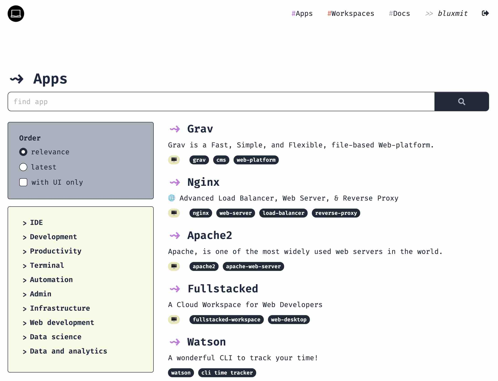
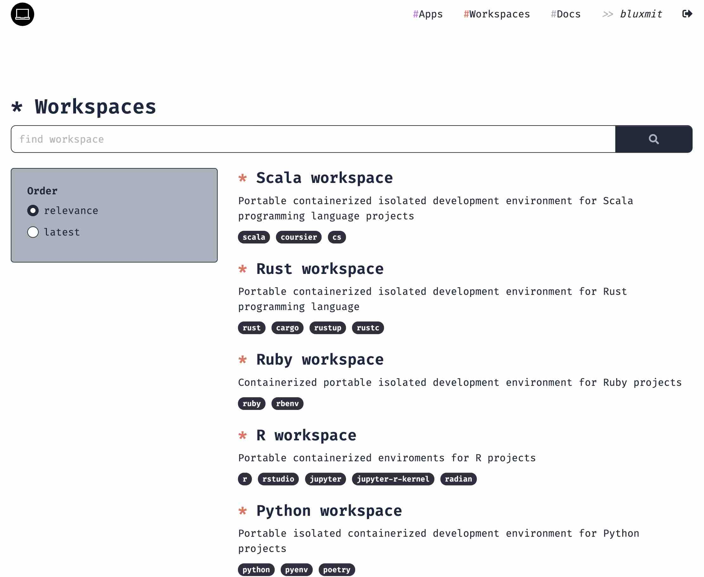
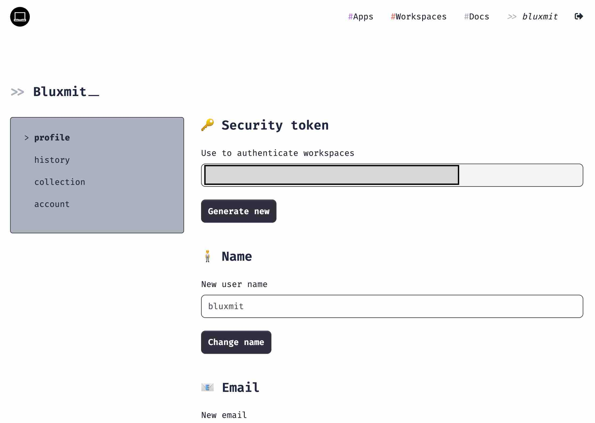
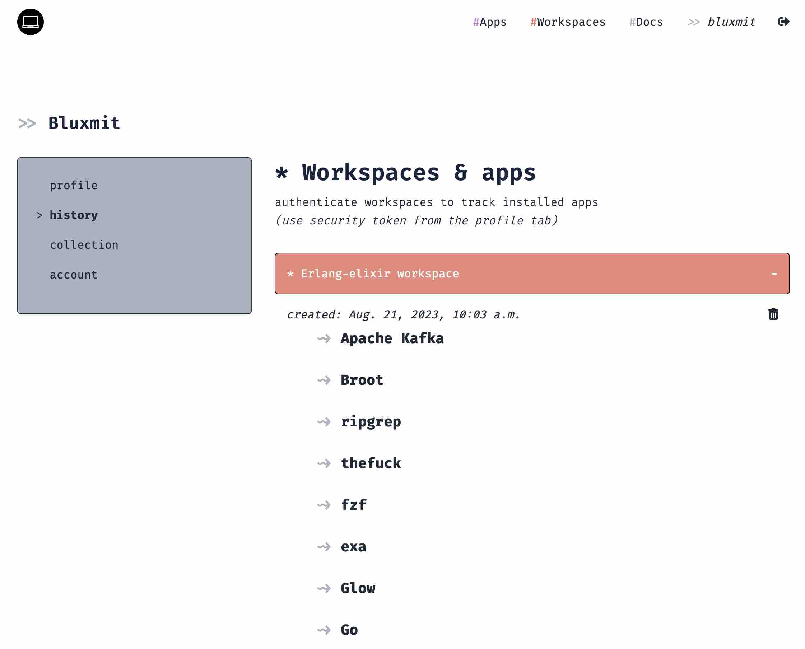

# About

[__Alnoda Hub__](https://alnoda.org/) is a collection of scripts which will istall various applications, packages and libraries, download artifacts or datasets in the workspace.  

You can use Alnoda Hub to quickly install frequently used applications in any of your workspaces, reducing the bootstraping time. And by combining 
different applications you can create unique workspaces for every specific need. 

Alnoda Hub is used to register applications and workspaces and set compatibilities between them. 

## Apps

In the [__#Apps section__](https://alnoda.org/registry/) of the Hub you will find a list of applications that can be installed in Alnoda workspaces. Every app has its own page with description and installation script. 

## Workspaces 

In the [__#Workspaces section__](https://alnoda.org/registry/) of the Hub you will find a list of workspaces created by you or other users, and 
registered in the Alnoda Hub. 

Registering workspace in the Alnoda Hub would allow to define app-worksapce compatibility, as well as make your workspace visible for other 
people. 

## User section 

If you create an account in the Alnoda Hub, you will also get a user's section, from where you can create your own apps and register new workspaces, as well as see the history of the installed applications in your workspaces.

You can use the security token to log into your lnoda Hub account from any workspace. If you do this, all apps from the Alnoda Hub installed in the 
authenticated workspace will be logged to the Alnoda Hub. So you will remember which apps were installed in your workspaces. 

Workspace authentication also enables longer workspace sharing sessions with faster speed.
