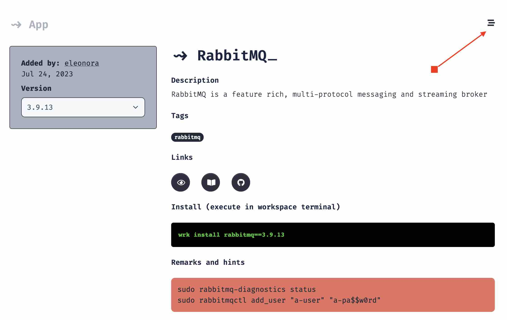

# Alnoda App 

_"Applications"_ in the Alnoda Hub are merely shell scripts that will install and configure applications in the workspaces. The latter 
are built from the base images - the LTS version of Ubuntu, hence Alnoda Apps will be compatible with early all of the workspaces. 

Alnoda has deliberately chosen plain straight shell as a wehicle to install applications, without relying on popular tools such as Chef or Ansible. 
Basic shell makes it very clear what is going to be executed, allows to look through the script before installing and does not require to 
learn the tool that you might not be familiar with.   

!!! info 
    App script (for the given version) is immutable, it cannot be changed. This guarantees stability and removes the eed to review the installation script every time you need to install this version. 

## App page

Every App has its own page in Aloda Hub with short description, installation script, relevant links to the docs and code repository and optional notes. 

## App Info 

Each App has name, description, tags, links to docs, repository and/or main website, install command (execute in the workspace terminal to install application), installation script, and optional notes, where author of the installation script can write remarks, such as default login credentials, how to get a secret, location of the configuration file, example how to use application in terminal etc.  

Every application has __installation script__ - _a sequence of shell commands that will usually perform such actions as downloading and installing binaries, cloning Git repositories, installing runtimes and virtual environments, building applications from source, downloading artifacts and making app configurations, such as setting environmental variables or creating configuration files_. 

Applications that run as service will also have the startup command. This is a command that is used to start application every time the workspace is started (or restarted). Applications with UI will also have image for the workspace home tab. After app is installed, this tab will appear in the workspace UI, and serve as convenient shortcut to ope application

Different applications with UI listen to varios ports. You don't need to care about it, the traffic will be automatically forwarded to one of the free workspace ports that were reserved for workspace applications and mapped to the host network.

## Versions

Alnoda apps have versions, that usually should match the version of the installed application itself. There can be differences though when several pplications are installed together, or new version is created to fix the bug in the installation script itself. 

!!! note
    Anyone can add versions to any Alnoda app, even if this app is not created by you.  

To add another version to the Alnoda app (created by you or anyone else) click button in the top right corner. You must have account and signed in to do this.  

## Workspace Compatibility

On the app page you can find information about compatibility with the workspaces. This compatibility information can help to know if application can 
freely be installed in the workspace. If you try to install application which is not defined to be compatible with your workspace, you will see a warning. 

If the application compatibility with some workspace is not set, it does not mean that it is incompatible. It is possible that the information is simply has not been updated yet. 

Apps can be compatible or incompatible with different workspaces. Such compatibility is optional and serves informational purpose only. 
No matter if app is compatible or incompatible with a given workspace, you can ignore the warning and install anyway. 

!!! info 
    You can ignore compatibility warning and install app in your workspace anyway. 

!!! hint 
    If you see the compatibility warning, but still want to continue, it is a good idea to stop installation and back up the workspace prior to installing the app.

If you notice compatibility or incompatibility of an app with some workspace, you can update app compatibility with the relevant information, which will help your later if you want to install it in a similar workspace. 

!!! info 
    You can update compatibility of a app with aother workspace even if you haven't created neither of them. 

Because workspaces can be built from each other, it is not necessary to set compatibility of an app with all the possible workspaces. It is enough 
to have compatibility with a single workspace in the lieage of the given workspace. You can see the workspace lineage on the Workspace UI _About tab_ 

For example, _php workspace_ is built from _Theia workspace_ and the latter is built from the _alnoda worksapce_. Application _Apache2_ (popular web server) is compatible with _aloda workspace_, which means it becomes implicitly compatible with both _php workspace_ and _codeserver workspace_.

## App Compatibility

App compatibility is also optional, much like workspace compatibility. It is a mean to track compatibilities, incompatibilities or requirements between different applications and their versions. 

If you notice incompatibility between applicationns which is missing in the Alnoda Hub, you can as well add it to the applicaion, eve if it is not yours app. This will help you to remember if you try to install this app in the other workspaces. 