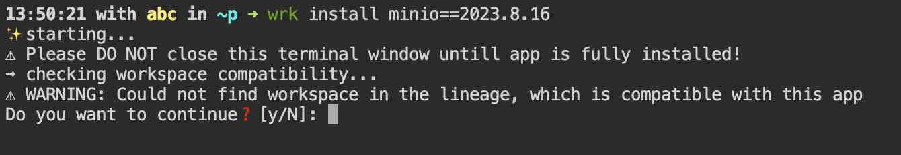
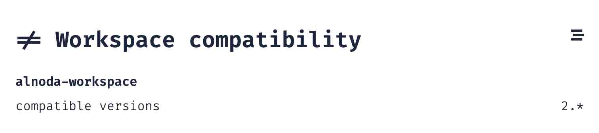
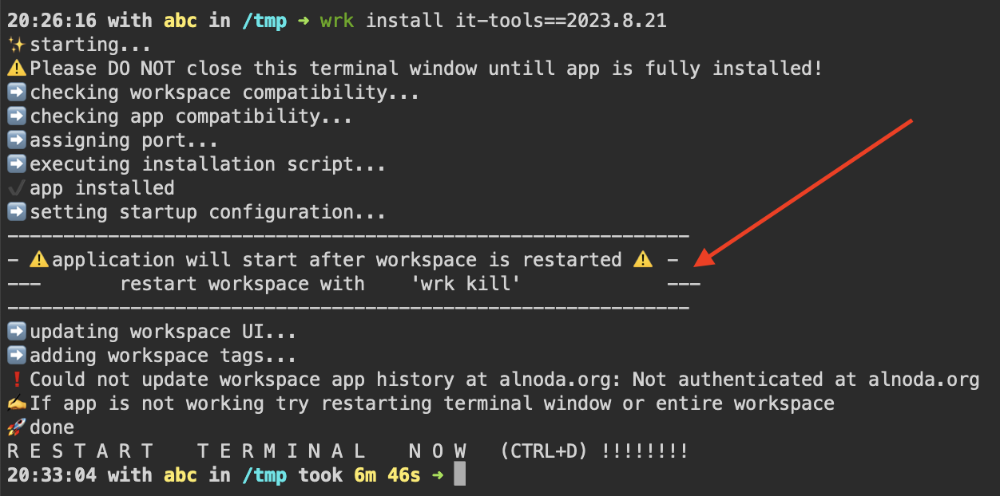

# Install Apps

Alnoda Hub has many different applications, which you can use to create comprehensive workspace for your specific project. The variety of 
applications is huge, ranging from CLI tools, TUI applications, applications with WEB UI, services, databases and many more.

!!! info 
    You do not need account in the Alnoda Hub to install applications

You can install apps added by you or other people. To install an app you need to execute a single command in the workspace terminal 


<div class="termy">
```
<font color="#5EA702">wrk</font> install [app-id]==[app-version]
```
</div>


For example to install Nginx execute  


This application install command can be found in every application page in the Alnoda Hub


## Versions

You can install specific version of the application, if it is present. It is possible to install app without specifying a version. In this case the version which was added the last will be installed. For example  

<div class="termy">
```
<font color="#5EA702">wrk</font> install nginx
```
</div>

If you cannot find the version suitable for you or compatible with your workspace, or if the latest version of the application is just missig, you can add the new version to any application in the Alnoda Hub.

## Considerations

There are several things to consider when installig a application in your workspace 

- [x] Check out the stallation script if application is created by someone else. Most of the installation scripts are relatively small - between 5 and 20 commands, so it is not a hard task. 
- [x] Install a particular version of the application. Anyone can add a version to your app, hece specify the version explicitly, don't rely on the lates added version.
- [x] Back up workspace before installing applicatio created by someone else or compatibility is doubtful. Backing up a workspace is merely a single command, so it's worse it! 
- [x] It is not possible to uninstall an app in the workspace. Better back up workspace before trying new application. 
- [x] There is a limit of 10 applications with WEB UI that can be installed in a single workspace. 

Installation might not actually work! Alnoda applications are just a sequence of commands that download binaries, packages, repositories and then configure, build and install applications. But packages are moved, repositories renamed, binary releases deleted. With time the chance of successful app installation dimisishes, and new version of the app might be required.

!!! hint 
    If isntallation script is outdated, and the app canot be installed anymore, you are welcome to add a new version with the updated and 
    corrected installation and configuration script. You can add a new version to any app in the Alnoda Hub.

## Application limits 

There are different kinds of applications, some of them called using the command line in the workspace terminal, other must run as background service for you to interact with them. The example of such applications are for example databases. Most applications with WEB UI also run a service. 

You don't need to start all the service applications manually, they all start automatically when workspace is started or restarted. Because _workspace_ is a collection of applictions for a specific project or task, workspace is not a replacement for an entive desktop.  

Because all service applications are running all the time i the workspace, it might become resource-consuming if there are too many applications running. This means that it is necessary to plan what to install in every workspace, and install the most needed applications first. 

Workspaces have a limit for a number of applications that have UI - 12 applications which can be installed. You can also use 3 more ports to run your own applications.  

## Workspace compatibility 

Applications can have compatibility or incompatibility with different workspaces. Compatibilities can be set by the person who added the app, or the one who created a workspace, or anyone else who notices compatibility or incompatibility between app and workspace can update such a compatibility. 

If during the app installation you see incompatibility warning, you can ignore it and cotinue installation. 



Incompatibility warning does not necessarily mean that app is incompatible with the workspace. It is possible that compatibility between this app and this workspace was simply not set. You can ignore the warning, install it in the workspace and check out if it works. 

!!! info
    Incompatibility warning does not necessarily mean that app is incompatible with the workspace. 

By default app the compatibility warning will appear if the compatibility is not set with this workspace. But if you see that the compatibility with the workspace is set, but with another version - then it likely to incompatible, except the cases when the nobody has updated compatibility of this app with the new workspace version. You can still try to install the app, but back up workspace first. It is also possible to explicitly set incompatibility of the app with the workspace versions. In this case the app is clearly incompatible.   

Whether the compatibility between the app and the workspace is defined you can see down below on the app page. 



Because workspaces can be built from each other, it is not necessary to set compatibility of an app with all the possible workspaces. It is enough 
to have compatibility with a single workspace in the lieage of the given workspace. You can see the workspace lineage on the Workspace UI _About tab_. 

## App compatibility 

Usually apps are compatible with each other, and if the installation script is done right, apps will not affect each other. This is achieved by using 
virtual environments and tools like _nodeenv_ or _pipx_. Nevertheless, it is also possible that apps become incompatible with each other. 

!!! hint
    If you notice incompatible apps, you are free to update the app page and mark incompatibility. 

It is more common to see when one app requires another. In general it is then better to stop installation and install the reqiuired application first. 

## Restart workspace

It is often necessary to restart the workspace or reload the terminal window after the installation of the application. This is necessary to activate environmental variables, set aliases and start daemon services. You will see the notification if it is necessary to restart the workspace, and reload terminal window every time you install any app. 



If inn the output of the `wrk install` there is a warning that workspace restart is required, the application will not be started immediately after the `wrk install` finishes, even if the shortcut appears in the Wokspace UI. You do need to restart the workspace. Save your work and restart workspace with the command `wrk kill`.  

!!! warning
    All applications that run as a service or have UI do require restart of the workspace.

Even if the restart of the application is not required, you should reload the terminal either with ++ctrl+d++ or simply reloading the browser window.

## Workspace meta 

Workspace keeps trak of the apps installed from the Alnoda Hub. 

## Apps and services 

## Uninstall app

