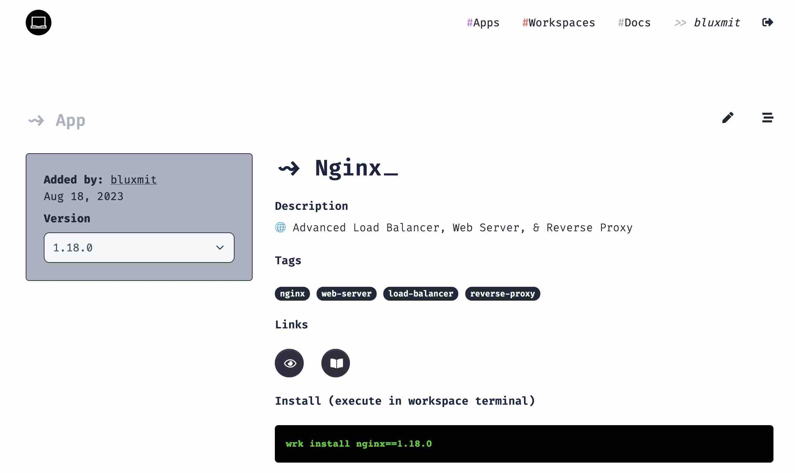

# Install Apps

Application from the Alnoda Hub can be installed in your workspace, if the app is compatible with the workspace. 

!!! info 
    You do not need account in the Alnoda Hub to install applications

You can install apps added by you or other people. To install an app you need to execute a single command in the workspace terminal 


<div class="termy">
```
<font color="#5EA702">wrk</font> install [app-id]==[app-version]
```
</div>


For example to install Nginx execute  


This application install command can be found in every application page in the Alnoda Hub



## Versions

You can install specific version of the application, if it is present.  

It is possible to install app without specifying a version. In this case the version which was added the last will be installed. For example  

<div class="termy">
```
<font color="#5EA702">wrk</font> install nginx
```
</div>