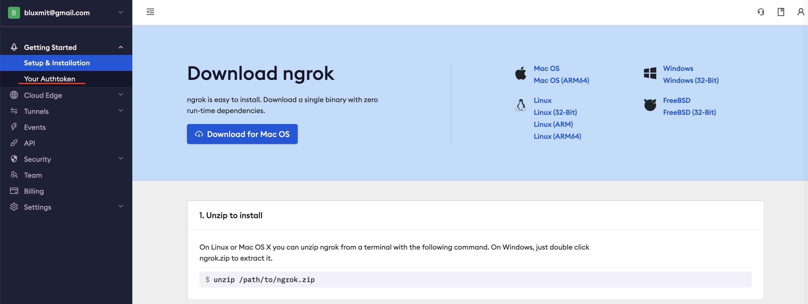
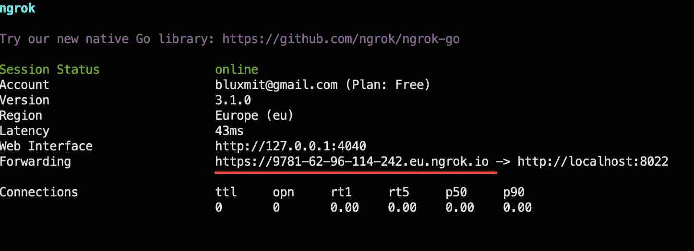

# Ngrok - put localhost on the internet

With [__Ngrok__](https://ngrok.com/) you can expose any workspace application to the world with a single command.  

!!! note
    With a single terminal command you can share any workspace tool with your friend. And your friend does not need to install any software. 

To share workspace is as simple as execituting `ngrok http [APP PORT]` in the workspace terminal. 

!!! attention
    Ngrok can be installed in any workspace. We will use __Codeserver workspace v.4.0__ for this example.

## Install 

To install Ngrok simply copy this code snippet and execute it in the workspace terminal

<div class="termy">
```
curl -s https://ngrok-agent.s3.amazonaws.com/ngrok.asc | tee /etc/apt/trusted.gpg.d/ngrok.asc >/dev/null \
&& echo "deb https://ngrok-agent.s3.amazonaws.com buster main" | tee /etc/apt/sources.list.d/ngrok.list \
&& sudo apt-get -y update \
&& sudo apt-get install -y ngrok
```
</div>


## Register 

Before using Ngrok you have to create an account at [__ngrok.com__](https://ngrok.com/). You only need a free account.   

You can authenticate with your Google or GitHub accounts.  

The only thing you need to do - is to copy your auth token. 



We only need to configure ngrok token in the workspace. Open workspace terminal and execute 

<div class="termy">
```
$ ngrok config add-authtoken <font color="#9B9B9B">[YOUR TOKEN]</font>

Authtoken saved to configuration file: /home/abc/.config/ngrok/ngrok.yml
```
</div>

Thai is it! You are ready to share your workspace with anyone in the worrld. 


## Share  

Exposing any application is as simple as running `ngrok http [PORT TO EXPOSE]`.

Choose what application you want to share. Different applications run on different ports.  

You can find out which port is used by every application on the "About" tab.  

Let's expose terminal, it runs on port 8022 

<div class="termy">
```
$ ngrok http 8022

>>
```
</div>

Ngrok TUI appears displaying the generated random URL that provides access to the exposed application



Share this likn to your peer, and she will be able to work directly in the workspace running on your laptop!   

The access will be open untill you shut down the terminal session, where you have established the ngrok connection.  

