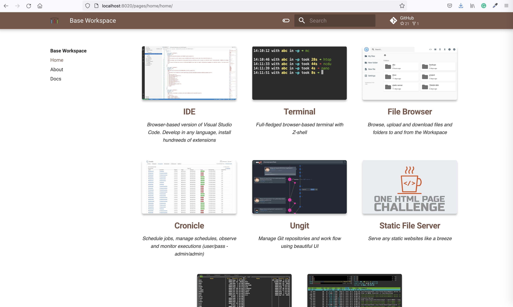

Every workspace has browser-based VS-Code version, full-screen terminal, file manager, and task scheduler. 
You can code, upload and dowload files and schedule periodic executios of scripts and jobs.  

## Quickstart

From the quickstart page you can open workspace apps, such as code editor or terminal 

    Demo: Quickstart page 

## Code Editor

Code editor is a browser-based open-source Visual Studio Code. It is fast, responsive, and full-featured. It features code highlighting, 
autocompletion, a great number of pre-installed color themes. You can install any extension 
from [open-vsx.org](https://open-vsx.org/) that has hundreeds of extensions for VS Code compatible editors. 

## Terminal

Workspace has full-size browser-base terminal

## File Browser

File browser helps to manage files and folders within the workspace, as well as upload and download files and 
folders to and from workspace.

## Scheduler

Cronicle can execute on schedule scripts, jobs and tasks. It has nice UI to monitor executions and failures

