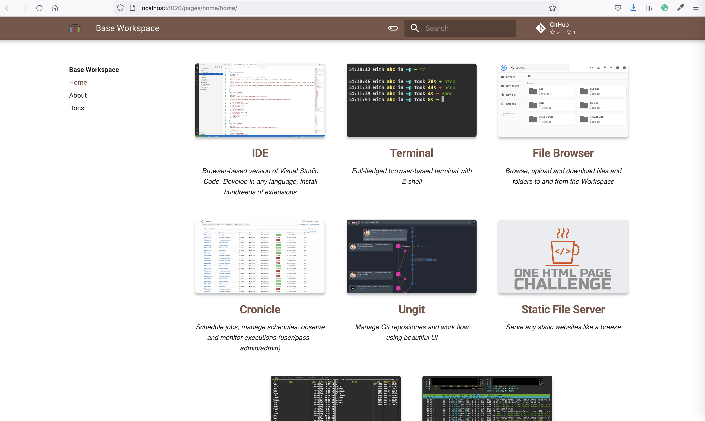

Workspace is a docker image. To create workspace you need to have [Docker](https://docs.docker.com/get-docker/) 
on your computer.  

If you have docker execute docker run command, providing the port mapping for the range of ports from 8020 to 8040.  

For example, to start Codeserver Workspace open terminal, and execute 

```
docker run --name space-1 -d -p 8020-8040:8020-8040 alnoda/codeserver-workspace
```

Open Quickstart page on [localhost:8020](http://localhost:8020)  

<div align="center" style="font-style: italic;">
    Demo: Quickstart page 
</div>

