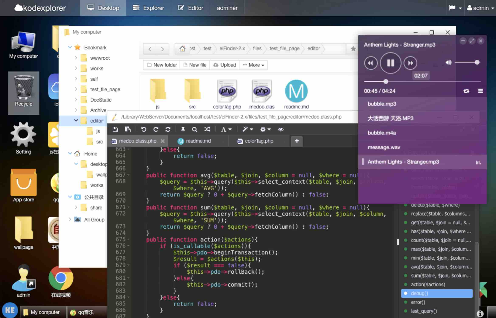
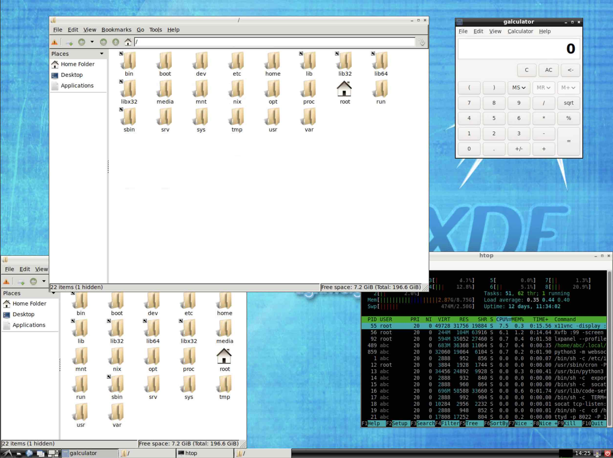

<p align="center">
  
</p>

# Install Desktop 

Do you want to get even more desktop experience? Install browser-based desktop from Alnoda Hub!  

## Web desktop

__KodExplorer__ is windows-style desktop environment with file manager and code editor. 

<div class="termy">
```bash
$ wrk install kodexplorer

✨ starting...
⚠️ Please DO NOT close this terminal window untill app is fully installed!
➡️ checking workspace compatibility...
➡️ checking app compatibility...
➡️ assigning port...
➡️ executing installation script...
✔️ app installed
➡️ setting startup configuration...
-------------------------------------------------------------
- ⚠️ application will start after workspace is restarted ⚠️  -
---       restart workspace with    'wrk kill'             ---
-------------------------------------------------------------
➡️ updating workspace UI...
➡️ adding workspace tags...
❗ Could not update workspace app history at alnoda.org: Not authenticated at alnoda.org
✍️ If app is not working try restarting terminal window or entire workspace
🚀 done
R E S T A R T    T E R M I N A L    N O W   (CTRL+D) !!!!!!!!
```
</div> 

!!! note 
    After installation of applications it is necessary to restart workspace!

Restart workspace with the command `wrk kill`

<div class="termy">
```bash
$ wrk kill   

⚠️ WARNING: this will stop the workspace.
Do you want to continue❓ [y/N]: 
```
</div> 

After worksapce is restarted you can open KodExplorer from the workspace home page.



## Linux desktop environment

Do you want to install a complete Linux desktop in your workspace, that you can use via browser? You can select one of desktop environments 
from the [Alnoda hub](https://alnoda.org/registry/?text=desktop&ord=relevance&uionly=true&qs=Productivity&sel=desktop) and install it in 
the workspace with a single command!  



In the [Alnoda hub](https://alnoda.org/registry/?text=desktop&ord=relevance&uionly=true&qs=Productivity&sel=desktop) you will find 

- __XFCE:__ Lightweight and fast, ideal for lower-end hardware or users who prefer a simple, efficient desktop without sacrificing functionality.

- __LXDE/LXQt:__ Extremely lightweight and resource-efficient, perfect for very old hardware or minimalistic setups.

- __MATE:__ A continuation of GNOME 2, providing a classic desktop experience with simplicity and ease of use. 

For example in order to install LXDE desktop in the Alnoda workspace, open workspace terminal and execute 

<div class="termy">
```bash
$ wrk install lxde-desktop
```
</div> 

!!! note 
    Installation of Linux desktop might take some time. Wait untill the process is finished.


*💡 Explore [__Alnoda Hub__](https://alnoda.org) to find many more awesome applications to install*

<a href="/get-started/personalize/">
    <div id="lottieContainer" style="display: flex; justify-content: flex-end;">
        <div id="lottieAnimation" style="width: 4rem; text-color: #E77260;"></div>
    </div>
</a>
<script src="https://cdnjs.cloudflare.com/ajax/libs/lottie-web/5.8.0/lottie.min.js"></script>
<script>
    var animation = bodymovin.loadAnimation({
      container: document.getElementById('lottieAnimation'),
      renderer: 'svg',
      loop: true,
      autoplay: true,
      path: '../img/arrow-circle-right.json' 
    });
</script>