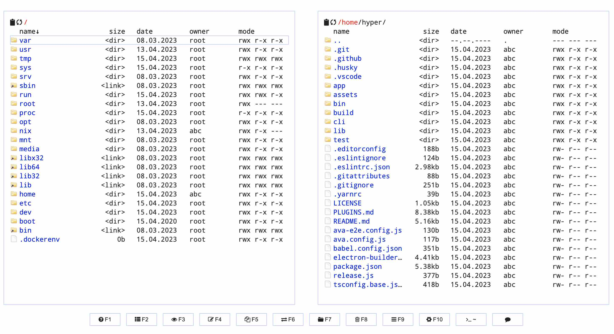

<p align="center">
  
</p>

## Install file manager

In Alnoda Hub you can finnd many applications that can improve your workspace experience. One of them is Cloud Commander - 
a great browser-based file manager, and has many very useful features:

- [x] Has 2 classic panels
- [x] Has 3 built-in editors with support of syntax highlighting
- [x] Console with support of the default OS command line
- [x] Built-in archives extract: zip, tar, gz, bz2, .tar.gz and .tar.bz2

To istall Cloud Commander execute `wrk install cloud-commander` in the workspace terminal

<div class="termy">
```bash
$ wrk install cloud-commander

✨ starting...
⚠️ Please DO NOT close this terminal window untill app is fully installed!
➡️ checking workspace compatibility...
➡️ checking app compatibility...
➡️ assigning port...
➡️ executing installation script...
✔️ app installed
➡️ setting startup configuration...
-------------------------------------------------------------
- ⚠️ application will start after workspace is restarted ⚠️  -
---       restart workspace with    'wrk kill'             ---
-------------------------------------------------------------
➡️ updating workspace UI...
➡️ adding workspace tags...
❗ Could not update workspace app history at alnoda.org: Not authenticated at alnoda.org
✍️ If app is not working try restarting terminal window or entire workspace
🚀 done
R E S T A R T    T E R M I N A L    N O W   (CTRL+D) !!!!!!!!
```
</div> 

!!! warn 
    After installation of applications it is necessary to restart workspace!

Restart workspace with the command `wrk kill`

<div class="termy">
```bash
$ wrk kill   

⚠️ WARNING: this will stop the workspace.
Do you want to continue❓ [y/N]: 
```
</div> 

After worksapce is restarted you can open Cloud Commander from the workspace home page.



*Explore [__Alnoda Hub__](https://alnoda.org) to find many more awesome applications to install*

<a href="/get-started/install-desktop/">
    <div id="lottieContainer" style="display: flex; justify-content: flex-end;">
        <div id="lottieAnimation" style="width: 4rem; text-color: #E77260;"></div>
    </div>
</a>
<script src="https://cdnjs.cloudflare.com/ajax/libs/lottie-web/5.8.0/lottie.min.js"></script>
<script>
    var animation = bodymovin.loadAnimation({
      container: document.getElementById('lottieAnimation'),
      renderer: 'svg',
      loop: true,
      autoplay: true,
      path: '../img/arrow-circle-right.json' 
    });
</script>