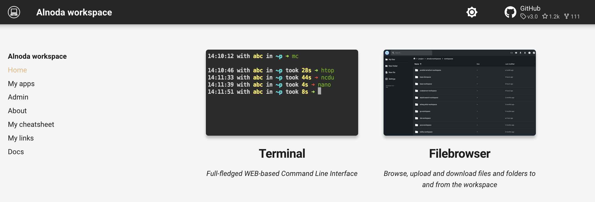

<p align="center">
  
</p>

# Launch workspace 

It is very easy to launch Alnoda workspace - it is just a Docker image, and all you need is to have Docker on your computer. 
If you don't have Docker installed, visit [docker.com](https://www.docker.com/)

To start a foundation Alnoda workspace simply execute this command in your terminal shell, this will work in any system 

```
docker run --name space-1 -d -p 8020-8040:8020-8040 --restart=always alnoda/alnoda-workspace
```

Open your WEB browser and navigate to localhost:8020.

The workspace UI home page includes default applications: a terminal and a file browser. You can open them directly from the page.



Lets install more applications, sich as Integrated Development Environment (code editor), advanced file manager and desktop application. 

<a href="/get-started/install-apps/">
    <div id="lottieContainer" style="display: flex; justify-content: flex-end;">
        <div id="lottieAnimation" style="width: 4rem; text-color: #E77260;"></div>
    </div>
</a>
<script src="https://cdnjs.cloudflare.com/ajax/libs/lottie-web/5.8.0/lottie.min.js"></script>
<script>
    var animation = bodymovin.loadAnimation({
      container: document.getElementById('lottieAnimation'),
      renderer: 'svg',
      loop: true,
      autoplay: true,
      path: '../img/arrow-circle-right.json' 
    });
</script>

