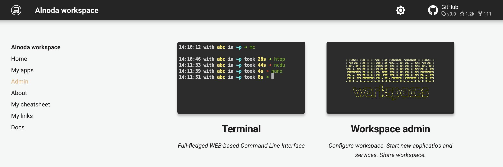
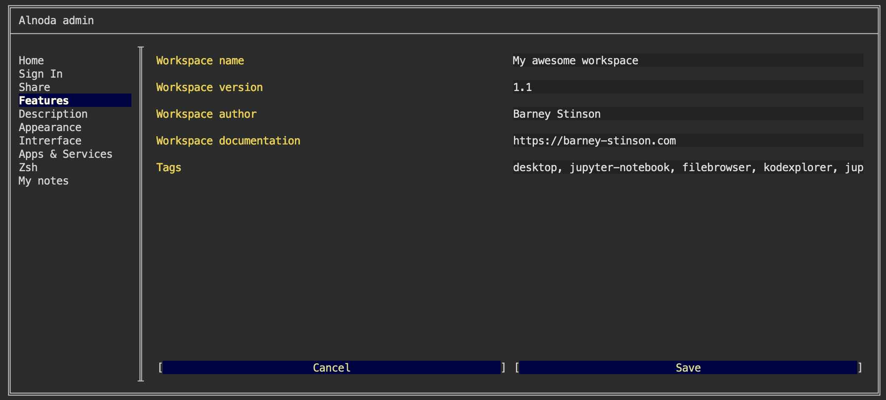
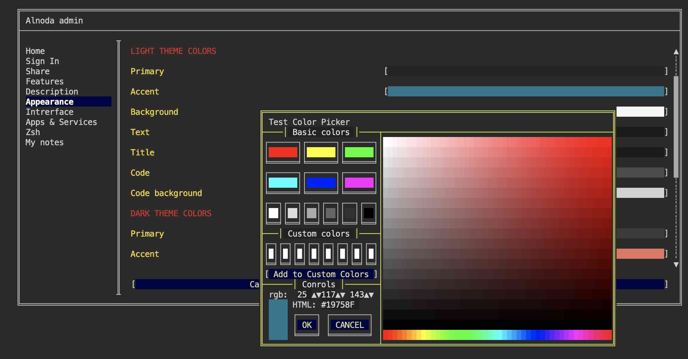

  

# Personalize workspace

To facilitate seamless switching between workspaces, personalizing each workspace can be very useful. This includes customizing its 
name, description, fonts, colors, and icons. By tailoring these aspects to your preferences, you can create a more 
intuitive and visually appealing workspace environment that suits your needs.

Open workspace Admin page, and change workspace name and author:

Modify fonts, colors, and icons: 

!!! info 
    As a font you can use any [Google font](https://fonts.google.com/). Simply update the name of the font.

!!! note 
    Don't forget to sign in from your workspace to Alnoda Hub! You will be able to log your workspaces and applications you 
    installed.

<a href="/get-started/share/">
    

        

    

</a>

