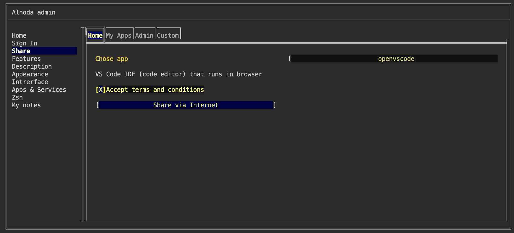
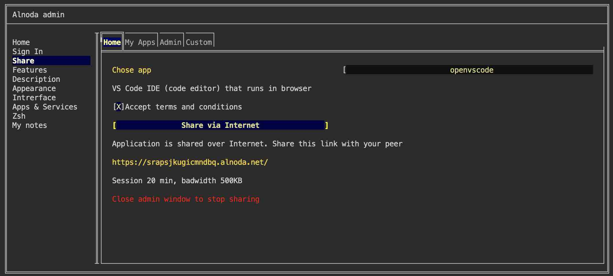

  

# Share workspace

Ready for an online pair coding session? Grant your friend remote access to your code editor over the internet, 
enabling collaborative coding in real-time. 

1. Open Admin, and select VSCode application to share 

2. Accept terms and click button "Share over the Internet"

3. Send the secret link with your peer. She can open VSCode in workspace even if it is running on your PC.

!!! warning 
    Don't close the Admin page - this will stop the sharing session.

!!! info 
    After session ends you can start the sharing session again. 

!!! hint
    Sign in from your workspace to Alnoda Hub and you will be have longer sessions.
