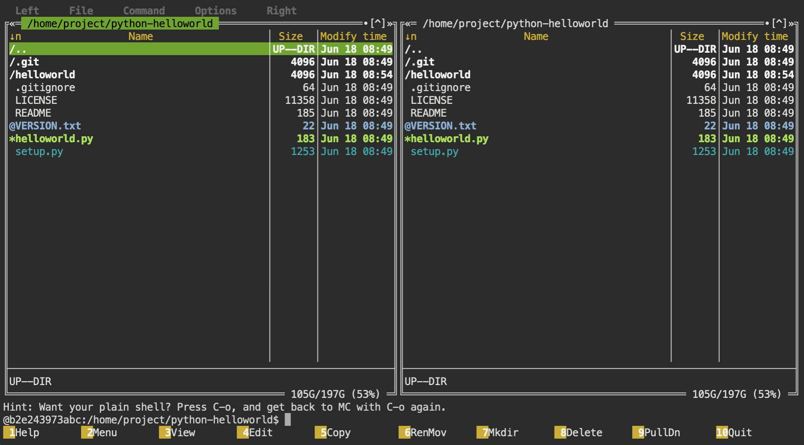

<p align="center">
  
</p>

# Terminal

Terminal with a command-line interface (CLI) allows to interact with the workspace: execute commands, run programs, navigate the file system, manage files and directories, etc.

!!! info 
    Workspaces are based on Linux (Ubuntu) hence you can execute any Linux commands.

!!! note
    Workspaces come with commonly used applications pre-installed, eliminating the need for repetitive installations when creating 
    containerized environments.

## Try it out

Let's clone GitHub repository and explore it with the pre-installed terminal file manager

<div class="termy">
```bash
$ <font color="#5EA702">git</font> clone https://github.com/dbarnett/python-helloworld.git 

Cloning into 'python-helloworld'...
remote: Enumerating objects: 41, done.
remote: Counting objects: 100% (8/8), done.
remote: Compressing objects: 100% (8/8), done.
remote: Total 41 (delta 2), reused 0 (delta 0), pack-reused 33
Unpacking objects: 100% (41/41), 10.59 KiB | 349.00 KiB/s, done.

$ <font color="#5EA702">cd</font> python-helloworld
$ mc
```
</div> 

Execute the command `mc` in the terminal to open the visual file manager Midnight Commander



In the terminal file manager you can browse directories, view and edit files

<a href="/get-started/file-browser/">
    <div id="lottieContainer" style="display: flex; justify-content: flex-end;">
        <div id="lottieAnimation" style="width: 4rem; text-color: #E77260;"></div>
    </div>
</a>
<script src="https://cdnjs.cloudflare.com/ajax/libs/lottie-web/5.8.0/lottie.min.js"></script>
<script>
    var animation = bodymovin.loadAnimation({
      container: document.getElementById('lottieAnimation'),
      renderer: 'svg',
      loop: true,
      autoplay: true,
      path: '../img/arrow-circle-right.json' 
    });
</script>

