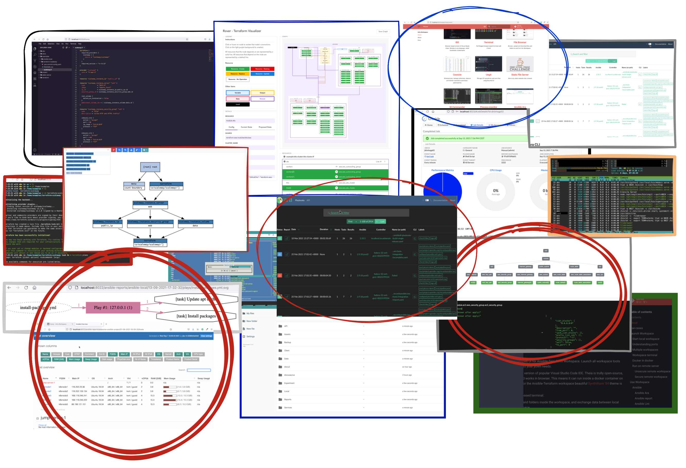

<p align="center">
  
</p> 

# Kubespray workspace

Collection of tools to install, explore, develop, manage and maintain Kubernetes cluster. 



## Why this images

1. You need to set up and manage Kubernetes cluster with Kubespray and Ansible.
2. You need a convenient tool that has everything needed to create infrastructure, install and manage Kubernetes cluster. 

All you need is servers with SSH access (via SSH key) set up. Start workspace, follow brief istructions, and 
you will have Kubernetes cluster up and running. Moreover, with this workspace you will have a broad toolset 
to interact, explore, monitor and develop this cluster.   

Workspace will also be useful for

- declarative infrastructure creation and visualisation (Terraform, Rover, Blast-radius and other)
- create, schedule and monitor maintenance tasks for the k8s cluster and servers (Cronicle, Ansible, Ansible Ara)
- work entirely inside a private network (Browser-based VS-Code, browser-based terminal, browser-based Filebrowser)

## Start
 
```
docker run --name rwid-1 -d -p 8020-8040:8020-8040 -p 9000:9000 alnoda/kubespray-workspace
```  

and open [localhost:8020](http://localhost:8020) in browser.  

## Features

**Kubernetes tools:**

- [Kubespray](https://github.com/kubernetes-sigs/kubespray#requirements) with required dependencies. 
- [Octant](https://github.com/vmware-tanzu/octant) - highly extensible platform for developers to better understand the complexity of Kubernetes clusters.
- Kubectl - Kubernetes command-line tool, allows you to run commands against Kubernetes clusters.
- [Helm](https://helm.sh/) - package manager for Kubernetes.
- [K9s](https://github.com/derailed/k9s) - Kubernetes CLI To Manage Your Clusters In Style.
- [Kube-shell](https://github.com/cloudnativelabs/kube-shell) - integrated shell for working with the Kubernetes CLI.
- [Krew](https://krew.sigs.k8s.io/) - plugin manager for kubectl command-line tool.
- [kubectl-aliases](https://github.com/ahmetb/kubectl-aliases) - hundreds of convenient shell aliases for kubectl.

**Ansible tools:**

- [**Ansible**](https://docs.ansible.com/)
- [**Ansible Ara**](https://github.com/ansible-community/ara)
- [**Ansible-cmdb**](https://github.com/fboender/ansible-cmdb)
- [**Ansible inventory grapher**](https://github.com/willthames/ansible-inventory-grapher)
- [**Ansible Playbook Grapher**](https://github.com/haidaraM/ansible-playbook-grapher)
- [**Ansible Lint**](https://ansible-lint.readthedocs.io/en/latest/installing.html)
- [**Ansible Doctor**](https://ansible-doctor.geekdocs.de/)

**Terraform tools:**

- [**Terrraform**](https://www.terraform.io/)
- [**Pre-commit-terraform**](https://github.com/antonbabenko/pre-commit-terraform)
- [**Rover**](https://github.com/im2nguyen/rover)
- [**Blast-Radius**](https://github.com/28mm/blast-radius)
- [**Terraform Visual**](https://github.com/hieven/terraform-visual)
- [**Terraform Graph**](https://www.terraform.io/docs/cli/commands/graph.html)
- [**Inframap**](https://github.com/cycloidio/inframap)

**Dev tools:**

- [**Eclipse Theia**](https://theia-ide.org/docs/) - open source version of popular Visual Studio Code IDE. Theia is trully open-source, has 
VS-Code extensions and works in browser. This means it can run inside a docker container on local machine or in cloud. A lot of beautiful color themes and many common plugins are already installed to save time.  
- [**Terminal**](https://github.com/tsl0922/ttyd) - secure browser-based terminal.
- [**FileBrowser**](https://github.com/filebrowser/filebrowser)  - manage files and folders inside the workspace, and exchange data between local environment and the workspace
- [**Cronicle**](https://github.com/jhuckaby/Cronicle)  - task scheduler and runner, with a web based front-end UI. It handles both scheduled, repeating and on-demand jobs, targeting any number of worker servers, with real-time stats and live log viewer.
- [**Static File Server**](https://github.com/vercel/serve) - view any static html sites as easy as if you do it on your local machine. Serve static websites easily.
- [**Ungit**](https://github.com/FredrikNoren/ungit) - rings user friendliness to git without sacrificing the versatility of it.
- [**MkDocs**](https://squidfunk.github.io/mkdocs-material/)  - create awesome documentation for your project with only markdown. 
- [**Midnight Commander**](https://midnight-commander.org/)  - Feature rich visual file manager with internal text viewer and editor. 
- [**Process Monitor**](https://htop.dev/)  - Monitor running process and resource utilization. 
- Quicklaunch UI with getting started tutorial

Image is built from **Ubuntu 20.4** with the additional CLI apps

- [Zsh](https://www.zsh.org/), [Oh my Zsh](https://ohmyz.sh/)
- Python 3, Pip, Pipx 
- Node/nodeenv
- curl, wget, telnet, jq
- **Git:** git, git-flow, lazygit 
- **File browsers:** mc, xplr
- **Text editors:** nano, vim, mcedit
- **System monitors:** ncdu, htop, glances, vizex
- **Process Control:** supervisord
- **Job scheduler:** cron

