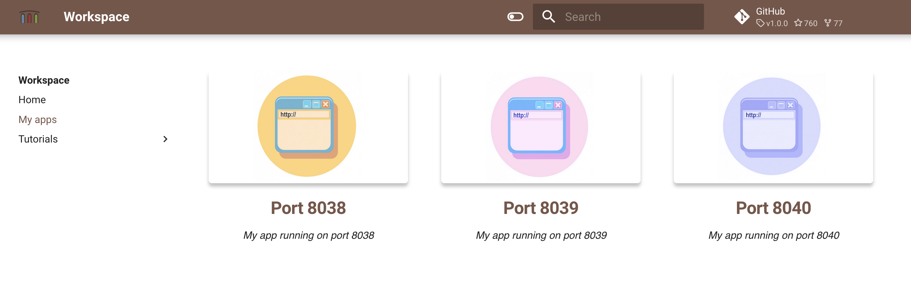

This tutorial shows how to install other versions of Node.js, install packages with Npm and 
Yarn, create simple web server

## Node.js

Open workspace terminal and check Node.js or npm versions 

```
node -v
npm -v
```

To start Node.js REPL session simply execute 

```
node
```

## Nvm

NOTE: nvm does not work from the Codeserver embedded terminal.  

Use another version of Node.js

```
nvm install 16.0.0
nvm use 16.0.0
```

## Npm

Check npm version 

```
npm -v
```

Install latest version of npm

```
npm install -g npm@latest
```

## Yarn

[Yarn](https://yarnpkg.com/) is a package manager for Node. js that focuses on speed, security, and consistency. 
It was originally created to address some issues with the popular NPM package manager.

```
npm install --global yarn
yarn --version
```

## Nodeenv

Node.js virtual environment - a tool to create isolated node.js environments.

It creates an environment that has its own installation directories, that doesn’t share libraries with other node.js virtual environments.  

Create folder and vrtual ennvironment in it

```
mkdir /home/project/venv-test 
cd /home/project/venv-test
nodeenv --node=12.18.3 env && . env/bin/activate 
```

Check Nnode.js version

```
node -v
npm -v
```

## Simple example

Clone example project 

```
cd /home/project
git clone https://github.com/contentful/the-example-app.nodejs.git 
cd the-example-app.nodejs
```

Install the dependencies

```
npm install
```

Start app

```
export PORT=8040
npm run start:dev
```

Open Quickstart page, go to "My apps" and use port 8040 shortcut to open your web app




