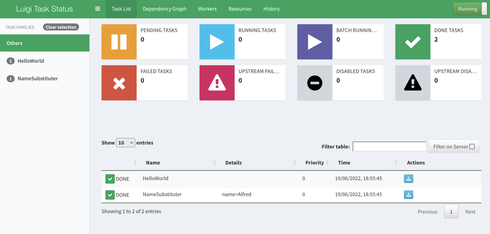

This basic example shows how to create pipelines in the workspace with Luigi or Ploomber.  

## Luigi

[Luigi](https://github.com/spotify/luigi) is a Python package that helps you build complex pipelines of batch jobs. 
It handles dependency resolution, workflow management, visualization, handling failures, command line integration, and much more.  

Luigi workflows consists more or less of tasks and targets.   

1. __Targets__. Broadly speaking, the Target class corresponds to a file on a disk. Or a file on S3. 
Or some kind of a checkpoint, like an entry in a database. You might use the LocalTarget, S3Target, or FTPTarget classes 
that are available out of the box. These directly map to a file on the local drive, on S3, or in FTP, respectively.  

2. __Tasks__ are defined as python classes that subclass the luigi.Task superclass. Each task has methods that 
the workflow designer is supposed to implement:

    - requires(): should return one or more instantiated tasks that the current task depends on.
        You can have as many upstream dependencies as you like, or you can indicate zero dependencies by returning an empty array (return []), which you'll often do for the Task that kicks off a pipeline. Returning None also works.
    - output(): return one or more targets objects, typically representing files, the the current task will produce when run.
        When you run a pipeline, Luigi first checks whether its output Targets already exist, and if not, schedules the Task to run. Otherwise, Luigi assumes that the Task is complete, and does not rerun it.
    - run(): Here goes all the code that the task should run as its job.

__Example 1__

Workspace includes couple of Luigi examples in the folder `/home/exemples/luigi`. 
From the Quickstart page go to IDE and explore file `helloworld.py` in the VS-Code editor. 
You can see the most basic Luigi workflow, which consists of just one task that creates textual file with one line - "Hello World!".  

You can see in this example one task - class 'HelloWorld' which extends 'luigi.Task'. This class implements alle the abovementioned 
methods: requires(), output() and run(). This task has no depenndencies, thus requires() returns None. Output uses 'LocalTarget', which  
is a .txt file. The run() method outputs to the Target.   

You can execute this Luigi workflow, open terminal, cd to the folder and run 

```
cd /home/examples/luigi
python helloworld.py --local-scheduler HelloWorld
```


You can see that file 'helloworld.txt' has appeared in the same folder as expected.  

__Example 2__

The first example was executed with the '--local-scheduler' flag. 

While the --local-scheduler flag is useful for development purposes, it’s not recommended for production usage. 
The centralized scheduler serves two purposes:

- Make sure two instances of the same task are not running simultaneously
- Provide visualization of everything that’s going on.

Workspace has centralized Luigi Scheduler up and running, any Luigi workflow executed without the'--local-scheduler' flag, 
will be tracked by the Luigi scheduler. For example, 
 
```
cd /home/examples/luigi
python luigitutorial-2.py NameSubstituter --name Alfred
```

Go to the Quickstart page, and open Luigi UI. You can see that the workflow execution was captured, you can explore 
tasks and history of executions. 




#### Useful links:

- [Luigi Github Repo](https://github.com/spotify/luigi)
- [Luigi on PyPi](https://pypi.org/project/luigi/)
- [A Tutorial on Luigi, the Spotify’s Pipeline](https://towardsdatascience.com/a-tutorial-on-luigi-spotifys-pipeline-5c694fb4113e)
- [Create your first ETL in Luigi](http://blog.adnansiddiqi.me/create-your-first-etl-in-luigi/)
- [Building Data Science Pipelines with Luigi and Jupyter Notebooks](https://intoli.com/blog/luigi-jupyter-notebooks/)


## Ploomber

[Ploomber](https://ploomber.io/) is the fastest way to build data pipelines with Jupyter notebooks. 

Ploomber helps you build modular pipelines. A pipeline (or DAG) is a group of tasks with a particular execution order, 
where subsequent (or downstream tasks) use previous (or upstream) tasks as inputs.  

Create file `pipeline.yaml ` with the following content 

To demonstrate Ploomber, chose and download a Ploomber examples 

```
# list examples
ploomber examples

# choose an example, and download with name
ploomber examples --name {name}

# download the following example
ploomber examples --name guides/first-pipeline 
```

This pipeline is an introductory tutorial to learn the basics of Ploomber. Pipeline contains five tasks, 1-get.py, 
2-profile-raw.py, 3-clean.py, 4-profile-clean.py and 5-plot.py. The pipeline.yaml file defines the execution order 

 

Read more abou this pipeline in the [pipeline documentation]([Pipeline documentation](https://github.com/ploomber/projects/blob/master/guides/first-pipeline/README.ipynb))  

Explore the tasks with the Jupyter Lab. Notice, that tasks are `.py` files, but they are not mere scripts - they 
are jupytext notebooks. Open them as notebooks 

 

In order to execute, cd to the downloaded pipeline folder, and run 

```
cd guides/first-pipeline/
ploomber build
```

The execution produces an output in the ./output folder. Copy it to the folder served by a static file serer.  

```
cp -r output /home/static-server
```

Now you can open Static File Server from the Quickstart page, and explore the output. 


