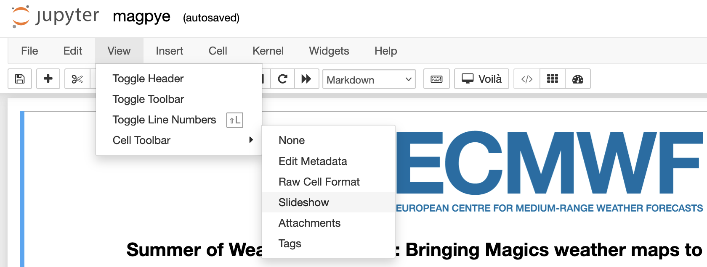
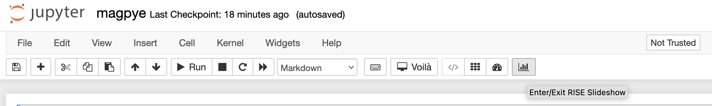
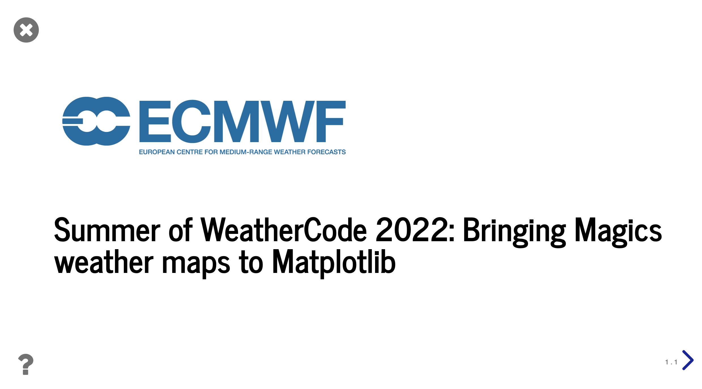

# Presentations from Jupyter notebooks

Jupyter notebooks is an awesome environment for creating slides and presentations. 
This is especially useful, if you need to make a presentation as a result of the analysis 
and experiments done in the notebook itself.  

First let's copy an example notebook to the project forlder. Open Quickstart, and then Terminal, execute

```
cp /home/examples/jupyter/magpye.ipynb /home/project/
```

Now open Jupyter notebook, and open the notebook we have just copied.  

First thing to do - is to enable cell Slideshow toolbar. Click 'View' -> 'Cell toolbar' -> 'Slideshow'



Assign different types of slide to notebook cells: 

- Slide: Presents each cell in a different slide. Good for containing heading, sub-heading, image and text notes. Use right arrow to navigate.
- Sub-slide : A continuation from the previous slide. Use down arrow to go to a sub-slide from a slide.
- Fragment : Fragment is interesting because it presents multiple cells in one slide one by one.
- Skip/Notes : Skip skips the marked cells. Cells that are unused for the presentation can also be marked as the notes.

Click on the toolbar pannel 'enter RISE slideshow' 



Navigate through the presentation




## nbless

If you don't want to bother making slides yourself, nbless can do it for you, creating reasonable slides from 
your notebook.    

The [nbless](https://github.com/py4ds/nbless) Python package includes `nbdeck` shell command which prepares 
a notebook to be viewed as or converted into slides. Try it out with the example notebook 

```
nbdeck /home/examples/jupyter/magpye.ipynb -o /home/project/nbless-slides.ipynb
```

Open Jupyter notebook, go to notebook 'nbless-slides.ipynb' and click on the toolbar pannel 'enter RISE slideshow'.  

Now you can convert notebook into HTML presentation with the `nbconv` shell command.  

```
nbconv /home/project/nbless-slides.ipynb  -e slides -o /home/static-server/nbless-slides.html 
```

Folder '/home/static-server' can be viewed with the Static File Server. Open Static File Server from the Quickstart page, 
and view the generated HTML slides. 