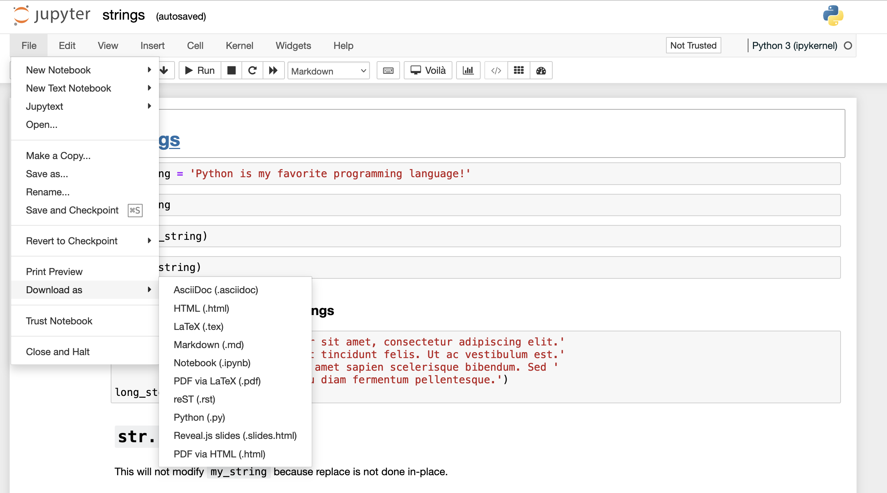
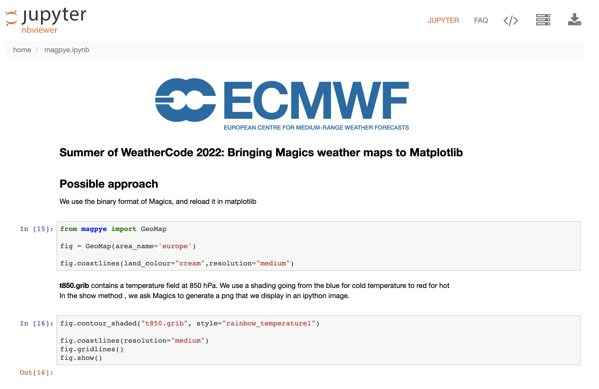

# Reports from notebooks 

Jupyter notebook - is a famous exploration and visualisation tool, which in turn makes it a good 
option to present the results or becoming a reporting solution.  

There are couple options how to create reports from notebooks:

1. Notebooks in view-only mode
2. Notebooks converted to different formats that can be downloaded

This workspace has necessary tools to enable all of these options.  


## Jupyter notebook and Jupyter Lab

The easiest way to create a report from the Jupyter notebook is export and download it directly from the Jupyter 
notebook or Jupyter Lab. Oopen any notebook go to 'File' -> 'Download as' and coose the format 

 

This is an easy and fast option, but the tools listed below provide more functionality. They are executed in terminal, 
and hence can be scheduled to be executed automatically. You can get a daily report of your stock price technical analysis 
ready for you without the need to execute notebook yourself. You can view the report whenever yopu want. 


## NBViewer

[NBViewer](https://github.com/jupyter/nbviewer) is a web service that displays Jupyter notebooks in view-only mode. NBViewer does not 
execute notebooks.  

NBViewer suits the purpos to visualize executed notebooks. It is also a hub for sharing notebooks, as users can download notebooks 
from NBViewer.    

Workspace has NBViewer up and running, it serves notebooks from the folder `/home/project/nbviewer`. It is enough to simply 
move or copy your Jupyter notebook to this folder to make it displayed by the NBViewer.    

Copy an example notebook to the NBviever folder 

```
cp /home/examples/jupyter/magpye.ipynb /home/project/nbviewer 
```

Open Notebook Viewer from the Quickstart page.  

 

__HINT:__ if you need to view freshly executed notebook every day, schedule periodic executions with Cronicle.  


## Nbconvert 

With [Nbconvert](https://nbconvert.readthedocs.io/en/latest/index.html) we can convert an .ipynb notebook 
to various static formats including HTML, PDF, LaTeX, Markdown.  

Workspace has a Static File Server, which serves HTML pages from folder `/home/static-server`. Let's convert 
Jupyter notebook to the HTML page in this folder

```
jupyter nbconvert --to html /home/examples/jupyter/magpye.ipynb --output /home/static-server/magpye
```

From the Quickstart page open Static File Server, and then open 'magpye.html'.  

 

If you want to hide code in the output, add `--no-input` flag

```
jupyter nbconvert --to html --no-input /home/examples/jupyter/magpye.ipynb --output /home/static-server/magpyeout
```

 

Nbconvert can convert to other formats too, such as PDF, 

```
jupyter nbconvert --to pdf /home/examples/jupyter/magpye.ipynb --output /home/project/magpye
```

From the Quickstart page open Filebrowser, go to folder '/home/project', preview and download pdf file 

 

If you want to convert notebook to LaTeX, run

```
jupyter nbconvert --to latex /home/examples/jupyter/magpye.ipynb --output /home/project/magpyetex
```


## Voila

[Voilà](https://voila.readthedocs.io/en/stable/) allows you to convert a Jupyter Notebook into an interactive dashboard 
that allows you to share your work with others.   

Voila is up and running as a standalone application inside the workspace. Shortcut for Voila can be found on the Quickstart page.    

To serve notebok with Voila it is enough to move this notebook to the folder '/home/project/voila'.   

Voila can serve any notebook. Upon opening, notebook is executed. This is a differece with NBViewer that does not run 
notebooks.  

To demonstrate how Voila works, copy an example notebook to the served folder 

```
cp /home/examples/notebooks/basic-notebook.ipynb /home/project/voila/
```

Open Voila dashboard and check the notebook.  

 

Voila can also serve notebooks with interactive widgets, as well as notebook with Slides. 
Workspace has several examples of such interactive notebooks. Copy examples to the folder served

```
cp /home/examples/voila/* /home/project/voila/
```


## Datapane

[Datapane](https://github.com/datapane/datapane) is a Python library for building interactive reports for your end-users in seconds.  

Workspace has everything needed to get started with the Datapane. You can see how datapane works by following instructions and 
running cells in the tutorial notebook 'datapane.ipynb'.   

Save resulted reports in the folder '/home/static-server/', open Static Server from the Quickstart page, and explore the 
generated reports. 

 


## Cronicle

With [Cronicle](https://github.com/jhuckaby/Cronicle) we can easily schedule executions of shell commands and scripts. Cronicle 
has WEB UI, monitor of executions, collect logs and advanced features such as limiting resources for each execution.  

From the Quickstart page open Cronicle, (Cronicle user/pass: admin/admin), go to 'Schedule' and add new Event. Chose category 'General' 
and plugin 'Shell script'. Now we can configure the schedule, and provide any of the command to be executed.
