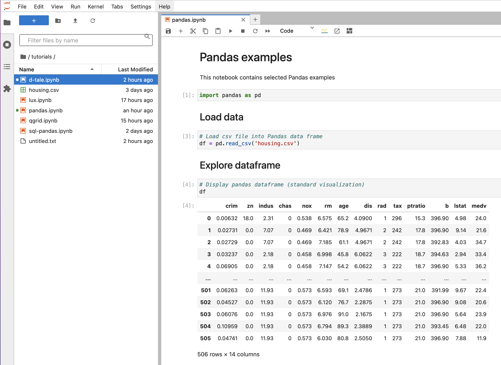
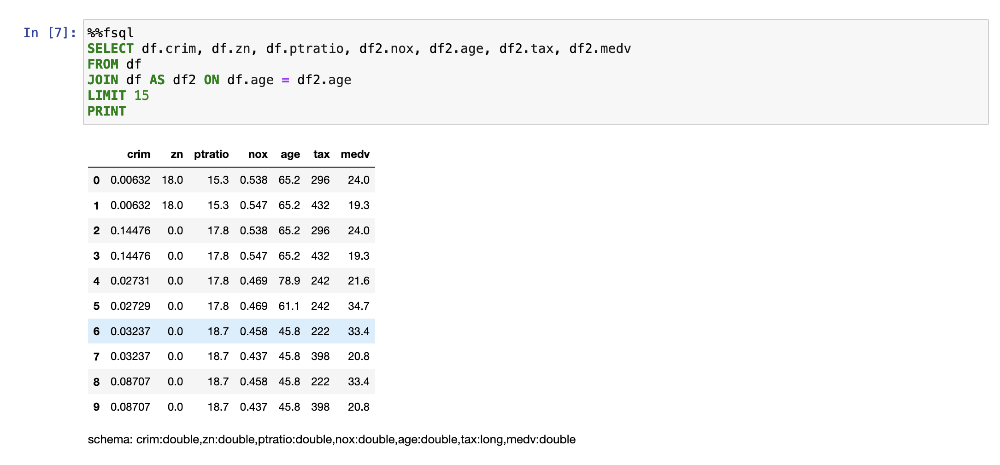
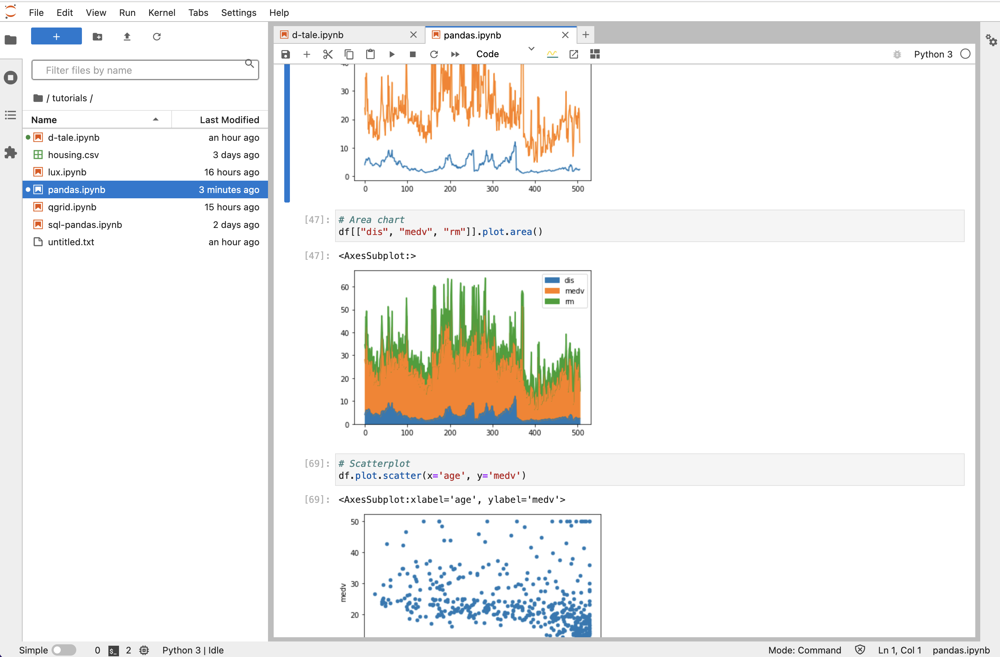

## Working with Data

Jupyter notebooks are famous for their convenience to explore, experiment and visualize. All these steps include 
working with data, including data manipulations and looking on data, tables and charts.   

Workspace has several popular python data packages including numpy, pandas, and matplotlib. 
To start with, copy tutorial notebooks into the project forlder.

```
cp -r /home/examples/tutorials /home/project
```

## Pandas

[Pandas](https://pandas.pydata.org/) is a fast, powerful, flexible and easy to use open source data analysis and manipulation tool,
built on top of the Python programming language.  

Workspace contains basic pandas tutorial notebook. Open in Jupyter `tutorials/pandas.ipynb` and follow the steps 

 

Explore entire [pandas documentation](https://pandas.pydata.org/docs/user_guide/index.html)


## Pandas SQL

Pandas is great for complex data transformations, but some queries on data frames can be much easier with the standard SQL.  

Workspace has [Fugue SQL](https://fugue-tutorials.readthedocs.io/tutorials/fugue_sql/index.html) which allows querying and 
transforming pandas data frames.  

FugueSQL integrates with Python by creating extensions and applying them in the `%%fsql` cells. Open in Jupyter 
`tutorials/sql-pandas.ipynb` and run with examples cells one-byone, following the instructions 

 


## Charts

Plotting charts - is one of the most typical steps in experiments, analytics and data science.  

Workspace has several popular plotting packages installed, which you can use to visualise trends and patterns in your data: 

- [Matplotlib](https://matplotlib.org/) 
- [Seaborn](https://seaborn.pydata.org/examples/index.html)
- [Plotline](https://github.com/has2k1/plotnine)
- [Plotly](https://plotly.com/python/getting-started/#installation)

Workspace includes tutorial notebook `tutorials/charts.ipynb`, open and follow the instructions 




