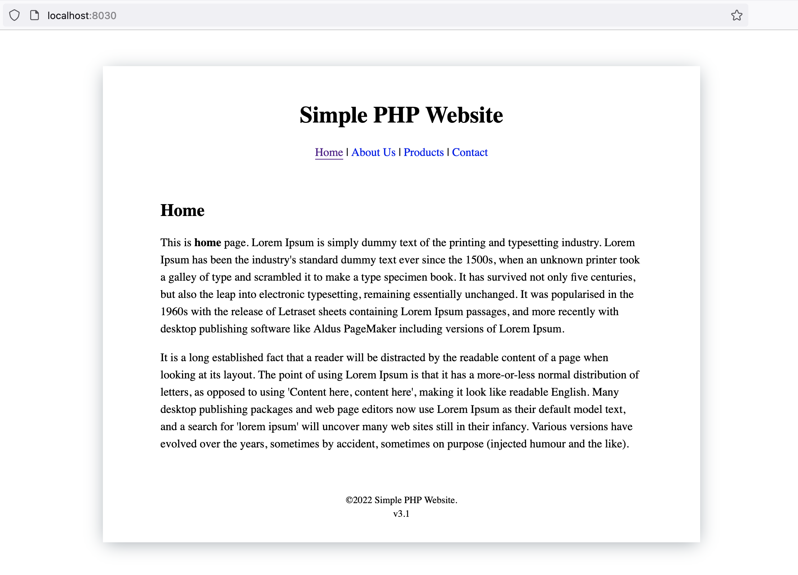

This basic tutorial shows how to create a Hello-world PHP app, serve example websites and how to install 
packages with Composer.

## Hello World

Check PHP version

```
php -v
```

Open IDE and create file `hello.php` with the following content

```
<html>
 <head>
  <title>PHP Test</title>
 </head>
 <body>
 <?php echo '<p>Hello World</p>'; ?> 
 </body>
</html>
```

Start server in terminal 

```
cd /home/project
php -S 127.0.0.1:8040
```

Open Quickstart page, go to "My apps" and use port 8040 shortcut to open your web app


## Website example

Clone GitHub repo with a PHP website, for example

```
git clone https://github.com/banago/simple-php-website.git
```

Server with PHP development server

```
cd simple-php-website
php -S 0.0.0.0:8040
```

Open Quickstart page, go to "My apps" and use port 8040 shortcut to open your web app



## Composer

Install package with Composer

```
composer require phpunit/php-timer
```

