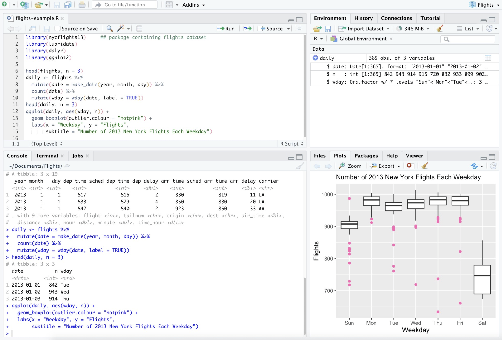
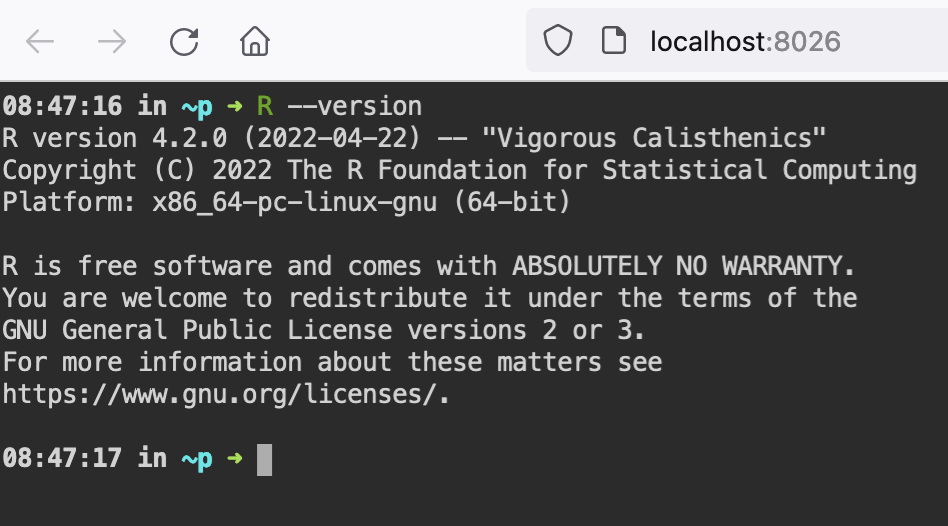
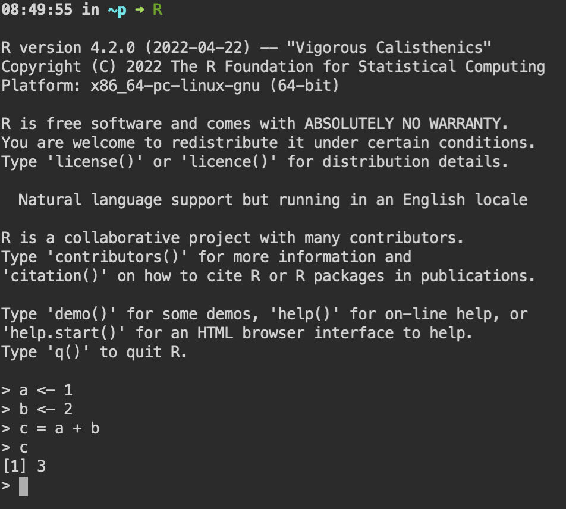
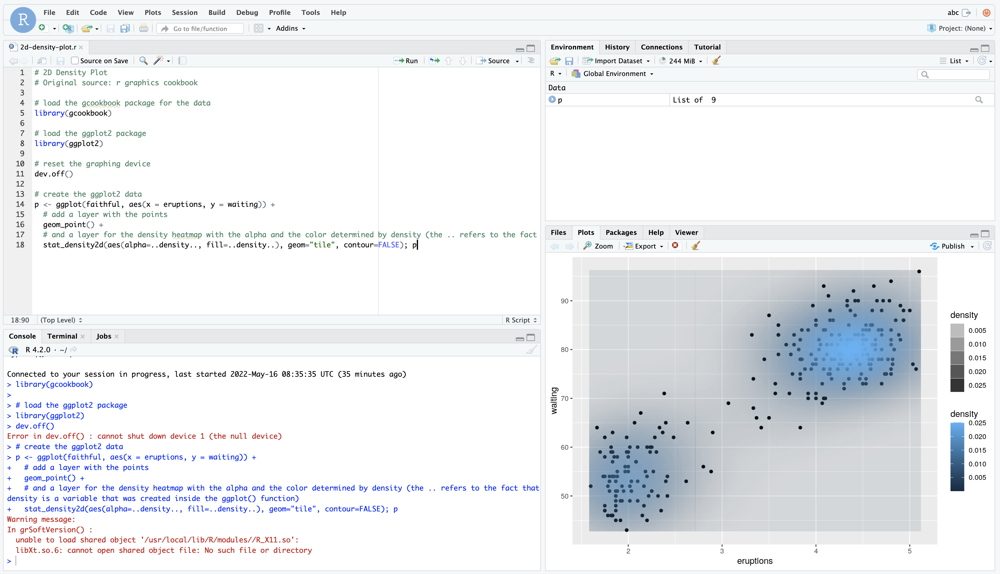

This basic tutorial shows how to work with R in this workspace. 

Workspace includes RStudio Server, a browser-based IDE for R. RStudio Server - is the best way to use R for 
statistics, data analytics and visualisation.



Workspace has full-size browser-base terminal. 


## R

Open terminal, and check R version 

```
R --version
```



To start R shell, simply execute `R` in the terminal



If you want to install packages from the terminal, execute 

```
Rscript -e 'install.packages("drat", repos="https://cloud.r-project.org")'
```


## Examples

Open workspace terminal and clone example repository 

```
cd /home/abc 
git clone https://github.com/dmarcelinobr/r-code-examples.git
```

Open Rstudio, and try some examples, i.e. `2d-density-plot.r`. Evaluate code, agree to install dependencies 


