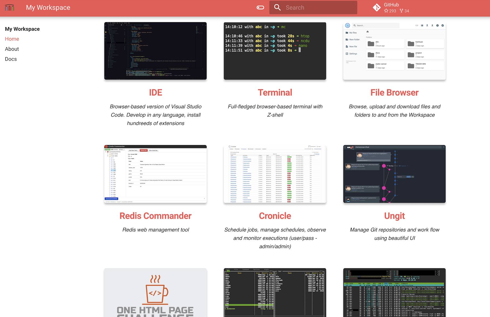
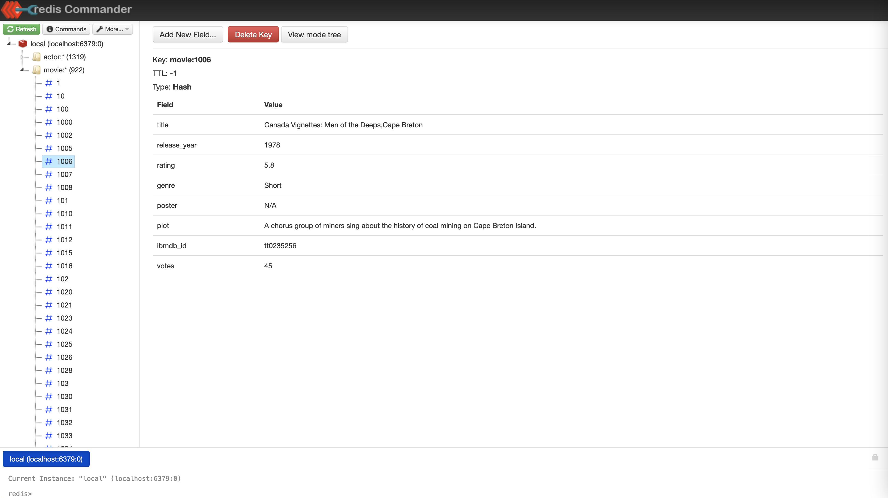
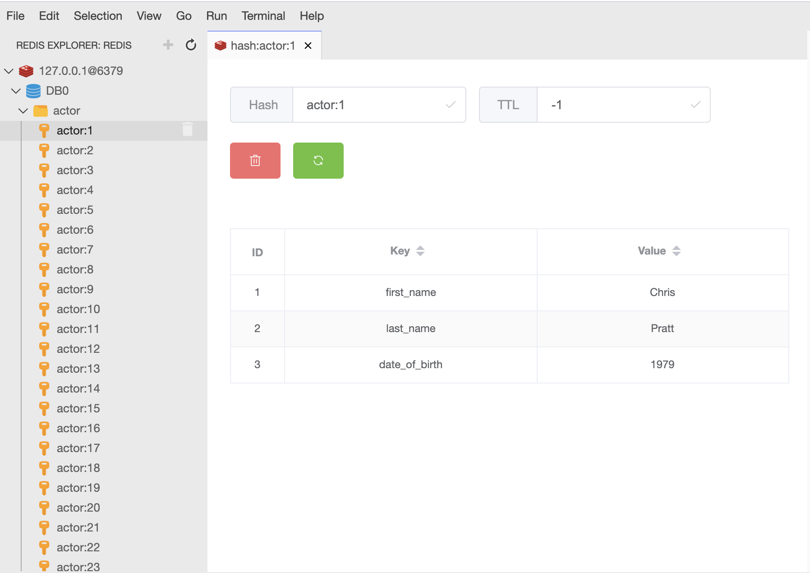
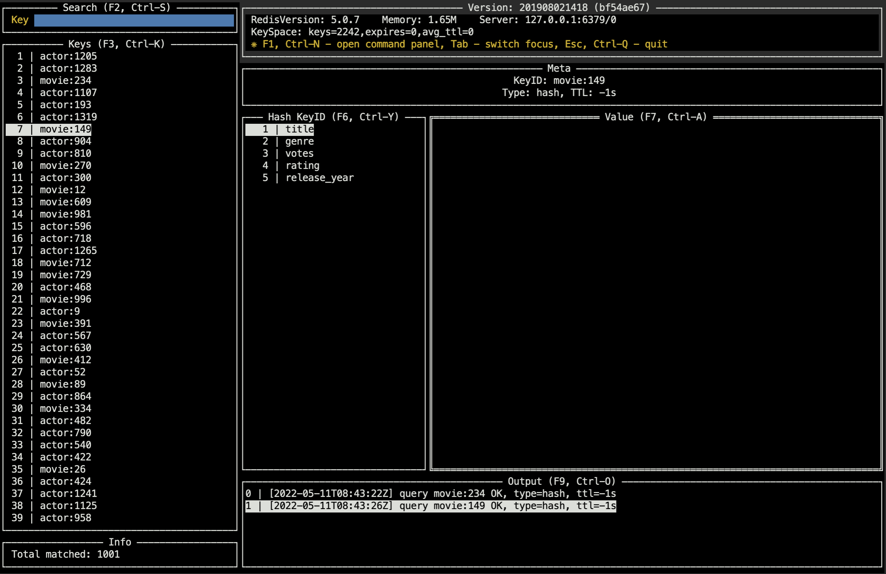
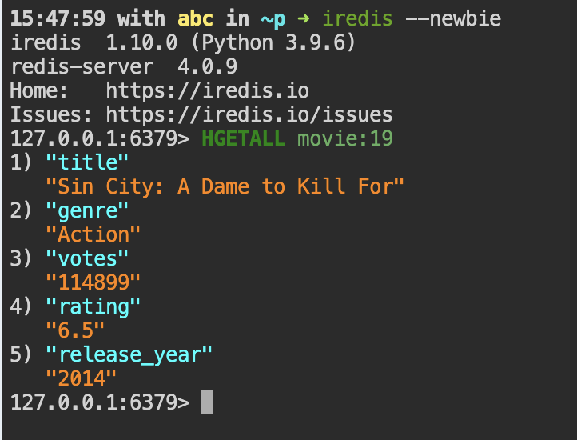
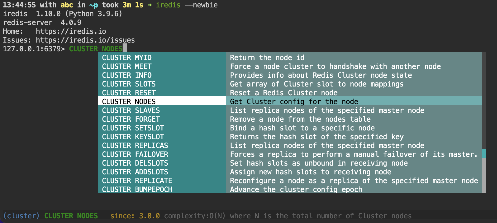

This doc has examples how to use workspace to interact with Redis.  

In examples we use local Redis that is running inside the workspace, but the commands apply to any Redis instance.

Open Quickstart for quick access to all the tools, including workspace terminal.



Open workspace terminal, and load example Redis datasets 

```
git clone https://github.com/redis-developer/redis-datasets.git /home/project/redis-datasets
cat /home/project/redis-datasets/movie-database/import_actors.redis | redis-cli 
cat /home/project/redis-datasets/movie-database/import_movies.redis | redis-cli 
```

## Redis Commander

Open Redis Commander and explore Redis databases 



Alternatively use browser-based VS-code with Redis extension



## CLI tools

If you prefer working in the terminal, explore Redis with [Redis-Tui](https://github.com/mylxsw/redis-tui). 
To connect to the internal Redis instance simply execute 

```
redis-tui
```



To interact with internal Redis, inn the workspace terminal launch iredis CLI, get & set keys 

```
iredis
```



Iredis has autocompletion and hints, which might be handy for administrative tasks

```
iredis --newbie
```



Create dump of the Redis database

```
redis-dump-go -h localhost > /home/redis-movie-dump.resp 
```

Go to the file browser and download the database dump to your PC 
