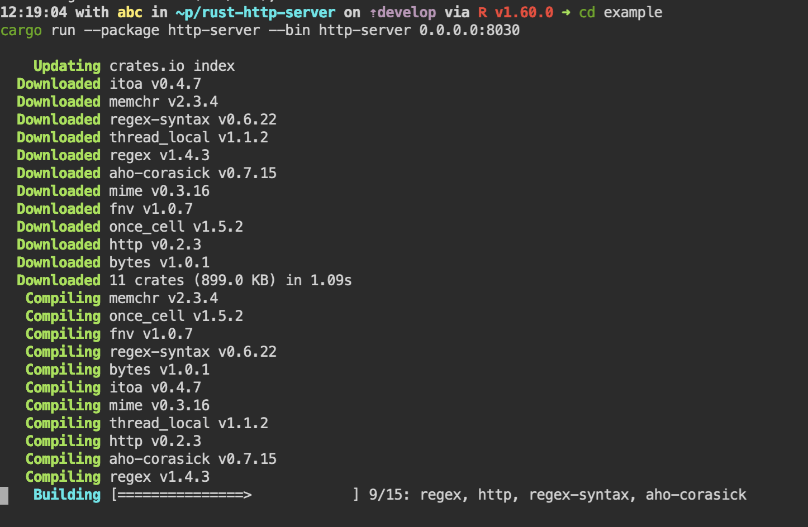

This basic tutorial shows how to create Rust Hello-world application, manage multiple versions of Rust with Rustup 
and install dependencies with Cargo.

## Hello world

Check Rust version 

```
rustc --version
```

Create new project folder

```
cargo new my_example
cd my_example
```

The new project is created together, with hello-world app in `src` sub-folder

```
cat src/main.rs
```

Compile it

```
cargo build
```

And then run it

```
./target/debug/my_example
```

We can also compile and then run it, all in one step

```
cargo run
```

## Rustup

[Rustup](https://rustup.rs/) - is a toolchain is a specific version of the collection of programs needed to compile a Rust application. 
It includes, but is not limited to:

- The compiler, rustc
- The dependency manager and build tool, cargo
- The documentation generator, rustdoc

Rustup provides ways to install, remove, update, select and otherwise manage these toolchains and their associated pieces.

Install specific version of Rust toolchain

```
rustup install 1.30.0
```

Show toolchains

```
rustup show
```

Change default toolchain

```
rustup default 1.30.0
```


## Project with dependencies

[Cargo](https://doc.rust-lang.org/cargo/) is Rust package manager. It is a tool that allows Rust packages to declare their 
various dependencies and ensure that you’ll always get a repeatable build.  

Clone example repo 

```
git clone https://github.com/rdesarz/rust-http-server.git
cd rust-http-server
```

Build and start the server 

```
cd example
cargo run --package http-server --bin http-server 0.0.0.0:8040
```

You will see that before cargo builds the package, it installs all the dependencies from the file `Cargo.toml`.  



Open Quickstart page, go to "My apps" and use port 8040 shortcut to open your web app


