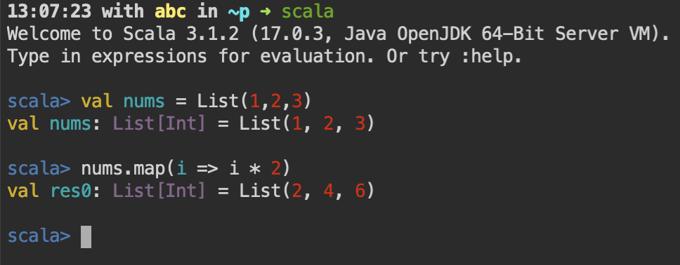

This basic tutorial shows how to create Scala Hello-world application, build and run project 
with Sbt. As well as manage Scala dependencies and versions with Coursier.

## Scala

To check scala version, execute in terminal

```
scala -version
```

To open scala REPL simply execute

```
scala
```



### Hello world

Use Code editor to create folder `helloworld` with file `Hello.scala` in it. The file should have the following content 

```
object Hello {
    def main(args: Array[String]) = {
        println("Hello, world")
    }
}
```

Open terminal, go into this folder and execute 

```
scala Hello.scala 
```

### Hello world with sbt

cd to the projects directory, and create new project with Sbt 

```
cd /home/project
sbt new scala/scala3.g8
```

Upon prompt type any project name, i.e. "hello-world". Sbt will generate progje boilerplate with the required folder structure.  

Enter the project folder, compile and run the app

```
sbt run 
```

## Coursier

[Coursier](https://get-coursier.io/) is the Scala application and artifact manager. It can install Scala applications and setup your Scala development environment. 
It can also download and cache artifacts from the web.  

Coursier provides a number of services:
- manage the installed Scala applications: `install`, `list`, `update`, `uninstall`, `search`
- configure channels to install Scala applications from: `channel`
- launchers for Scala applications: `launch`, `bootstrap`
- manage the installed JVMs: `java`, `java-home`
- directly manipulate Maven dependencies: `fetch`, `resolve`
- perform setup again

List all applications, installed by Coursier

```
cs list
```

The `install` command installs Scala applications, i.e. 

```
cs install scalafmt
```

If you want to launch another scala version 

```
cs launch scala:2.12.15
```
