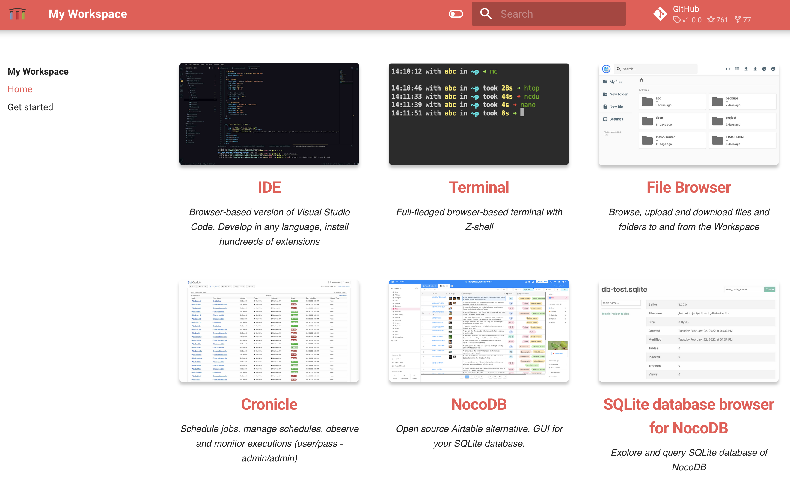
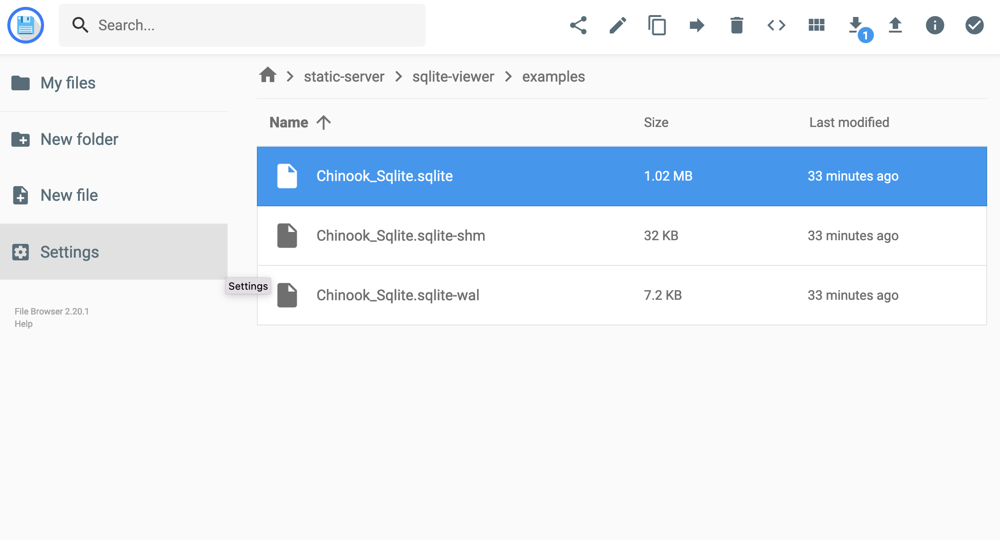
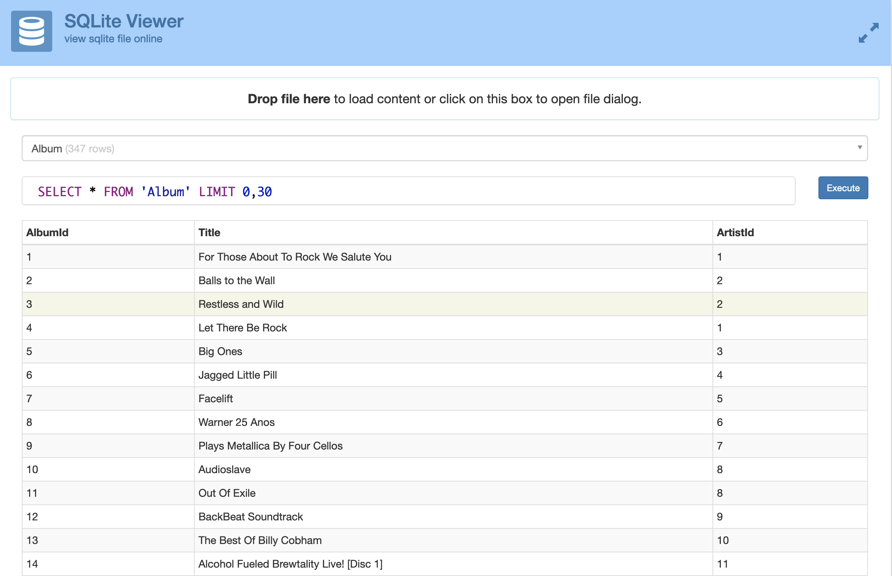
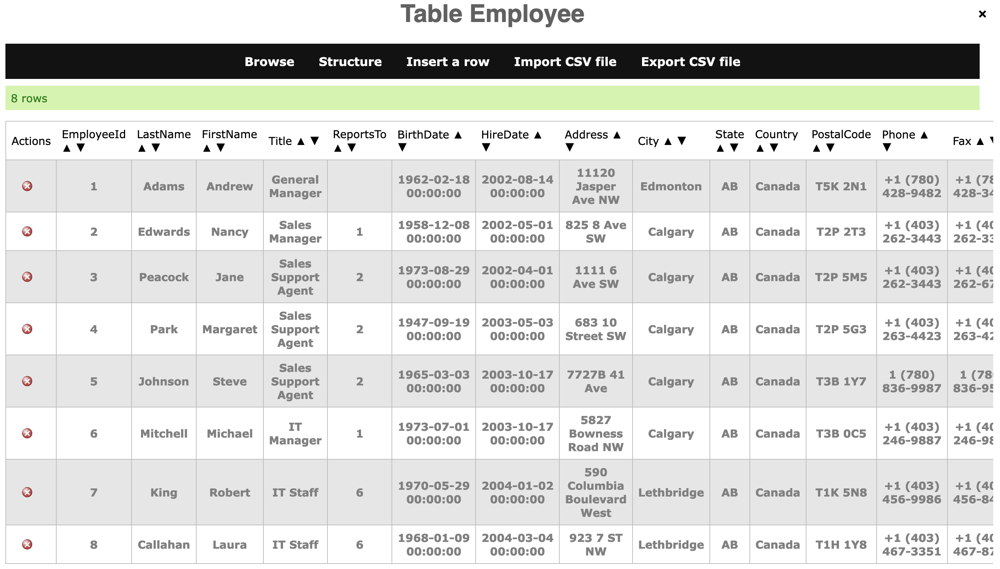
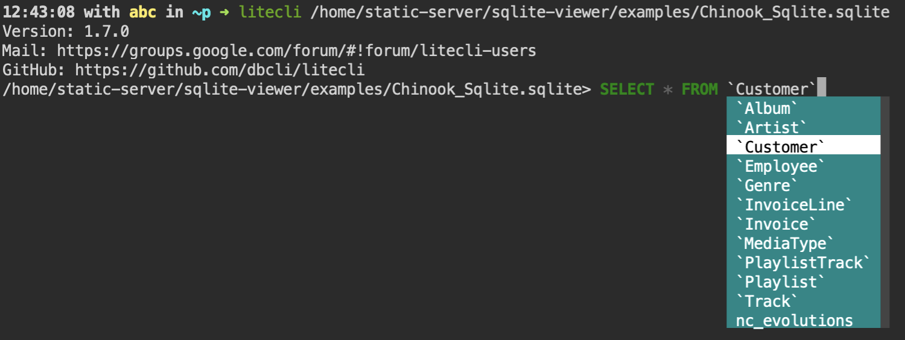
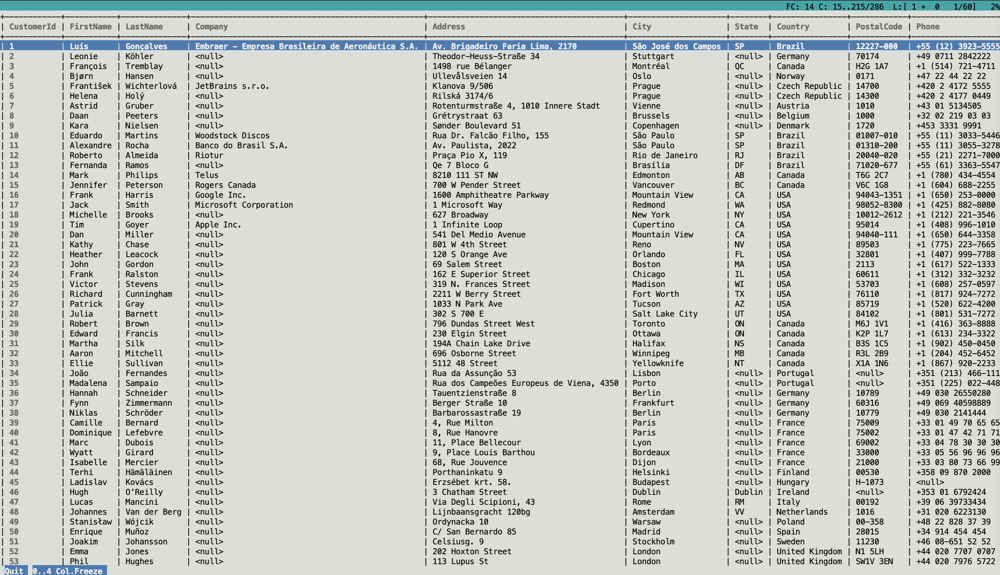
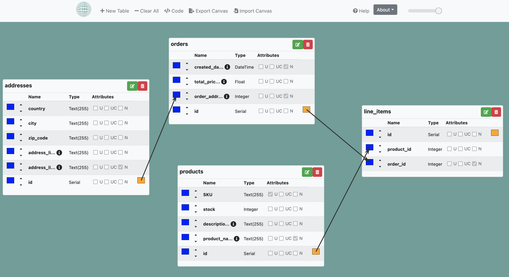

This doc has examples how to use workspace toolset to develop SQLite databases and fill them with data. 
As well explore, query and visualise.  
  
To start open Quickstart page for quick access to all the tools 



Use workspace terminal to execute CLI commands


Workspace conntains example SQLite database, the file `/home/static-server/sqlite-viewer/examples/Chinook_Sqlite.sqlite`  


## Sqlite 

SQLite3 is installed. Open terminal and execute

```
sqlite3
```

__Note:__ check out a better CLI [litecli](#litecli) 

### Sqlite extensions

The following compiled extensions are present in the folder `/home/sqlite-extensions`

- [crypto](https://github.com/nalgeon/sqlean/blob/main/docs/crypto.md): secure hashes
- [fileio](https://github.com/nalgeon/sqlean/blob/main/docs/fileio.md): read and write files
- [fuzzy](https://github.com/nalgeon/sqlean/blob/main/docs/fuzzy.md): fuzzy string matching and phonetics
- [ipaddr](https://github.com/nalgeon/sqlean/blob/main/docs/ipaddr.md): IP address manipulation
- [re](https://github.com/nalgeon/sqlean/blob/main/docs/re.md): regular expressions
- [stats](https://github.com/nalgeon/sqlean/blob/main/docs/stats.md): math statistics
- [text](https://github.com/nalgeon/sqlean/blob/main/docs/text.md): string functions
- [unicode](https://github.com/nalgeon/sqlean/blob/main/docs/unicode.md): Unicode support
- [uuid](https://github.com/nalgeon/sqlean/blob/main/docs/uuid.md): Universally Unique IDentifiers

Example start SQLite, and load extension: 

```
sqlite3
.load /home/sqlite-extensions/stats
```

### Upload & download SQLite databases

No matter if workspace is used locally, in cloud or kubernetes you can upload and download database files using file browser 




## Sqlite-web

[sqlite-web](https://github.com/coleifer/sqlite-web) - is a web-based SQLite database browser. It can serve any SQLite database.  

There are 2 SQlite database served by default:

- 'Main' database. Empty SQlite3 database. Sqlite-web 'Main'
- 'Example/test' database. Filled with test "Chinook" database. 

### Serve on-demand SQlite database

One port 8034 is reserved for serving on-demand database with Sqlite-web. 
Serve it with the following command

```
sqlite_web <path-to-your-sqlite-database-file> --host 0.0.0.0 --port 8034
```

Example, start sqlite-web on port 8034 for SQLite database file `/home/static-server/sqlite-viewer/examples/Chinook_Sqlite.sqlite`

```
sqlite_web /home/static-server/sqlite-viewer/examples/Chinook_Sqlite.sqlite --host 0.0.0.0 --port 8034 
```

and with extensions loaded:

```
sqlite_web /home/static-server/sqlite-viewer/examples/Chinook_Sqlite.sqlite --host 0.0.0.0 --port 8034  -e /home/sqlite-extensions/text.so -e /home/sqlite-extensions/unicode.so -e /home/sqlite-extensions/uuid.so
```

You can open on-demand database served with Sqlite-web from the Quickstart page.


## Sqlite-viewer 

[sqlite-viewer](https://github.com/inloop/sqlite-viewer) - explore and query SQLite databases.   

Upload SQLite database file (from your local machine) and explore.




## Web-GUI-for-SQLite

[Web-GUI-for-SQLite](https://github.com/cyrilbois/Web-GUI-for-SQLite) - explore and query SQLite databases.  

Upload SQLite database file (from your local machine) and explore.
 



## Litecli

[Litecli](https://github.com/dbcli/litecli) - is a command-line client for SQLite databases that has auto-completion and syntax highlighting. Useful if you prefer CLI.  

Open Terminal and try with example database:  

```
litecli /home/static-server/sqlite-viewer/examples/Chinook_Sqlite.sqlite
```






Load extensions

```
.load /home/sqlite-extensions/stats
```


## Tbls

Generate docs for the example database

```
tbls doc sqlite:////home/static-server/sqlite-viewer/examples/Chinook_Sqlite.sqlite /home/static-server/sql-tbls
```

and view SVG files with Static File Server


## DB designer

With DB designer you can visually create ERD diagrams, and generate DDL SQL scripts 



## Advanced 

### SQLite Json

Examples

```
CREATE TABLE jsontest   (
  id INTEGER NOT NULL PRIMARY KEY,
  jss JSON
);

INSERT INTO jsontest  VALUES 
(1, json(' { "key1" : "my key 1", "key2": [ "test" ] } ')),
(2, json(' { "key1" : "my new key", "key2": [ "test", "test" ] } ')),
(3, json(' { "key1" : "my yet another key", "key2": [ "test", "test", "test2" ] } '));

SELECT * FROM jsontest;
```

__Links:__
    - [Complete SQlite JSON docs](https://www.sqlite.org/json1.html#jmini)


### Rclone

[rclone](https://rclone.org/) is a command line program to manage files on cloud storage. 
It is a feature rich alternative to cloud vendors' web storage interfaces.  

__Copy dump to S3:__  
Create file `~/.config/rclone/rclone.conf` with the following content

```
[remote]
type = s3
provider = AWS
access_key_id = XXXXXXXXXXXXXXXXXXXXXX
secret_access_key = XXxxXXxXXXxxxXXxXXXxxXXXxxxXXXxXXXX
region = xx-xxxx-x
```

Use Rclone to copy to S3 and delete from local

```
rclone move /home/project/sqlite-db remote:my-s3-bucket/sqlite/
```

__Restore from S3 to local:__
When there is a need to get database from S3 to local folder. 

```
# copy 
rclone copy remote:my-s3-bucket/sqlite/ /home/sqlite-db/
# mount S3 without copying
rclone sync remote:my-s3-bucket/sqlite/ /home/sqlite-db/
```

