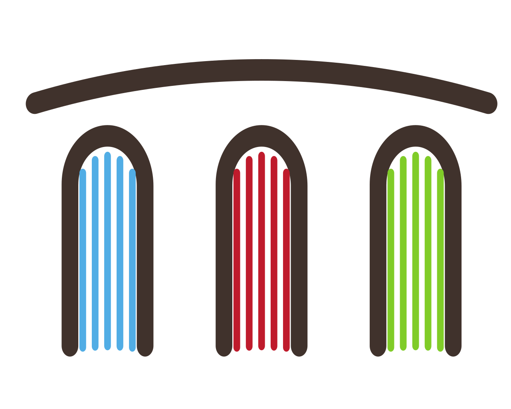

<p align="center">
  
</p> 

# Ubuntu docker workspace

Containerized Linux terminal environment. Essentially Ubuntu 20.04 docker image extended with typical console apps, such as Git, 
file browsers and system monitors. Has docker in docker.

Start

```
docker run --name space-1 -d -v /var/run/docker.sock:/var/run/docker.sock --user=root alnoda/ubuntu-docker-workspace
```

Enter workspace

```
docker exec -it space-1 /bin/zsh
```

## Features

- **Docker**

    - [Docker](https://www.docker.com/)
    - [Ctop](https://github.com/bcicen/ctop) - Top-like interface for container metrics.
    - [Lazydocker](https://github.com/jesseduffield/lazydocker) - A simple terminal UI for both docker and docker-compose, written in Go with the gocui library.
    - [Sen](https://github.com/TomasTomecek/sen) - A terminal user interface for containers.
    - [Dive](https://github.com/wagoodman/dive) - A tool for exploring a docker image, layer contents, and discovering ways to shrink the size of your Docker/OCI image.

- **Ubuntu 20.4** with the following CLI apps

    - [Zsh](https://www.zsh.org/), [Oh my Zsh](https://ohmyz.sh/)
    - [Zsh](https://www.zsh.org/), [Oh my Zsh](https://ohmyz.sh/)
    - Python 3, Pip 
    - Node/nodeenv
    - curl, wget, telnet, jq
    - **Git:** git, git-flow, lazygit 
    - **File browsers:** mc, xplr
    - **Text editors:** nano, vim, mcedit
    - **System monitors:** ncdu, htop, glances, vizex
    - **Process Control:** supervisord
    - **Job scheduler:** cron

## Why this image

If you need to isolate some work without polluting main environment.
