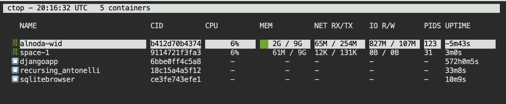
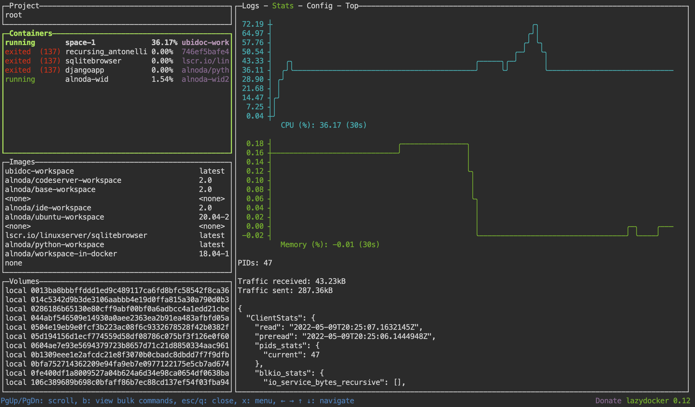
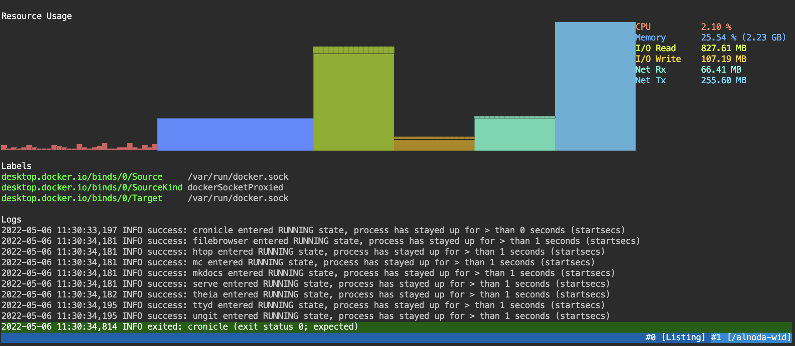
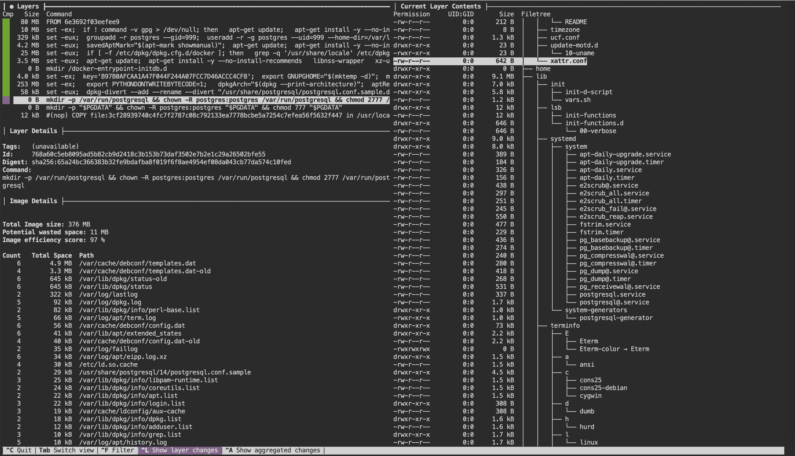

This a basic tutorial to demonstrate workspace docker toolset.

## Ctop

[Ctop](https://github.com/bcicen/ctop) - is a top-like interface for container metrics.  

```
ctop
```




## Lazydocker 

[Lazydocker](https://github.com/jesseduffield/lazydocker)  - a simple terminal UI for both docker and docker-compose, 
written in Go with the gocui library.

```
lazydocker
```




## Sen

[Sen](https://github.com/TomasTomecek/sen) - is a terminal user interface for containers.

```
sen
```




## Dive

[Dive](https://github.com/wagoodman/dive) - is a tool for exploring a docker image, layer contents, 
and discovering ways to shrink the size of your Docker/OCI image.
    
```
docker pull postgres
dive alpine/postgres 
```




## Browser-based terminal

This workspace has browser-based terminal up and running. Open [localhost:8026](http://localhost:8026) in browser. 
Start the workspace on Rasberri Pi and use it via Tablet.  

In order to use browser-based terminal, expose port 8026

```
docker run --name space-1 -d -p 8026:8026 -v /var/run/docker.sock:/var/run/docker.sock --user=root alnoda/ubuntu-docker-workspace
```


## Extra

This workspace has all the features of the [**ubuntu-workspace**](../ubuntu-workspace/README.md)   
 