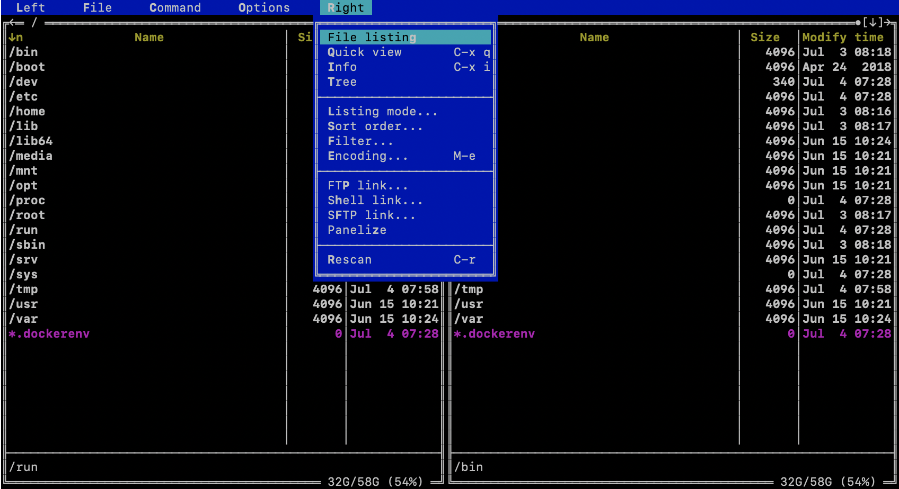
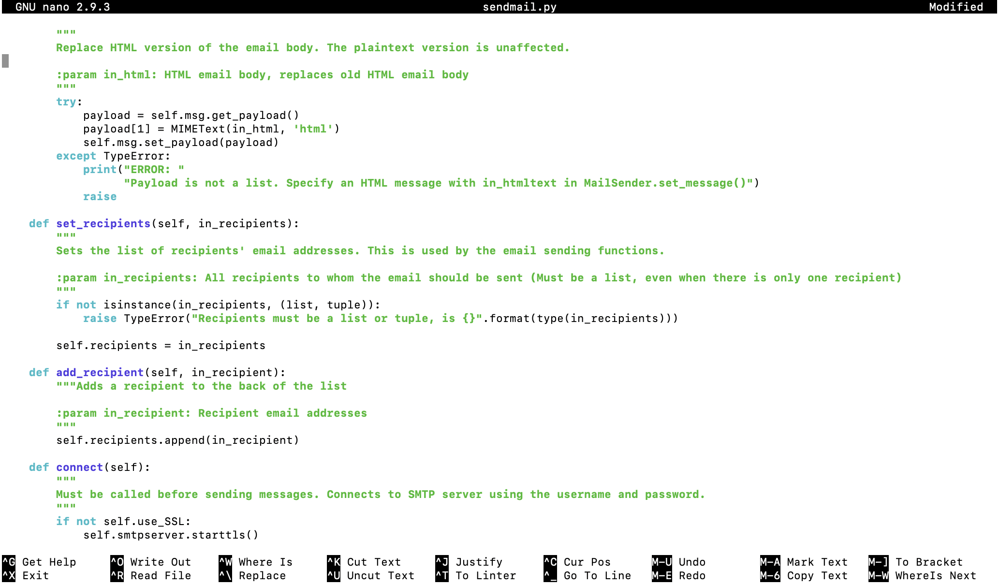
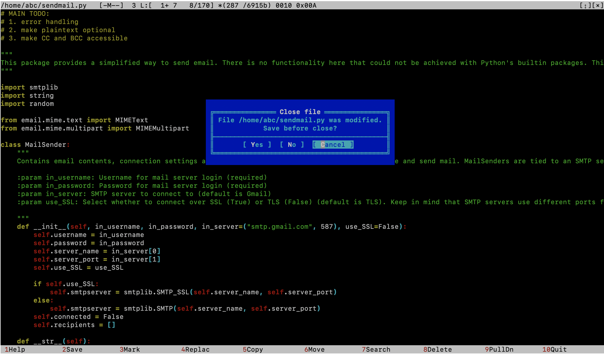
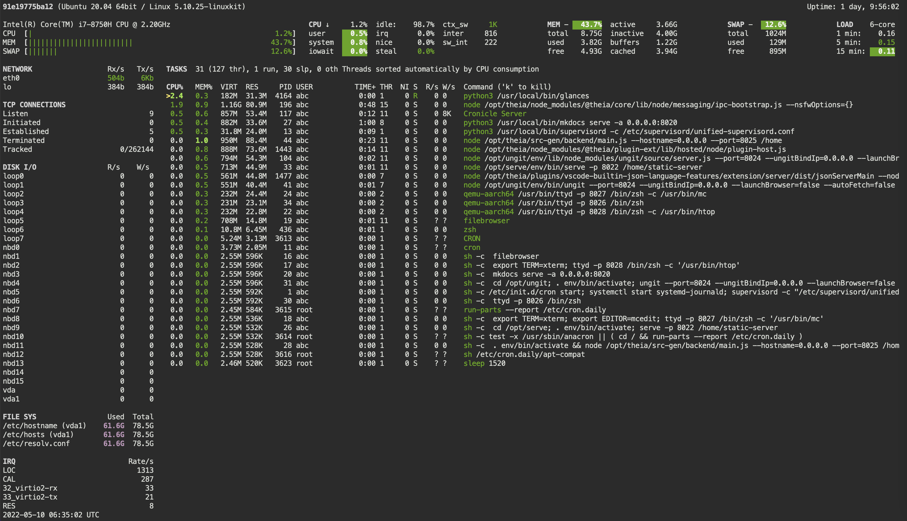
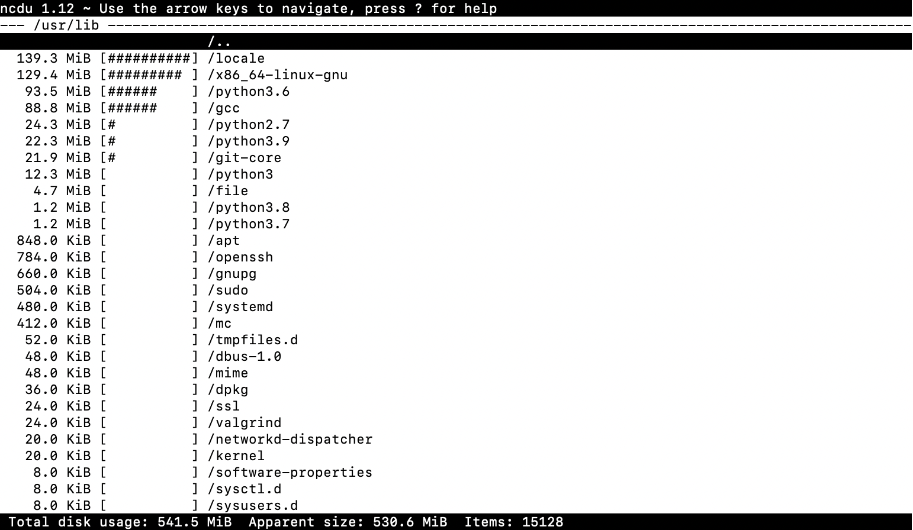
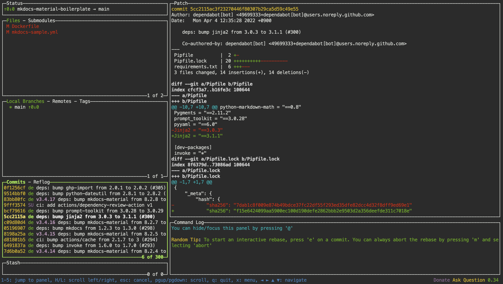
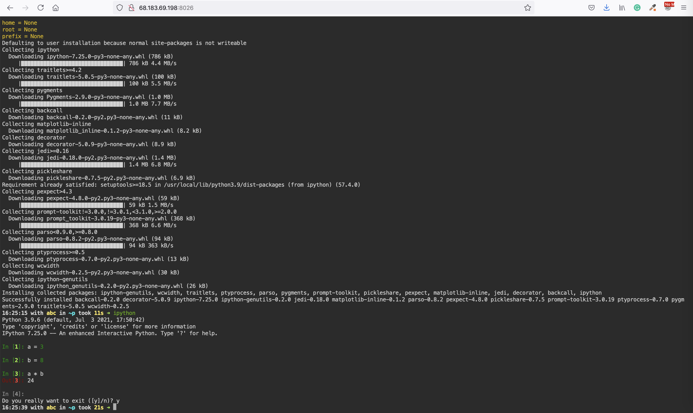

This is a demonstration of the CLI applications pre-installed in the workspace.

## Start

```sh
docker run --name space-1 -d alnoda/ubuntu-workspace
```

Now you can ssh into the running workspace container  
```sh
docker exec -it space-1 /bin/zsh
```

## Root user

ssh into the running workspace container as root user
```sh
docker exec -it --user=root space-1 /bin/zsh
```

## File browser

Explore file system with Midnight Commander

```
mc
```




## Text editor

Text editors ```vim```, ```nano``` and ```mcedit``` are available. For example, clone git repo and edit python file with nano

```
git clone https://github.com/dimaba/sendmail.git
cd sendmail
nano sendmail.py 
```



```
mcedit sendmail.py 
```



## System monitor

Launch system-monitor, process-viewer and process-manager  

```
htop
```


Explore processes and resources with Glances   

```
glances
```



Explore file/folder sizes

```
ncdu
```



## Git

Clone Git repo and explore with Lazygit

```
git clone https://github.com/peaceiris/mkdocs-material-boilerplate.git
lazygit
```



## Browser terminal

This workspace has browser-based terminal up and running. Open [localhost:8026](http://localhost:8026) in browser. 
Start the workspace on Rasberri Pi and use it via Tablet. 

In order to use browser-based terminal, expose port 8026

```
docker run --name space-1 -d -p 8026:8026 alnoda/ubuntu-workspace
```



## Docker in docker

If you want to use docker, check out [**ubuntu-docker-workspace**](../ubuntu-docker-workspace/README.md). It is the same, but with docker-in-docker. 

