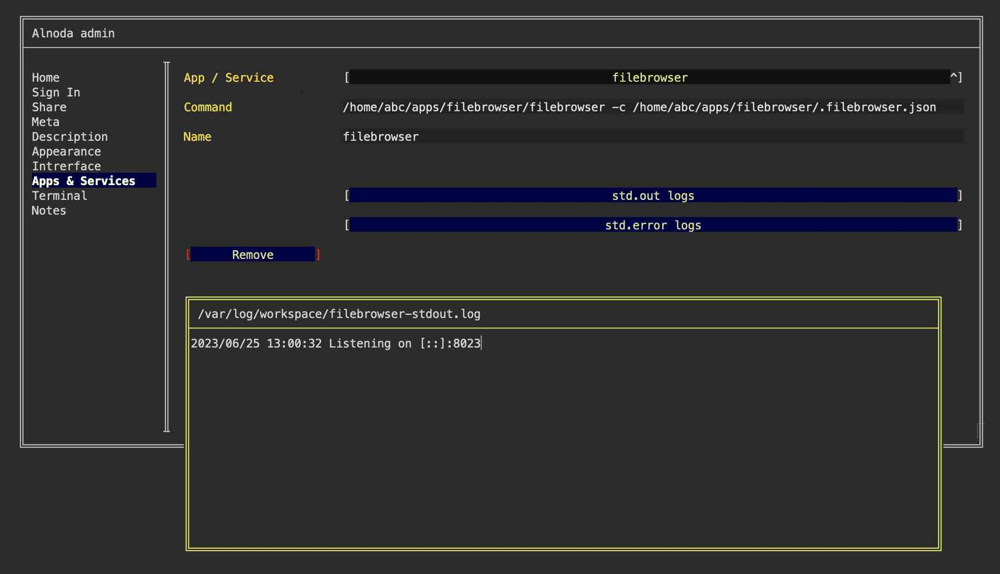
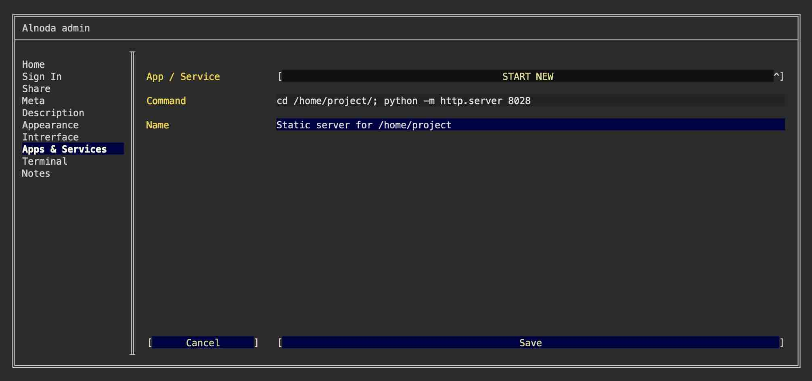
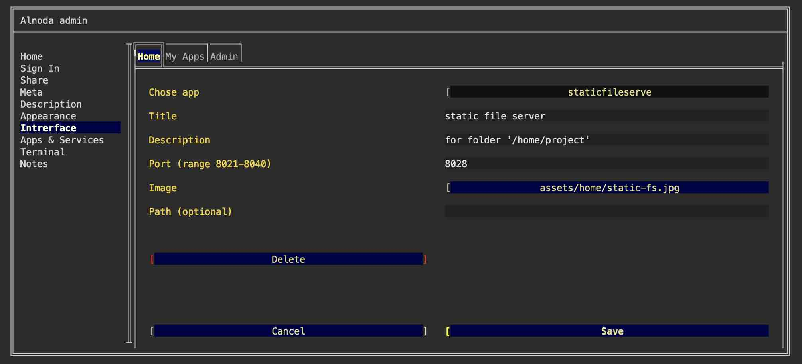

# Applications and services 

## Persistent service

Alnoda workspaces enable you to make any application or service persistently operational. This is facilitated by the supervisord process control system, 
which serves a function similar to that of the systemd service manager found in many Linux distributions, though systemd is not included in Alnoda workspaces.

Supervisord ensures that all persistent services are initiated whenever a workspace container starts, facilitating the concurrent operation of multiple 
processes within the workspaces.

While it's possible for you to manually adjust supervisord configuration files, the _Alnoda Admin_ offers a user interface tool for this task. Within the 
'Apps & Services' tab, you'll have the ability to create and delete services operating within the workspace.



Here you can also see the logs and errors from the runninng or failed to start services.

!!! warning
    After creating a new persistent service it is required to restart the worksapce for the new service to get up and runnig. You can do it with `wrk kill` command.

As an example, let's create a service for a built-in static file server that will serve `/home/project` folder and listen to port 8028 makig it accessble via 
the shortcut "My app on port 8028" of the "My apps" tab. To do this perform the following steps: 

- [X] Open "Admin" tab of the workspace UI and then "Workspace admin" 
- [X] Go to the tab "Apps & Services"
- [X] Select "START NEW" from the picklist 
- [X] Enter the following command 

```sh
cd /home/project/; python -m http.server 8028
```

- [X] Give it any name you want 
- [X] Click "Save"
- [x] Restart workspace 



After workspace is restarted you can open "My app on port 8028" and see that static file server is operational.

## Application shortcuts

If a persistent application has browser-based user interface you can create a shortcut and place it on one of the tabs: _Home_, _My apps_ or _Admin_. 
Such functionality is provided on the 'Interface tab' of the Workspace Admin. 

As an example let's add shortcut for the persistent static file server, that we have created in the previous section of this doc. To do this 
follow the next steps: 

- [x] Upload the shortcut image to the workspace, i.e. with file browser
- [X] Go to the "Interface" tab of the _Workspace Admin_
- [X] chose the workspace tab and select "CREATE NEW" from the picklist  
- [X] Give it any title and description 
- [X] In the field "Port" enter port 8028 
- [X] In the file picker find your image 
- [X] Leave field "path" blank and click "Save"



You will see that the new shortcut has appeared on the respective page of the workspace UI

!!! hint 
    Rather than following the steps indicated in this example, you can simply employ the command `wrk install static-server-python` to install the static file 
    server from the Alnoda Hub. The installation of apps from the Alnoda Hub automatically creates persistent services and adds application shortcuts.