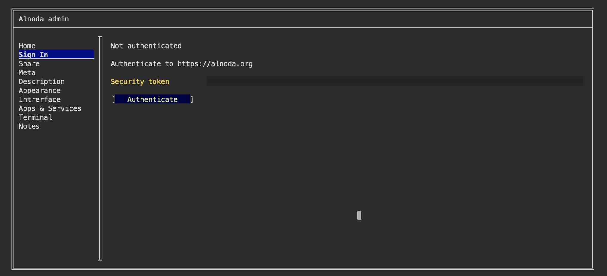

# Workspace Admin 

Alnoda Admin is an application integrated within the workspace. It helps to fine-tune and customize the workspace according to your specific project requirements.

With the help of Alnoda Admin you can:

- [x] customize workspace UI: change colors, icons and fonts
- [x] edit workspace metadata: name, version, author
- [x] edit wrokspace or project description 
- [x] create persistent workspace services
- [x] add custom application shortcuts to the workspace UI tabs
- [x] set terminal aliases and environmental variables
- [x] manage project links and cheatsheet 
- [x] sign in to Alnoda Hub 
- [x] share workspace browser-based applications over the interet

!!! tip 
    You can open _Workspace Admin_ from the Workspace UI _Admin tab_ 

## Sign in to Alnoda Hub

After setting up an account with Alnoda Hub, you can log in from your workspaces using either the __wrk__ tool or the _Alnoda Admin app_. 

Logging into the Alnoda Hub from your workspace allows you to monitor the applications installed in your workspaces. This feature aids in replicating 
workspaces and maintaining a record of the applications used for different projects.

!!! note 
    To log into the Alnoda Hub from your workspace, you will use a security token, which can be found on the profile page of your Alnoda Hub user account.