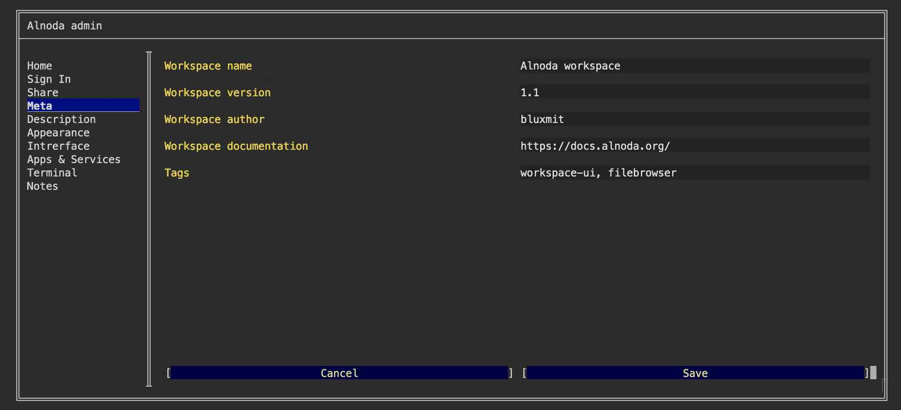
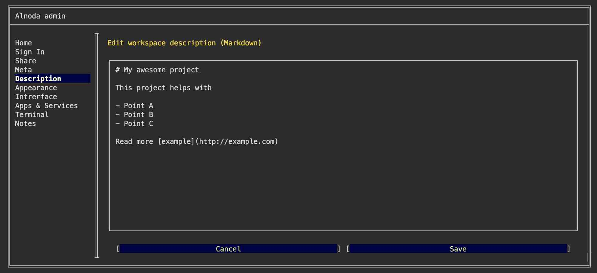

# Metadata 

You can edit workspace metadata such as the name, version, author, tags, and documentation link with the help of Workspace Admin.

To modify this metadata, open the Workspace Admin and navigate to the 'Meta' tab. You can then alter the respective fields and save your modifications:

To edit workspace description open Workspace Admin and then 'Description' tab:

!!! hint 
    You can use Markdown to write description

After you save the changes to meta or description you will see Workspace UI updated. 