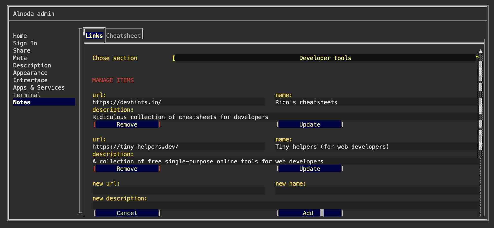

# Project notes 

Workspace UI has 2 tabs that help to keep worksapce specific commands (cheatsheet) and collection of relevant Internet links, and Workspace Admin helps to 
manage them. 

You can edit both workspace links and cheatsheet of useful commands in the Workspace Admin 'Notes' tab. 

!!! hint
    In the Alnoda Hub you will find many more apps that you can use to store workspace-related notes, links, compose your own cheatsheets and even create collections 
    of code snippets. 