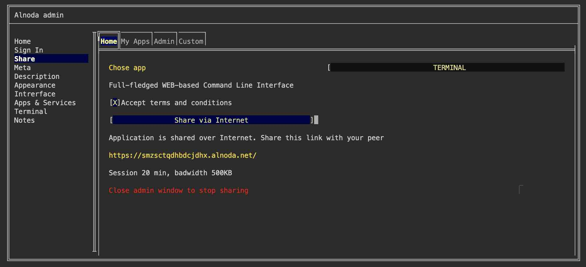

# Share workspaces 

Alnoda workspaces offer a unique function that lets you share any workspace application with a web-based UI across the internet through a secure link. 
Simply navigate to the 'Share' tab in the Workspace Admin, select the application you wish to share, and then send a secure link to your colleague.

!!! note 
    Each sharing session is time-bound. It will also terminate once you close the Workspace Admin. After a session ends, you are free to initiate a new one.

!!! hint 
    You can extend the duration of a session if you sign in to the Alnoda Hub from the workspace. 