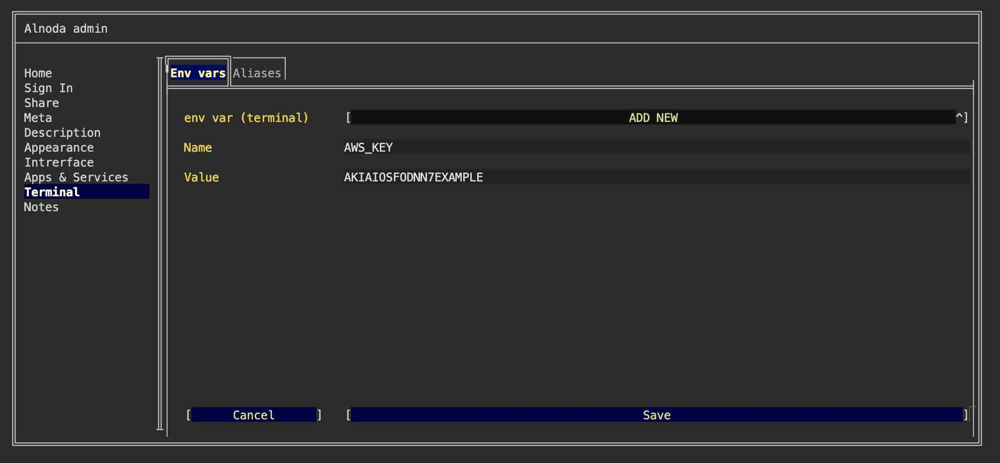
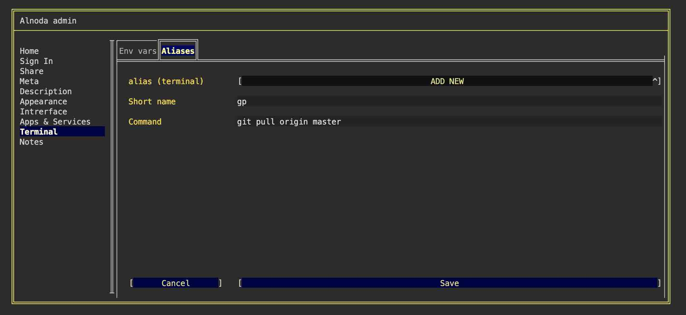
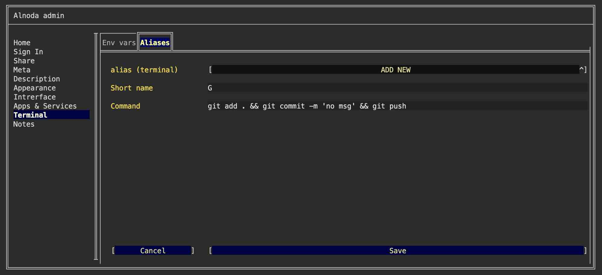

# Termial experience 

In diverse projects, the terminal is used frequently. Workspace Admin enhances this experience with features for setting environmental variables, creating aliases, 
and configuring toolchains.

!!! warning 
    Settings detailed in this document are applicable only to the zsh interactive shell. As an example, environmental variables or aliases won't be 
    accessible for the _start command_ of a persistent service.

## Environmental variables 

Using the Workspace Admin, you can set environment variables for the zsh terminal shell. This is particularly useful for setting parameters such as AWS keys 
and secrets, environment definition, or database connection parameters via environment variables, as required by your application or other tools you utilize.

Set an environmental variable for the terminal zsh shell:

- [X] Open Workspace Admin and go to the 'Terminal' tab 
- [X] Make sure you are on the 'Env vars' tab and select "ADD NEW" from the picklist
- [X] Enter environmental variable name and value 
- [X] Save the new variable 

!!! warning 
    To activate the new environment variables in your terminal session, you must restart the terminal window

## Aliases 

Aliases are a way to define our own commands or create shortcuts for existing commands. Aliases are quite handy for saving time, particularly when a command 
is complex or frequently used.

Here are a few examples where you would use aliases:

- [x] Navigate to a Frequently Accessed Directory: Suppose you often navigate to a directory with a long path, e.g., __/home/user/documents/projects/my_project/__. Instead of typing `cd /home/user/documents/projects/my_project/` 
each time, you could create an alias: `cdp` = `cd /home/user/documents/projects/my_project/`. Now, typing `cdp` in the terminal will navigate to that directory. 
- [x] Shorten Long Commands: if for example you often need to check the status of your Git repository with the command `git status`. 
Instead of typing out the full command each time, you could create an alias `gs` = `git status`
- [x] Correct Common Typos: If you often mistype a command, an alias can correct it for you. For example, if you frequently type `sl` instead of `ls`, 
you could make an alias to fix this, i.e. `sl` = `ls`.
- [x] Make Commands More Memorable: If you have trouble remembering a particular command, you can create an alias that's easier for you to recall. 
For example, if you can never remember the command to display disk usage `du -sh *`, you might create an alias like `showdisk` = `du -sh *`.

!!! warning 
    The standard `alias` command is present in the workspaces, but aliases created with it will not persist after workspace is restarted.

Creating persistent aliases is possible with Workspace Admin. To create an alias follow these steps:

- [X] Open Workspace Admin and go to the 'Terminal' tab 
- [X] Make sure you are on the 'Aliases' tab and select "ADD NEW" from the picklist
- [X] Enter alias and the value 
- [X] Save the new variable 

!!! warning 
    To use the newly created alias you need to restart the terminal window

!!! info 
    The Alnoda workspaces come pre-configured with a few handy aliases. For instance, typing `cd ~p` in the terminal will navigate you directly to 
    the `/home/project` directory. The alias `p` is a shortcut for `rich`, a utility that provides aesthetically pleasing file printing in the terminal, 
    complete with syntax highlighting. Moreover, `l` serves as an alias for `ls -lah`, a command that displays a detailed list of all files in the current folder.

## Toolchains

You can leverage workspace aliases to create a chain of commands separating them with command separators `&`, `&&` or `;`

- [x] __;__ (semicolon): This separator allows you to run multiple commands sequentially, regardless of whether each previous command succeeds or not. 
The commands are executed in the order they are written. 
- [x] __&&__ (double ampersand): This separator allows you to run multiple commands sequentially, but only if each previous command succeeds 
(returns a zero exit status). If any command fails (returns a non-zero exit status), the remaining commands will not be executed. 
- [x] __&__ (single ampersand): This operator allows you to run commands in parallel, in the background. When you append & after a command, the shell does 
not wait for the command to finish, and you can continue to enter further commands.

For instance, you could establish a toolchain to automatically stage all modified files, commit them with a default message 'no msg', and push them to the 
remote repository. This could be achieved with the following sequence: `G = git add . && git commit -m 'no msg' && git push`.

!!! tip 
    Enhance your terminal productivity by installing tools from the Alnoda Hub which offeres a huge collection of popular CLI 
    tools, some with terminal user interfaces, such as terminal multiplexers, terminal workspaces, advanced file managers and even full-fledged terminal 
    IDEs!