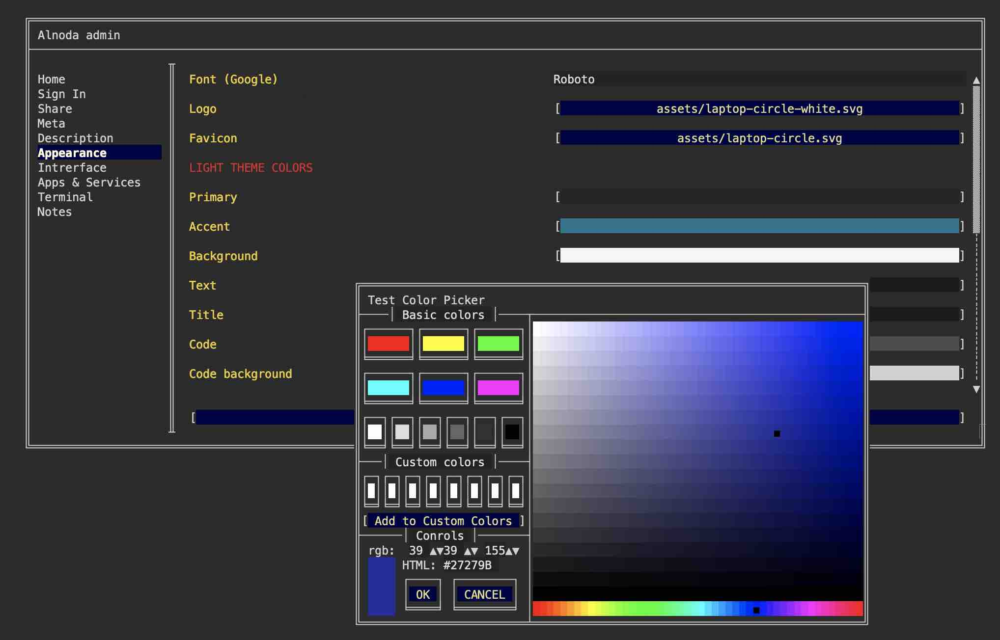

# UI Customization

The _Appearance_ tab within Workspace Admin allows you to customize the aesthetic of the workspace UI. By altering colors, fonts, and icons, you can create 
a visually distinct workspace. This customization can facilitate easier transitions when switching between different workspaces.

!!! info 
    As a font you can use any [Google font](https://fonts.google.com/). Simply update the name of the font.

!!! warning 
    Don't forget to _Save_ changes after modifying UI appearance.