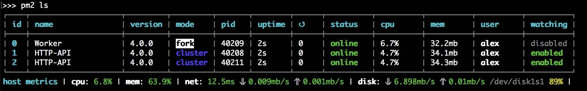
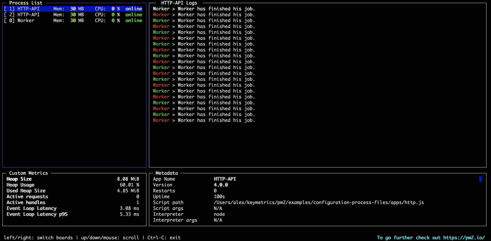
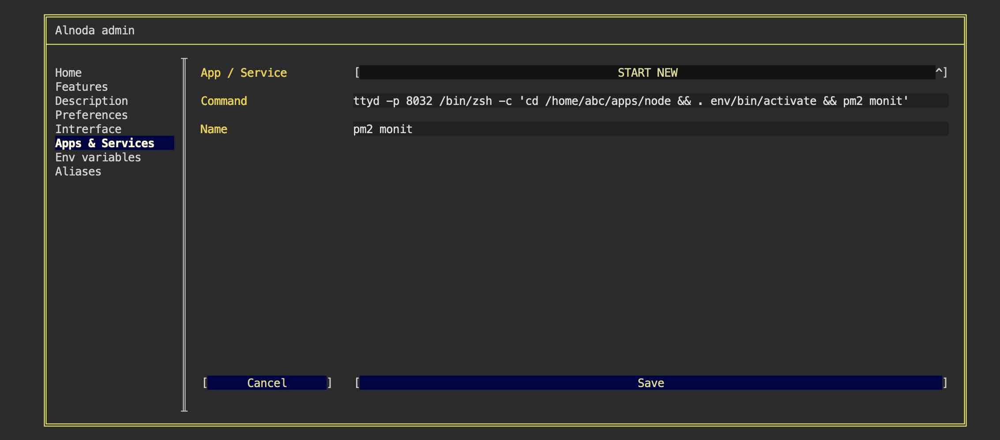
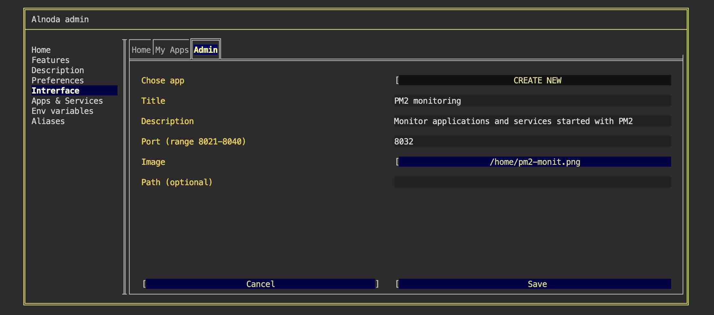
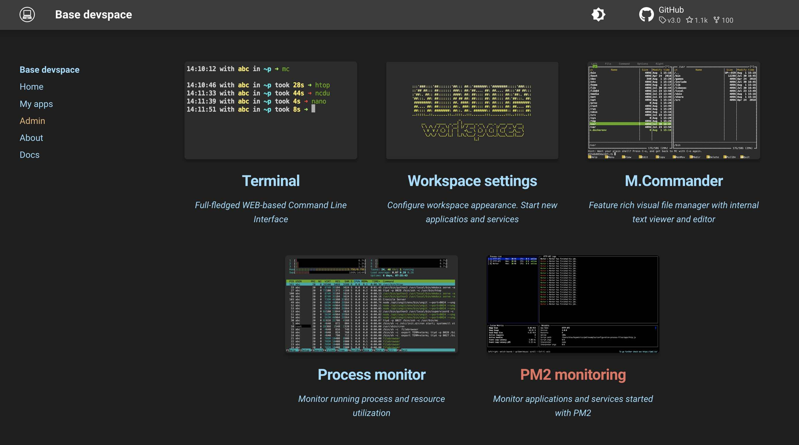

# PM2 - excellent process manager 

[__PM2__](https://pm2.keymetrics.io/docs/usage/quick-start/) is a daemon process manager that will help you manage and keep 
your application online. 

Getting started with PM2 is straightforward, it is offered as a simple and intuitive CLI



In order to use [__PM2__](https://pm2.keymetrics.io/docs/usage/quick-start/) you have to open workspace terminal. 
Thankfully, PM2 commands are very ituitive and easy to use.   

[__PM2__](https://pm2.keymetrics.io/docs/usage/quick-start/) has nice TUI interface to monitor apps and services 



!!! note
    Every workspace has [__PM2__](https://pm2.keymetrics.io/docs/usage/quick-start/) installed. 

## Start 

Starting any application with PM2 is as easy as

<div class="termy">
```bash
<font color="#5EA702">pm2</font> start bashscript.sh
<font color="#5EA702">pm2</font> start python-app.py --watch
<font color="#5EA702">pm2</font> start binary-file -- --port 1520
<font color="#5EA702">pm2</font> start app.js
```
</div> 

!!! attention
    Ay application started with PM2 will cotinue running even if terminal window is closed. But all processes started with PM2 
    will terminate when the workspace is stopped.

## Useful commands 

Below are some of the most useful commands that you would use to start and stop applications.  

- [X] Start application and daemonize with pm2 process manager

<div class="termy">
```bash
<font color="#5EA702">pm2</font> start <font color="#E77260">[application]</font>
```
</div> 

- [X] Start named application

<div class="termy">
```bash
<font color="#5EA702">pm2</font> start <font color="#E77260">[application]</font> --name <font color="#E77260">[name]</font>
```
</div> 

- [X] Start any application with flags

<div class="termy">
```bash
<font color="#5EA702">pm2</font> start <font color="#E77260">[application]</font> -- <font color="#E77260">[flags]
```
</div> 

- [X] Show applications 

<div class="termy">
```bash
<font color="#5EA702">pm2</font> ls 
```
</div> 

- [X] Stop running application 

<div class="termy">
```bash
<font color="#5EA702">pm2</font> stop <font color="#E77260">[application]</font> 
```
</div> 

- [X] Open monintor

<div class="termy">
```bash
<font color="#5EA702">pm2</font> monit
```
</div> 


## Examples 

### SimpleHTTPServer 

Let's launch static file server (python) with PM2.  

!!! note
    You can use any workspace for this example 

Python SimpleHTTPServer module is a very handy tool. You can use Python SimpleHTTPServer to turn any directory into a simple 
HTTP web server. To try it out execute

<div class="termy">
```bash
$ python3 -m http.server 8030

Serving HTTP on 0.0.0.0 port 8030 (http://0.0.0.0:8030/) ...
```
</div> 

As soon as you close the terminal session, this simple server will terminate too. To keep it running, 
let's launch it with the help of PM2

<div class="termy">
```bash
$ pm2 start python3 -- -m http.server 8030

<font color="#5EA702">[PM2]</font> Applying action restartProcessId on app [python3](ids: [ 1 ])
<font color="#5EA702">[PM2]</font> [python3](1) ✓
<font color="#5EA702">[PM2]</font> Process successfully started
```
</div> 

Open tab "My apps" and click on "My app on port 8030". You can see that SimpleHTTPServer is up and runing. 
It will keep running after you close the terminal winndow.


### Lazygit

Let's use lazygit to explore a git repository, start it with PM2 and turn into a web app with ttyd.  

!!! note
    You can use any workspace for this example 

Every workspace has [__lazygit__](https://github.com/jesseduffield/lazygit) - a simple terminal UI for git commands. 
Let's clone an example Git repository, and explore it with lazygit. Then we will turn lazygit into a web application 
using [__ttyd__](https://github.com/tsl0922/ttyd) - a browser-based terminal, which is istalled in every workspace.  

To start, let's clone an example Git repository.  

<div class="termy">
```bash
$ git clone https://github.com/johnpapa/node-hello.git

Cloning into 'node-hello'...
remote: Enumerating objects: 47, done.
remote: Total 47 (delta 0), reused 0 (delta 0), pack-reused 47
Unpacking objects: 100% (47/47), 6.01 KiB | 84.00 KiB/s, done.
```
</div> 

Go into the cloned repo, and launch lazygit 

<div class="termy">
```bash
$ cd node-hello

(env) 20:08:12 with <font color="#FDEB61">abc</font> in <font color="#37E6E8">~p/node-hello</font> on <font color="#BC94B7">⇡master</font> is 📦  <font color="#5EA702">via ⬢ v18.9.0</font>  <font color="#98E242">➜</font>
```
</div> 

Let's expose lazygit as web UI using __ttyd__. In this example, we will expose it on port 8031 - one of the free workspace ports, 
for which there is a shortcut tab __"My app on port 8031"__ on the "My apps" tab.  

<div class="termy">
```bash
$ pm2 start ttyd -- -p 8031 /bin/zsh -c 'cd /home/project/node-hello && lazygit'

<font color="#5EA702">[PM2</font>] Spawning PM2 daemon with pm2_home=/home/abc/.pm2
<font color="#5EA702">[PM2]</font> PM2 Successfully daemonized
<font color="#5EA702">[PM2]</font> Starting /usr/bin/ttyd in fork_mode (1 instance)
<font color="#5EA702">[PM2]</font> Done.
```
</div> 

Open tab "My apps" and click on "My app on port 8031". You can explore repository with lazygit. 
It will keep running after you close the terminal winndow.


## UI for PM2 

### Create service

[__PM2__](https://pm2.keymetrics.io/docs/usage/quick-start/) has terminal user interface (TUI) for monnitoring of 
running applications. You can start it executig `pm2 monit` in the workspace terminal.  

First thing, is to expose `pm2 monit` as a WEB application, and start the latter as a permanent service of the workspace. 
Any terminal application can be turned into WEB application wiht [__ttyd__](https://github.com/tsl0922/ttyd) (installed in every workspace). 

!!! note
    Permanent service starts automatically as soon as the workspace is started. 

Perform the next steps:

- [X] Go to the "Admin" tab on the workspace UI and open workspace settings 
- [X] Go to "Interface" and select "START NEW" from the picklist 
- [X] Enter command

```sh
ttyd -p 8032 /bin/zsh -c 'cd /home/abc/apps/node && . env/bin/activate && pm2 monit'
```

!!! note
    __pm2__ is an alias for command __cd /home/abc/apps/node && . env/bin/activate && pm2__

- [X] Give it any name and click "Save" 



Please __restart the workspace__ to apply the channge. 

### Create service

Let's create shortcut for pm2 monit on the "Admin" tab of the workspace UI: 

- [X] Go to the "Admin" tab on the workspace UI and open workspace settings 
- [X] Go to "Interface" and then to tab "Admin"
- [X] Select "CREATE NEW" from the picklist 
- [X] Enter any title and any description 
- [X] Enter port 8032 
- [X] Uploat an image to the workspace (use Filebrowser), and choose this image in the filepicker 
- [X] Ignore field "path", and click "Save" 



Nnow we have the PM2 monit tab on the workspace UI "Admin" tab  

