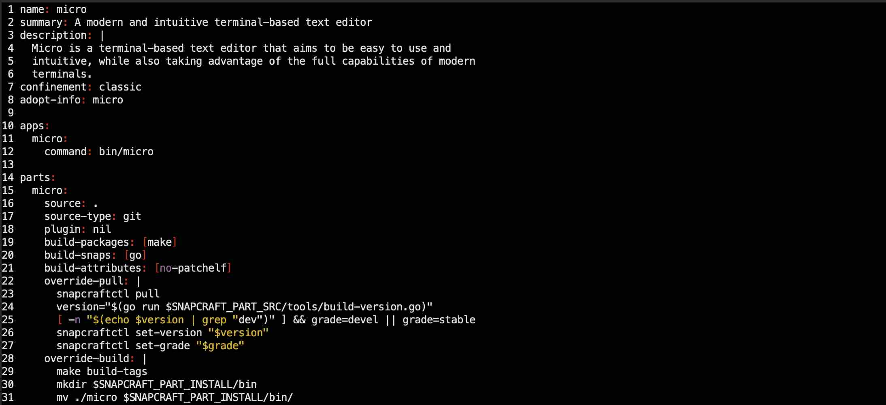

# Micro - modern and intuitive terminal-based text editor

## Intro 

In this example we will install [__Micro__](https://micro-editor.github.io/) - a terminal-based text editor that aims to be easy 
to use and intuitive, while also taking advantage of the full capabilities of modern terminals. It comes as one single, 
batteries-included, static binary with no dependencies, and you can download and use it right now.



Micro is a terminal-based application without a graphical user interface.  

!!! attention 
    Micro can be installed in any workspace. We will use __Theia workspace v.4.0__ in this example.

!!! note
    We will install micro with [__Nix__](https://nixos.org/) package manager, and create terminal alias for more convenient use of Micro.   


## Install

Every workspace has Nix, and it is very easy to install new applications with this package manager.  

To install Micro with Nix, execute the next command

<div class="termy">
```
$ nix-env -iA nixpkgs.micro

installing 'micro-2.0.11'
...
copying path '/nix/store/6f1vr3ar1rrz4dkbfsyprns33z6bf635-micro-2.0.11' from 'https://cache.nixos.org'...
building '/nix/store/ziffm6mfmqbbfq5ss7cb7ms2lr9ic92f-user-environment.drv'...
```
</div>


## Explore

To try Micro editor, let's clone Micro own repository and edit some of the files in it

<div class="termy">
```
$ git clone https://github.com/zyedidia/micro

Cloning into 'micro'...
remote: Enumerating objects: 18041, done.
remote: Counting objects: 100% (9/9), done.
remote: Compressing objects: 100% (9/9), done.
remote: Total 18041 (delta 2), reused 3 (delta 0), pack-reused 18032
Receiving objects: 100% (18041/18041), 12.26 MiB | 1.42 MiB/s, done.
Resolving deltas: 100% (12284/12284), done.
```
</div>

Go to the cloned directory, and use Micro to edit file `snapcraft.yaml`

<div class="termy">
```
$ cd micro   
08:01:32 with <font color="#FDEB61">abc</font> in <font color="#37E6E8">~p/micro</font> on <font color="#BC94B7">⇡master</font> <font color="#98E242">➜</font>    

$ micro snapcraft.yaml
```
</div>


## Alias

It is not very convennient to type the whole word "micro" every time we want to use it. let's create a single-character alias 
to open files with Micro: 

- [X] on the workspace UI go to the "Admin" tab, open "Workspace Settings" and go to "Aliases".  
- [X] select "ADD NEW", enter `m` as short name, and `micro` as command. Click "Save".  
- [X] open a new terminal window, go to the cloned repository folder again, and use `m` (instead of `micro`) to open the same file.   

<div class="termy">
```
$ cd micro   
08:01:32 with <font color="#FDEB61">abc</font> in <font color="#37E6E8">~p/micro</font> on <font color="#BC94B7">⇡master</font> <font color="#98E242">➜</font>    

$ m snapcraft.yaml
```
</div>

Well-done! Now we can quicly open and edit any file with a single-character command `m`.  

## Result 

We have installed [__Micro__](https://micro-editor.github.io/) usin the [__Nix__](https://nixos.org/) package manager. And created 
a teminal alias, which shortened command to start Micro from `micro` to a single-character `m`.

