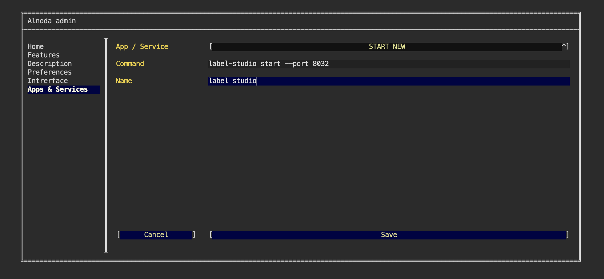

# Label Studio - data labeling tool

## Intro

In this example we are going to add [__Label Studio__](https://labelstud.io/) to the workspace as a permanent workspace application.   

[Label Studio](https://labelstud.io/) - is an open source data labeling tool. It lets you label data types like audio, text, 
images, videos, and time series with a simple and straightforward UI and export to various model formats. 
It can be used to prepare raw data or improve existing training data to get more accurate ML models.


!!! attention
    Label Studio can be installed in any workspace. We will use __Theia workspace v.4.0__ in this example.  

!!! note
    Label Studio is a python package. We will install it in an isolated environment, start it as a permanent workspace application, 
    and create Label Studio shortcut in the workspace UI page.   

## Install 

[Label Studio](https://pypi.org/project/label-studio/) is a python package. It can be installed with either __pip__ or [__pipx__](https://github.com/pypa/pipx). 
Both are present in every workspace.    

There is an advantage of using [__pipx__](https://github.com/pypa/pipx) - pipx installs and runs Python applications in an 
isolated environments. This will prevent package conflicts with any other Python application that we might install in future.  

To install Label Studio open workspace terminal and execute 
<div class="termy">
```bash
$ pipx install label-studio

  installed package label-studio 1.5.0.post0, installed using Python 3.8.10
  These apps are now globally available
    - label-studio
done! ✨ 🌟 ✨
```
</div>

Label Studio is installed and ready to be used. 

## Run

Let's start Label Studio on the port 8030

<div class="termy">
```bash
$ label-studio start --port 8030

System check identified no issues (1 silenced).
September 05, 2022 - 12:52:41
Django version 3.1.14, using settings 'label_studio.core.settings.label_studio'
Starting development server at http://0.0.0.0:8030/
Quit the server with CONTROL-C.
```
</div>

Now Label Studio is up and running. It listens to the port 8030, and we can quickly open it using 
the card for "My app on port 8030"


Great! We can use Label Studio now. But there are 2 improvements we would rather do: 

- Keep label studio running enen after we close the terminal sessio, annd even if we stop and start the workspace again 
- Create its own card for the Label Studio, instead of using "My app on port 8030"

## Start 

If you still have Label Studio running in your terminal, you can close it.  

Open workspace UI page, and on the "Admin" tab, navigate to "Workspace settings". When the workspace settings open, 
go to "Apps & Services" and select option "START NEW" in the picklist.   

Copy and paste the following command

```
label-studio start --port 8032
```

This is a command that would start Label Studio in a resilient way. Give it any name, and click "Save"



Restart the workspace for Label Studio to start.  

Started in this way, Label Studio will keep running even if you restart the workspace again. Notice that this time we have 
started it on the other port - 8032. This is a free port, not used by any application in the workspace.  

## Add UI card

Let's create a card for Label Studio, and place it on the "Home" tab of the workspace UI page.  

The first thing - is to choose ann image for this card. You can pick any, even a screenshot of Label Studio will work.  

Upload your image to the workspace using Filebrowser or IDE.  

Then on the "Admin" tab, open "Workspace settings", got to the "Interface" and select "CREATE NEW" in the picklist.  

You can give it any name, title and description. But it is important to enter port __8032__, because we started Label Studio 
exactly on this port.  


The final step is to find the image you have uploaded using the file picker

 

Great! We have created a convenient card for Label Studio on the Home page.  


## Result 

Label Studio was installed in the workspace and started in a resilient way. Label Studio is up and running. It will 
be automatically started every time we start the workspace. It will also be included in any workspace created from this one.  

We have created a visual card for the Label Studio, and added it to the Home tab of the workspace UI page.