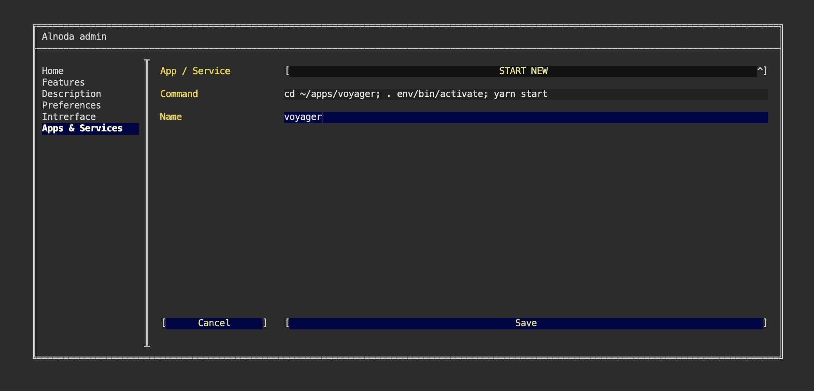
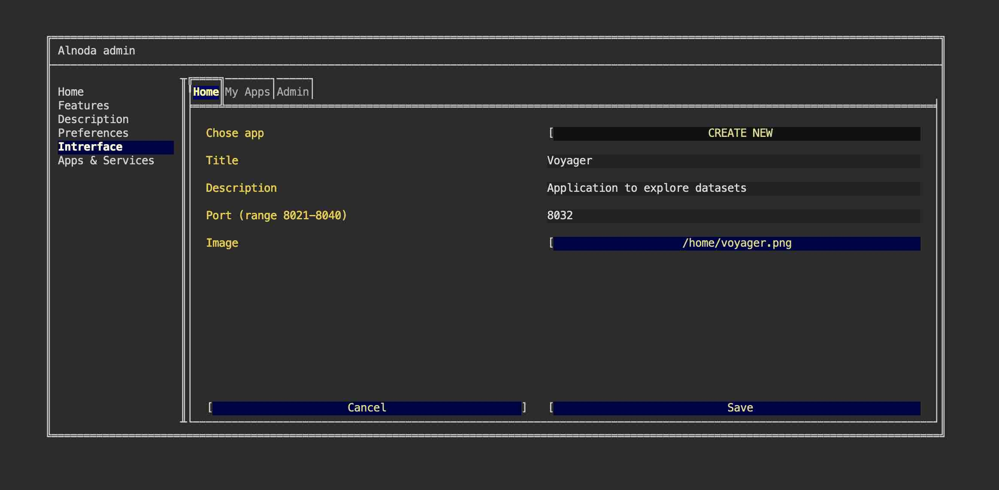

# Voyager

In this example we are going to add [Voyager](https://github.com/vega/voyager) to the workspace. Voyager is a data exploration 
tool that blends manual and automated chart specification.  

We will install Voyager in the separate isolated environment, start it in a way that is resilient to the workspace restart, 
and add a Voyager tab to the workspace UI Home tab.

## Build

First install python2. Voyager requires this dependency

```
sudo apt-get update
sudo apt-get install -y python2
```

Clone voyager repository, and go into it

```
git clone https://github.com/vega/voyager.git ~/apps/voyager
cd ~/apps/voyager
```

Create node environment. Separate environment will prevent dependencies conflicts with other applications.  

```
nodeenv --node=12.18.3 env
```

Activate this environment

```
. env/bin/activate
```

Install yarn

```
npm install -g yarn
```

Install all required packages

```
yarn
```

Build Voyager

```
yarn build
```

## Run

We have built voyager, now we can start it

```
yarn start
```

Voyager runs on port 9000, but workspace exposes port range 8020-8040. Lets create port tunneling 
from port 9000 to 8030. Open another terminal, and run

```
socat tcp-listen:8030,reuseaddr,fork tcp:localhost:9000
```

Now you can open Voyager from the "My-apps" tab. Click on "Application on port 8030". Browser opens Voyager in the new page.   

We can use Voyager now, but as soon as we close the terminal, Voyager will stop. It would be good if it kept running even if we 
close terminal and even after we restart the workspace. To make this happen, we need to start Voyager (together with the port tunneling) 
via the workspace settings page.  


## Add to workspace

Let's add Voyager as a permanent workspace application. Go to the "Admin" tab, open "Workspace Settings" and go to "Apps & Services".  

Here we can add new applications to the workspace. To do this we need to provide the command that sarts an application or service, 
and give this service a name.  

Let's first create an entry for Voyager. Select "START NEW" from the picklist, enter any name and paste this command

```
cd ~/apps/voyager; . env/bin/activate; yarn start
```

This commad will start Voyager. It consist of 3 sub-commands, separated by semicolon: 
go to voyager folder, activate environment and start application.  



Let's also start the port tunneling, which will map voyager's port 9000 to the port 8032. The latter is in the exposed range, hence it 
can be accessed.   

Select "START NEW" from the picklist, enter any name and paste this command

```
socat tcp-listen:8032,reuseaddr,fork tcp:localhost:9000
```

## Update UI

Finally, let's add Voyager shortcut to the workspace UI. This will allow us to open Voyager directly from the worspace UI page.   

Shortcut has title, description and image. Use filebrowser or IDE to upload any image intto the workspace. 
You can choose whatever you like, one option - is to create a printscreen of the Voyager app itself.  

After you upload the image to the workspace, go to the "Interface" tab of the workspace settings and select "CREATE NEW" from the picklist.   



Give it any title and description. In the field "Port" enter port 8032. Then select your image.   

Now we have Voyager tab on the Home page of the workspace.   


