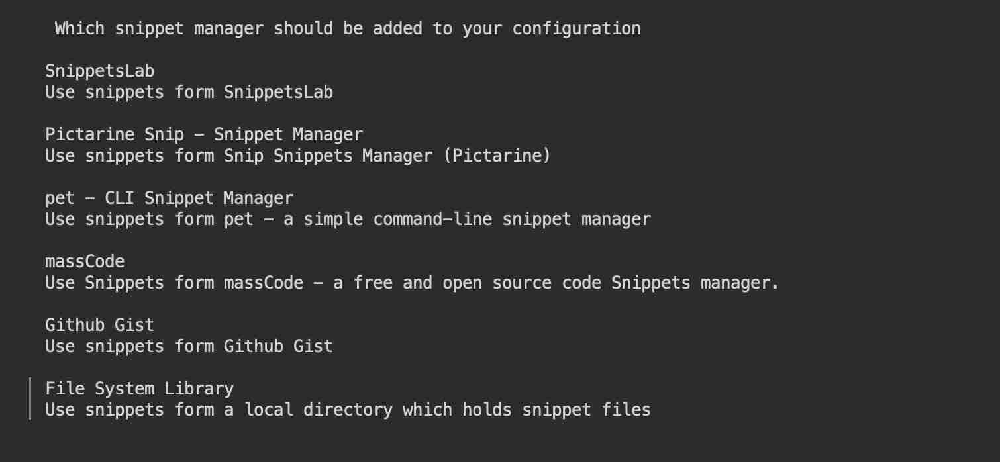

# SnipKit - Snippet CLI manager

work with pet https://github.com/knqyf263/pet


echo 'deb [trusted=yes] https://apt.fury.io/lemoony/ /' | tee /etc/apt/sources.list.d/snipkit.list
sudo apt-get update
sudo apt-get install snipkit


cat <<EOF >/home/abc/.config/snipkit/config.yaml
version: 1.1.1
config:
  style:
    theme: default
  editor: "" # Defaults to a reasonable value for your operation system when empty.
  defaultRootCommand: "" # If not set, the help text will be shown.
  fuzzySearch: false
  scripts:
    # The path to the shell to execute scripts with. If not set or empty, $SHELL will be used instead. Fallback is '/bin/bash'.
    shell: ""
    # Defines how parameters are handled. Allowed values: SET (sets the parameter value as shell variable) and REPLACE (replaces all occurrences of the variable with the actual value)
    parameterMode: SET
    # If set to true, any comments in your scripts will be removed upon executing or printing.
    removeComments: false
    # If set to true, the executed command is always printed on stdout before execution for confirmation (same functionality as providing flag -c/--confirm).
    execConfirm: false
    # If set to true, the executed command is always printed on stdout (same functionality as providing flag -p/--print).
    execPrint: false
  manager: {}
EOF


## Intro 

In this example we will install [__SnipKit__](https://github.com/lemoony/snipkit) - snippet manager that lets you execute 
the scripts saved in your favorite snippet manager without even leaving the terminal.   

[__SnipKit__](https://github.com/lemoony/snipkit) is a terminal-based application without a graphical user interface.   

!!! attention 
    [__SnipKit__](https://github.com/lemoony/snipkit) can be installed in any workspace. We will use __Codeserver workspace v.4.0__ in this example.

!!! note
    In this example tutorial we will add package repository, install SnipKit annd add tag to the workspace.  

## Install 

Add repository to the list of sources

<div class="termy">
```
$  echo 'deb [trusted=yes] https://apt.fury.io/lemoony/ /' | tee /etc/apt/sources.list.d/snipkit.list

deb [trusted=yes] https://apt.fury.io/lemoony/ /
```
</div>


Update the package lists 

<div class="termy">
```
$ sudo apt-get update

Fetched 339 kB in 2s (185 kB/s)
Reading package lists... Done
```
</div>


Install SnipKit

<div class="termy">
```
$ sudo apt-get install snipkit

Reading package lists... Done
Building dependency tree       
Reading state information... Done
The following NEW packages will be installed:
  snipkit
Preparing to unpack .../snipkit_1.3.1_amd64.deb ...
Unpacking snipkit (1.3.1) ...
Setting up snipkit (1.3.1) ...
```
</div>


## Initialize

Create a new config

<div class="termy">
```
$ snipkit config init

Config file created at:
  <span style="text-decoration: underline; font-style: italic;">/home/abc/.config/snipkit/config.yaml</span>

To add snippet managers, type in snipkit manager add.

If you want to edit the config, type in <span style="text-decoration: underline; font-style: italic;">snipkit config edit</span>.
If you want to delete the config, type in <span style="text-decoration: underline; font-style: italic;">snipkit config clean</span>.
```
</div>

Follow the next steps to add your snippet manager to SnipKit.



## Add tag 

On the "About" tab of the workspace UI you can see that workspaces have tags. Let's add `snipkit` tag tp our workspace to indicate 
that this application is present.  

Open "Admin" tab, go to "Workspace settings", then to "Features", add new tag after comma and save.


## Result

We have installed [__SnipKit__](https://github.com/lemoony/snipkit) and added a tag to the workspace.  