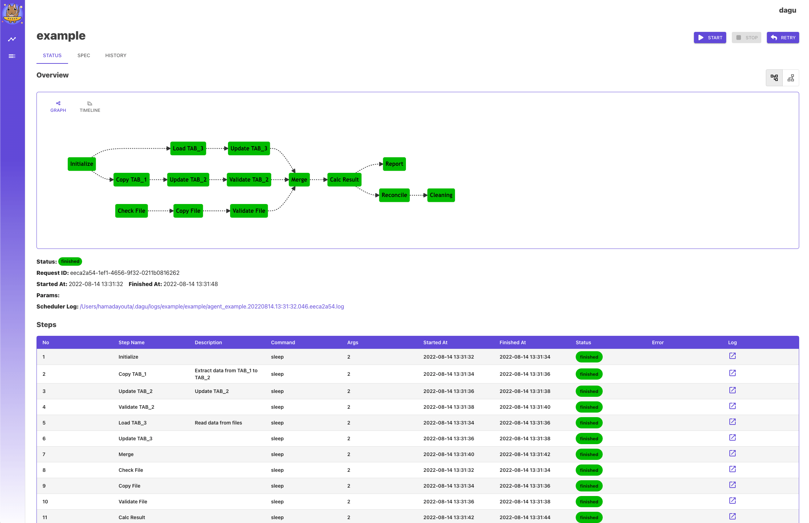
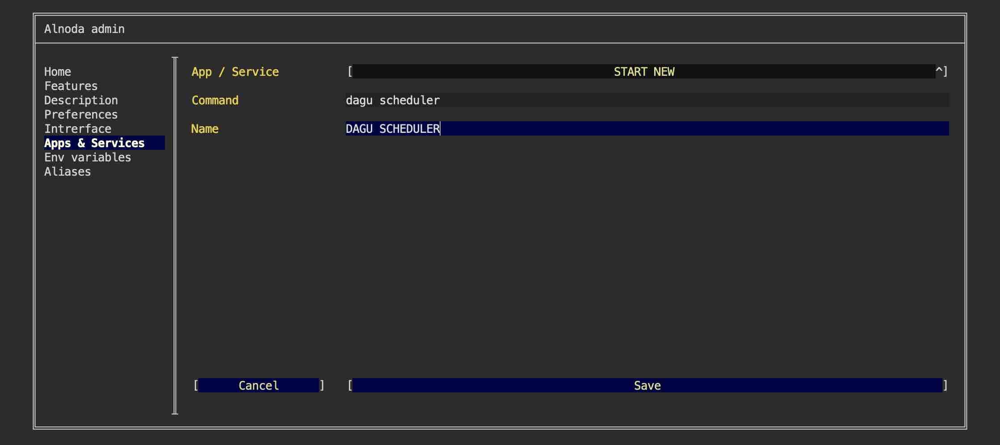
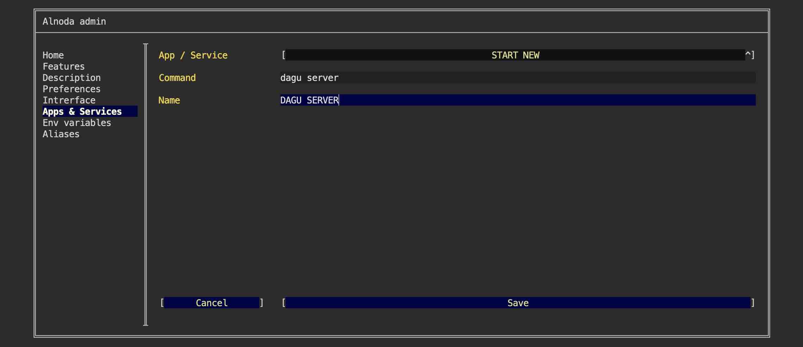
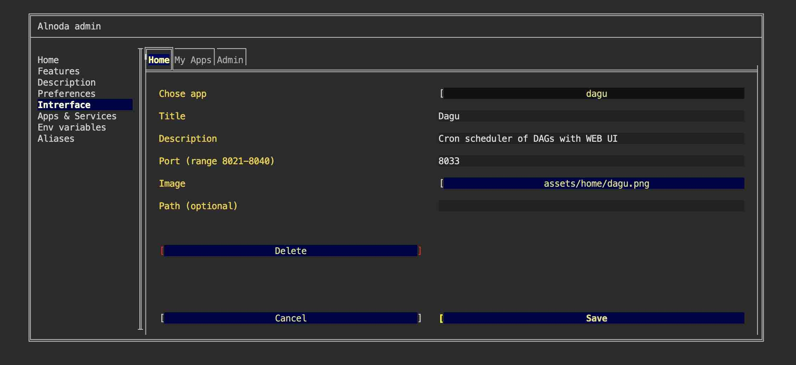
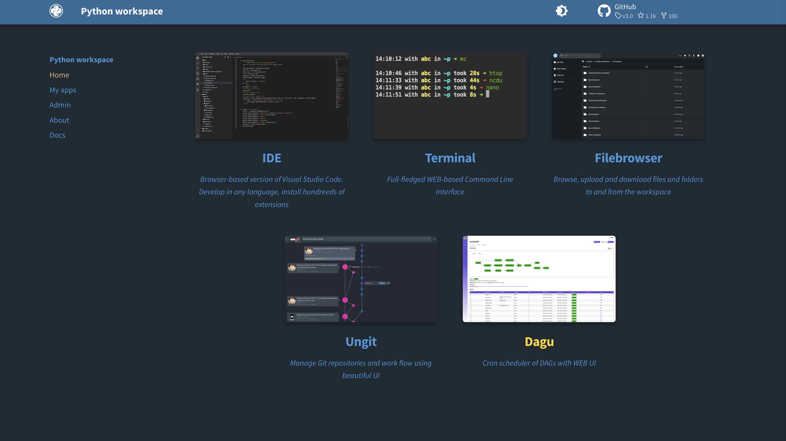
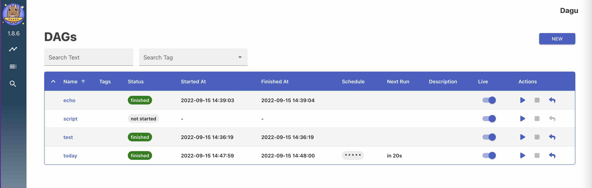

# Dagu - a Cron alternative with a Web UI, but with much more capabilities.

## Intro

In this example we will set up [__Dagu__](https://github.com/yohamta/dagu) in the workspace.  

Dagu can schedule executions of DAGs with Cron expressions, and define dependencies between related 
jobs and represent them as a single DAG (unit of execution).   



!!! attention 
    [__Dagu__](https://github.com/yohamta/dagu) can be installed in any workspace. We will use __Python workspace v.4.0__ in this example.

!!! note
    We will use dagu downloader script to get dagu binary. Then we will create cofiguration file and create several example DAGs. 
    Finally, we will add dagu to the workspace as a permanent application and create a shortcut tab for dagu on the Home page.   

## Install

First let's download dagu

<div class="termy">
```bash
$ curl -L https://raw.githubusercontent.com/yohamta/dagu/main/scripts/downloader.sh | bash

% Total    % Received % Xferd  Average Speed   Time    Time     Time  Current
                                 Dload  Upload   Total   Spent    Left  Speed
100   728  100   728    0     0   2628      0 --:--:-- --:--:-- --:--:--  2656
Downloading the latest binary to the current directory...
Downloading dagu v1.8.6...
```
</div>

Now we only need to move dagu to the user's bin folder 

<div class="termy">
```bash
$ mv dagu ~/bin

with <font color="#FDEB61">abc</font> in <font color="#37E6E8">~/p</font>
```
</div>

## Configure

Create configuration file `~/.dagu/admin.yaml`. You can do it simply by executing

<div class="termy">
```bash
$ mkdir ~/.dagu/ && touch ~/.dagu/admin.yaml

with <font color="#FDEB61">abc</font> in <font color="#37E6E8">~/p</font>
```
</div>


Open configuration file in IDE and paste the following lines 

```yaml
# Web Server Host and Port
host: 0.0.0.0
port: 8033

# path to the DAGs directory
dags: /home/project/dags

# Web UI Color & Title
navbarColor: "#1E415E"
navbarTitle: Dagu                      

# Basic Auth
isBasicAuth: false

# Base Config
baseConfig: /home/project/dags/config.yaml

# Others
logDir: /home/project/dags/logs/admin
command: /home/abc/bin/dagu
```

In the configuration file we have defined host `0.0.0.0` - this is necessary because we are running application withi the docker 
container. In addition, we have set port 8033 - one of the free ports from the workspace port range of 8021-8040.  

We have also specified folder `/home/project/dags` to be our dags folder. Let's create this folder and go into it 

<div class="termy">
```bash
$ mkdir /home/project/dags

with <font color="#FDEB61">abc</font> in <font color="#37E6E8">~/p</font>

$ cd /home/project/dags

with <font color="#FDEB61">abc</font> in <font color="#37E6E8">~/p/dags</font>
```
</div>

Let's create couple of dags in this folder. Open workspace IDE and create file `echo.yaml` with the following content 

```yaml
steps:
  - name: step 1
    command: echo hello
  - name: step 2
    command: echo world
    depends:
      - step 1
```

And file `script.yaml` 

```yaml
steps:
  - name: step 1
    command: "bash"
    script: |
      cd /tmp
      echo "hello world" > hello
      cat hello
    output: RESULT
  - name: step 2
    command: echo ${RESULT} # hello world
    depends:
      - step 1
```

And one file with schedule. Call this file `today.yaml` 

```yaml
schedule: "* * * * *" 
env:
  TODAY: "Saturday"
steps:
  - name: hello
    command: echo "hello, today is ${TODAY}" >> /home/hello.txt
```


## Add to workspace 

In order to start dagu we need to start dagu server and dagu scheduler. We will start both as resilient workspace services. Having started 
this way, dagu will start every time we start the workspace.  

Let's first create service for dagu scheduler 

- [X] Open "Admin" tab in the workspace UI and navigate to "Workspace Settings" 
- [X] Go to the tab "Apps & Services"
- [X] Select "START NEW" from the picklist 
- [X] Enter the command - `dagu scheduler`
- [X] Save

  

Now we need to create service for dagu server. Repeat the steps we have made with dagu scheduler. Give it any name, 
as command enter `dagu server`  

  

Restart the workspace to apply changes.  


## Add UI tab 

Let's add dagu shortcut tab to the workspace "Home" page.   

Shortcut tab has title, description and image. Use filebrowser or IDE to upload any image you want into the workspace. 
You can choose whatever you like, one option - is to create a printscreen of the app itself.  

After you upload the image to the workspace

- [X] Go to the "Interface" tab of the workspace settings and select "CREATE NEW" from the picklist.   
- [X] Give it any title and description. 
- [X] In the field "Port" enter port 8033 - the port we set in the dagu configuration file.
- [X] In the file picker find your image.   
- [X] Leave field "path" blank and click "Create"



Now we have Dagu on the Home page


 

## Use 

We can open dagu from the tab on the "Home" page that we have just created.   

you can see the DAGs from the folder `/home/project/dags`. You can explore dagu UI, run any of the DAGs or even create 
new DAGs directly from the dagu UI.   

We can also see that DAG `toda` is being automatically executed every minute. We can explore the history of executions and view logs.  




## Result

We have installed [__Dagu__](https://github.com/yohamta/dagu) in the workspace, created dagu configuration file and several 
example DAGs. 

Then we have started dagu scheduler and dagu server as workspace services. Every time we start the workspace, both dagu scheduler 
and dagu server will start too.  

Finally, we have create a shortcut tab for dagu on the home page. 