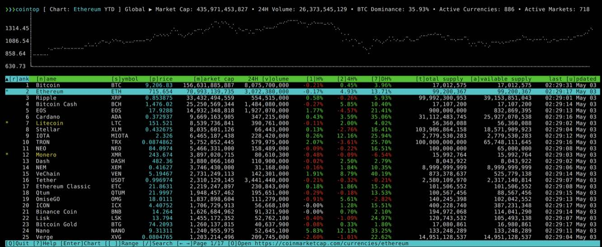

# Convert2Svg  - convert images to SVG

## Intro

In this example we will set up [__cointop__](https://docs.cointop.sh) - a fast and lightweight interactive 
terminal based UI application for tracking and monitoring cryptocurrency coin stats in real-time. 



## Golang

Requirement for any Go application - is to have go programming language installed

<div class="termy">
```
$ wrk install go==1.18.2
...
🚀 done
R E S T A R T    T E R M I N A L    N O W   (CTRL+D) !!!!!!!!
***********************************************
```
</div>

__Please restart the terminal!__

## App

Now we can istall. the latest versio of __cointop__ 

<div class="termy">
```
$ go install github.com/cointop-sh/cointop@latest
...
go: downloading github.com/godbus/dbus/v5 v5.0.4
go: downloading github.com/anaskhan96/soup v1.0.1
go: downloading golang.org/x/net v0.0.0-20210405180319-a5a99cb37ef4
```
</div>

__Restart the terminal again__

Now you can start the application from the command line

<div class="termy">
```
$ cointop
```
</div>
