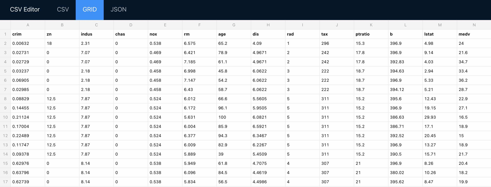
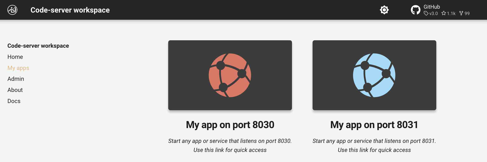
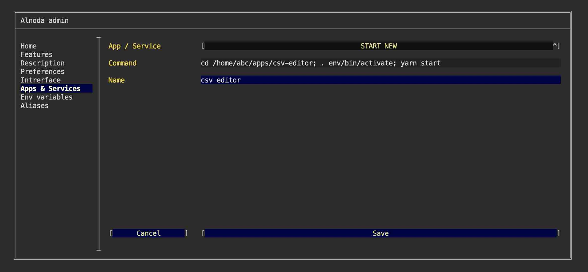
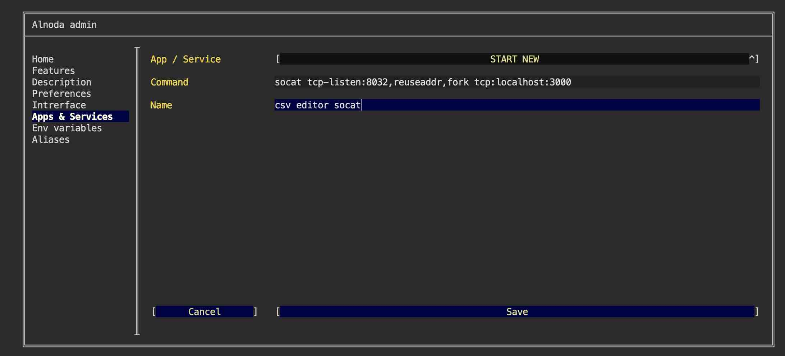
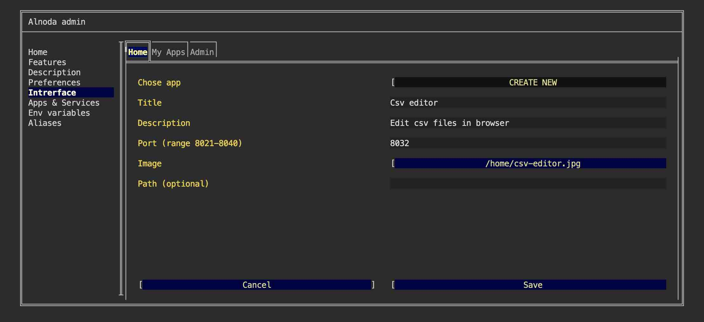
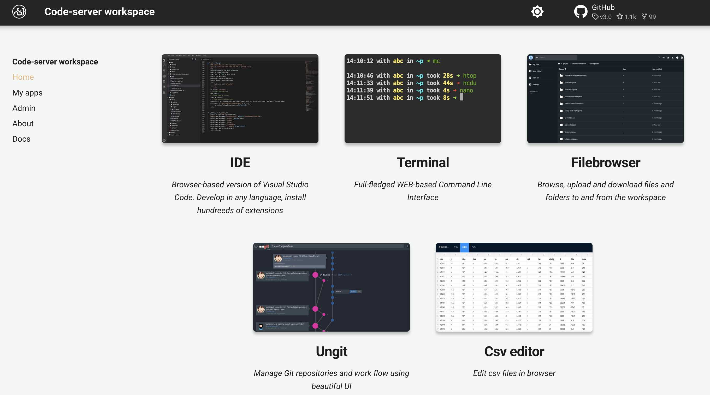

# CSV Editor  - edit csv data easily

## Intro

In this example we will set up [__csv-editor__](https://github.com/LemonUnit/csv-editor-online) which allows to change CSV in spreadsheet 
view in simple way.



!!! attention
    Csv-editor can be installed in any workspace. We will use __Codeserver workspace v.4.0__ in this example.

!!! note
    We will create isolated node environment for Csv-editor and its dependencies.  
    Then we will start it in the workspace and add Csv-editor tab shortcut to the workspace UI. 


## Install 

Open workspace terminal, clone Csv-editor git repository version 0.3.0

<div class="termy">
```bash
$ git clone https://github.com/LemonUnit/csv-editor-online.git /home/abc/apps/csv-editor

Cloning into '/home/abc/apps/csv-editor'...
remote: Enumerating objects: 282, done.
remote: Counting objects: 100% (20/20), done.
remote: Compressing objects: 100% (14/14), done.
remote: Total 282 (delta 6), reused 20 (delta 6), pack-reused 262
Receiving objects: 100% (282/282), 3.05 MiB | 11.72 MiB/s, done.
Resolving deltas: 100% (145/145), done.
```
</div>

Go to the repo we have just cloned

<div class="termy">
```bash
$ cd /home/abc/apps/csv-editor

with <font color="#FDEB61">abc</font> in <font color="#37E6E8">/home/abc/apps/csv-editor</font> on <font color="#BC94B7">⇡master</font> <font color="#98E242">➜</font>
```
</div>

Create node enviroment and activate it

<div class="termy">
```
$ nodeenv --node=12.7.0 env && . env/bin/activate

 * Install prebuilt node (12.7.0) ..... done.
(env) 19:58:14 with <font color="#FDEB61">abc</font> in <font color="#37E6E8">/home/abc/apps/csv-editor</font> on <font color="#BC94B7">⇡master</font> is 📦  <font color="#5EA702">via ⬢ v12.7.0</font>  <font color="#98E242">➜</font>
```
</div>

Install yarn

<div class="termy">
```
$ npm install -g yarn

+ yarn@1.22.19
added 1 package in 1.537s
```
</div>

Install dependencies

<div class="termy">
```
$ yarn install

[4/4] Building fresh packages...
Done in 71.73s.
```
</div>

Build the app

<div class="termy">
```
$ yarn run build

The project was built assuming it is hosted at <font color="#5EA702">/csv-editor-online/</font>.
You can control this with the <font color="#5EA702">homepage</font> field in your <font color="#00A7AA">package.json</font>.

The <font color="#00A7AA">build</font> folder is ready to be deployed.
To publish it at <font color="#5EA702">http://lemonunit.github.io/csv-editor-online</font>, run:

  <font color="#00A7AA">yarn</font> run deploy

Find out more about deployment here:

  <font color="#CFAE00">https://bit.ly/CRA-deploy</font>
Done in 54.30s.
```
</div>


## Run

start the server

<div class="termy">
```
$ yarn run start

The <font color="#00A7AA">Starting the development server...</font> 
```
</div>

Csv-editor is running on port 3000. Let's tunnel it to the port 8030

Open another terminal window, and execute

<div class="termy">
```
$ socat tcp-listen:8030,reuseaddr,fork tcp:localhost:3000

<font color="#646562">_</font>
```
</div>

Now you can open Csv-editor using tab "My App on port 8030"




## Add to workspace

We can work with Csv-editor now, but as soon as we close the terminal, Csv-editor will stop too.  

It would be much more convenient if we didn't need to start Csv-editor from the terminal each time. Let's add 
Csv-editor to the workspace list of services, so that Csv-editor starts automatically.  

Go to the "Admin" tab, open "Workspace Settings" and go to "Apps & Services".  

Here we can add new applications to the workspace. To do this we need to provide the command that sarts an application or service, 
and give this service a name.  

Let's first create an entry for the Csv-editor. Select "START NEW" from the picklist, enter any name and paste this command

```sh
cd /home/abc/apps/csv-editor; . env/bin/activate; yarn start
```

This commad will start Csv-editor. It consist of 3 sub-commands, separated by semicolon: 
go to Csv-editor folder, activate environment and start application.  



Let's also start the port tunneling, which will map Csv-editor's port 3000 to the port 8032. The latter is in the exposed range, hence it 
can be accessed.   

Select "START NEW" from the picklist, enter any name and paste this command

```sh
socat tcp-listen:8032,reuseaddr,fork tcp:localhost:3000
```



Please restart the workspace for new applications to start.  


## Update UI

Finally, let's add Csv-editor shortcut to the workspace UI. This will allow us to open Csv-editor directly from the worspace UI page.   

Shortcut has title, description and image. Use filebrowser or IDE to upload any image into the workspace. 
You can choose whatever you like, one option - is to create a printscreen of the Csv-editor app itself.  

After you upload the image to the workspace, go to the "Interface" tab of the workspace settings and select "CREATE NEW" from the picklist.   



Give it any title and description. In the field "Port" enter port 8032. Leave field "path" blank. Then select your image.   

Now we have Csv-editor tab on the Home page of the workspace. 



## Result

Csv-editor was permanently added to the workspace. If we stop and then start workspace, Csv-editor will be started too.  

Any new workspace we create from this workspace will have Csv-editor too.
