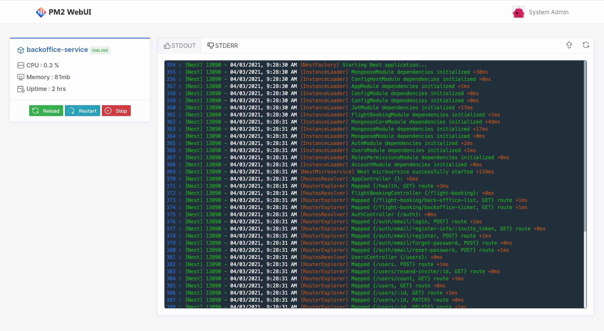
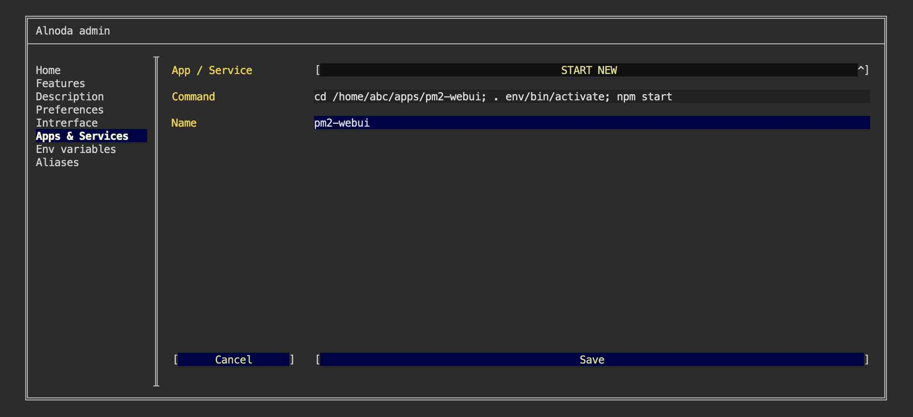
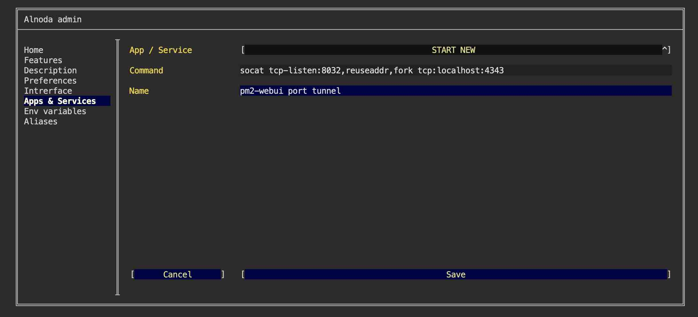
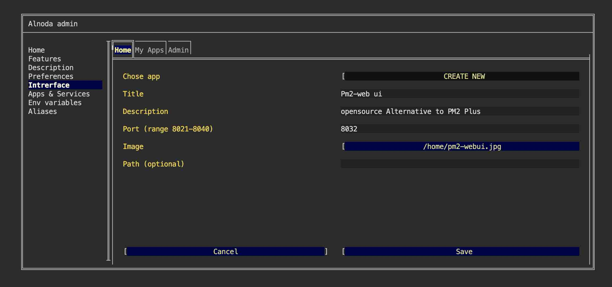
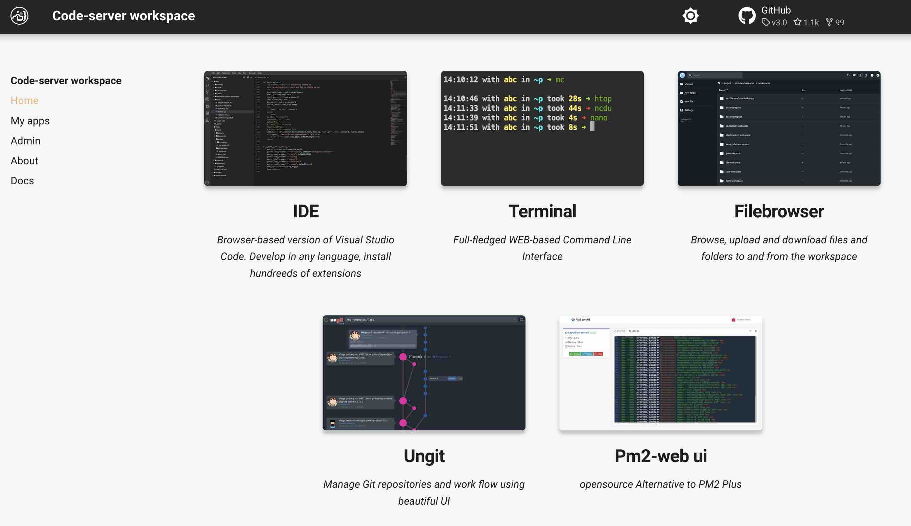

# Pm2-webui  - opensource Alternative to PM2 Plus

## Intro

In this example we will set up [__pm2-webui__](https://github.com/suryamodulus/pm2-webui) in the workspace.    

PM2 WebUI - is a minimalistic app manager and log viewer. 



!!! attention
    PM2 WebUI can be installed in any workspace. We will use __Codeserver workspace v.4.0__ in this example.

!!! note
    We will create isolated node environment for PM2 WebUI and its dependencies.  
    Then we will start it in a permanent way, and add PM2 WebUI tab shortcut to the workspace UI. 


## Install 

Open workspace terminal, clone PM2 WebUI git repository and enter it

<div class="termy">
```bash
$ git clone https://github.com/suryamodulus/pm2-webui /home/abc/apps/pm2-webui

Cloning into '/home/abc/apps/pm2-webui'...

$ cd /home/abc/apps/pm2-webui
with <font color="#FDEB61">abc</font> in <font color="#37E6E8">/home/abc/apps/pm2-webui</font> on <font color="#BC94B7">⇡master</font> <font color="#98E242">➜</font>
```
</div>

Create node enviroment and activate it (you can find required version in `package.json` file)

<div class="termy">
```
$ nodeenv --node=17.0.0 env && . env/bin/activate

 * Install prebuilt node (17.0.0) ..... done.
(env) 19:58:14 with <font color="#FDEB61">abc</font> in <font color="#37E6E8">/home/abc/apps/pm2-webui</font> on <font color="#BC94B7">⇡master</font> is 📦  <font color="#5EA702">via ⬢ v17.0.0</font>  <font color="#98E242">➜</font>
```
</div>

Install dependencies

<div class="termy">
```
$ npm install

...
added 407 packages, and audited 408 packages in 20s
```
</div>

Configure

<div class="termy">
```
$ cp env.example .env

(env) 19:58:14 with <font color="#FDEB61">abc</font> in <font color="#37E6E8">/home/abc/apps/pm2-webui</font> on <font color="#BC94B7">⇡master</font> is 📦  <font color="#5EA702">via ⬢ v17.0.0</font>  <font color="#98E242">➜</font>

$ npm run setup-admin-user 

<font color="#5EA702">✔</font> <b>App Username</b> … admin
<font color="#5EA702">✔</font> <b>App Password</b> … ***********
<font color="#5EA702">✔</font> <b>Confirm to create/update admin user ?</b> … yes

```
</div>


## Run

Start PM2 WebUI

<div class="termy">
```
$ npm start

> pm2-webui@1.0.0 start
> node .
Application started at http://127.0.0.1:4343
```
</div>

Application is running on port 4343. Let's tunnel it to the port 8031

Open another terminal window, and execute

<div class="termy">
```
$ socat tcp-listen:8031,reuseaddr,fork tcp:localhost:4343

<font color="#646562">_</font>
```
</div>

Now you can open PM2 WebUI from the tab "My App on port 8031"


## Add to workspace

PM2 WebUI is up and running. But it started from terminal. As soon as we close the terminal, PM2 WebUI will terminalte. 

Let's create a permanent workspace service for PM2 WebUI: 

- [X] Open "Admin" tab of the workspace UI and avigate to "Workspace Settings" 
- [X] Go to the tab "Apps & Services"
- [X] Select "START NEW" from the picklist 
- [X] Enter the following command 

```sh
cd /home/abc/apps/pm2-webui; . env/bin/activate; npm start
``` 
This command consists of several parts: 1) go to the PM2 WebUI repo, 2) activate node environment, 3) serve PM2 WebUI on port 8032

- [X] Give it any name you want 
- [X] Click "Save"



we also need to create service for socat that tunnels port 4343 to another port 

- [X] Open "Admin" tab of the workspace UI and avigate to "Workspace Settings" 
- [X] Go to the tab "Apps & Services"
- [X] Select "START NEW" from the picklist 
- [X] Enter the following command 

```sh
socat tcp-listen:8032,reuseaddr,fork tcp:localhost:4343
``` 

- [X] Give it any name you want 
- [X] Click "Save"



Restart workspace to apply changes.


## Create UI tab 

Let's add shortcut tab for PM2 WebUI on the "Home" page.   

Shortcut tab has title, description and image. Use filebrowser or IDE to upload any image you want into the workspace. 
You can choose whatever you like, one option - is to create a printscreen of the PM2 WebUI app itself.  

After you upload the image to the workspace

- [X] Go to the "Interface" tab of the workspace settings and select "CREATE NEW" from the picklist.   
- [X] Give it any title and description. 
- [X] In the field "Port" enter port 8032 
- [X] In the file picker find your image.   
- [X] Leave field "path" blank and click "Create"



Now we have PM2 WebUI tab on the Home page 




## Result

PM2 WebUI was installed and permanently added to the workspace. If we stop and then start workspace, PM2 WebUI will start automatically. 
All workspaces that have this workspace i lineage will get PM2 WebUI too. 
