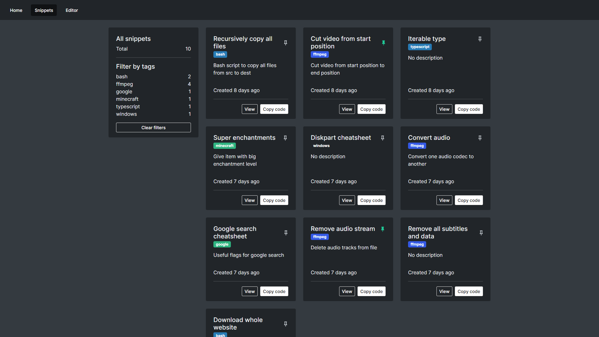
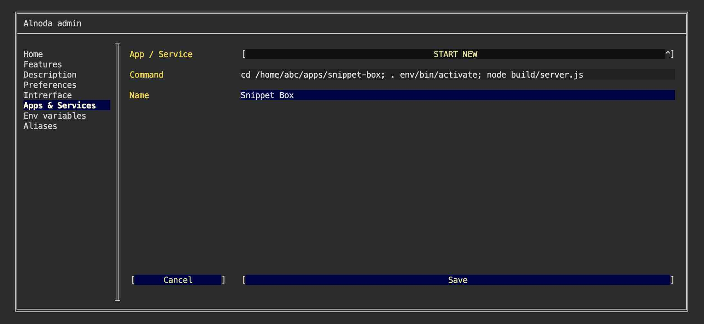
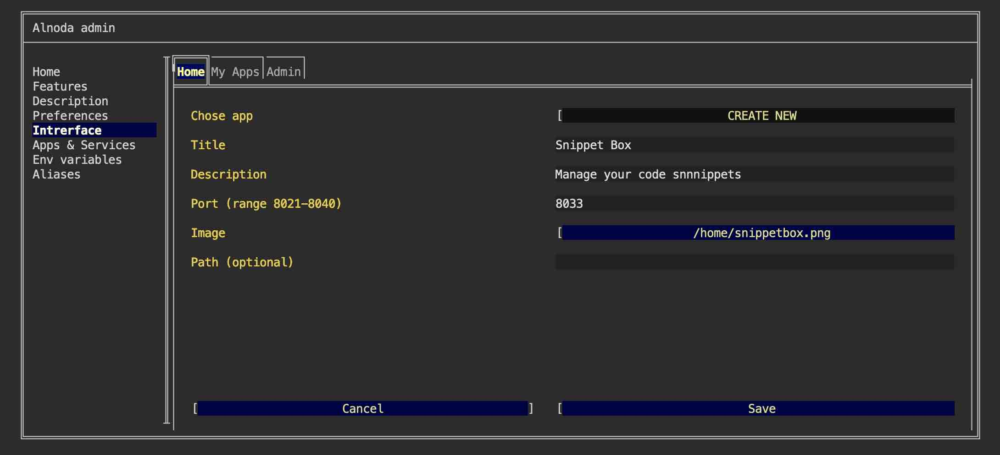
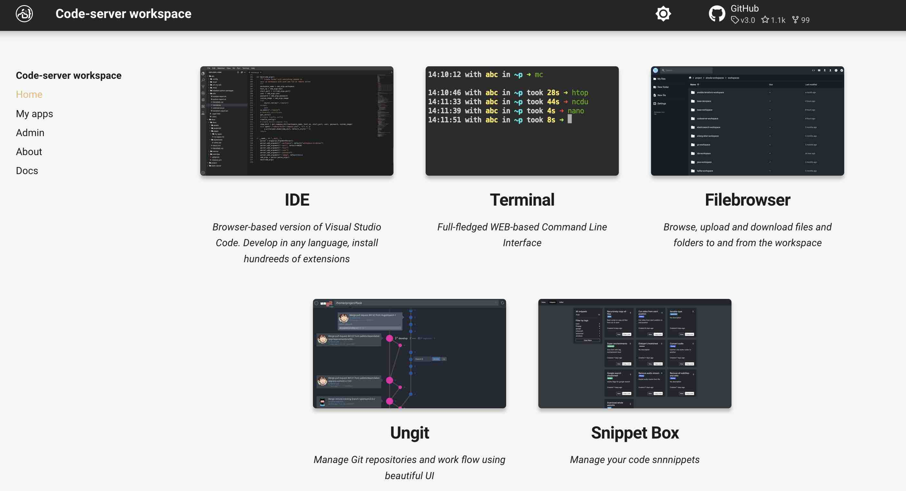
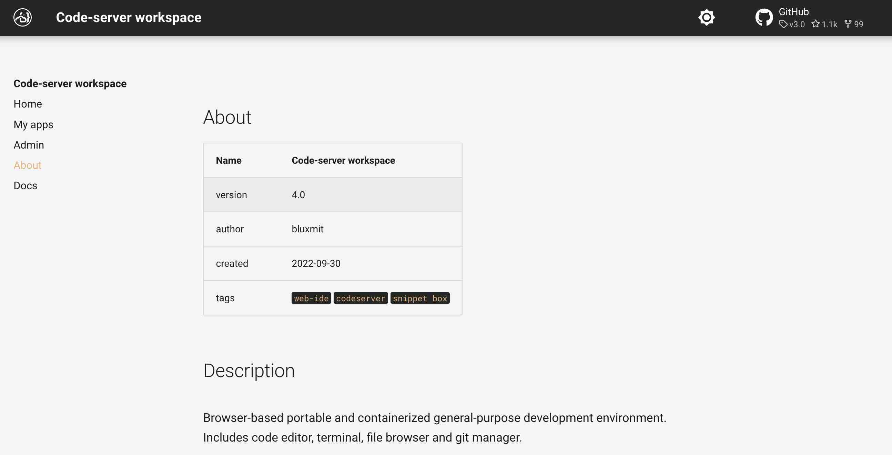

# Snippet Box - organize your code snippets

## Intro

In this example we will set up [__Snippet Box__](https://github.com/pawelmalak/snippet-box) in the workspace.   

[__Snippet Box__](https://github.com/pawelmalak/snippet-box) is a simple app for organizing your code snippets. It allows you to easily create, edit, browse and manage your snippets 
in various languages. With built-in Markdown support, Snippet Box makes it very easy to add notes or simple documentation to your code.



!!! attention
    Snippet Box is a browser-based application that can be installed in any workspace. 
    We will use __Codeserver workspace v.4.0__ in this example.

!!! note
    We will create isolated node environment for Snippet Box and its dependencies.  
    Then we will start it in a permanent way, and add Snippet Box tab shortcut to the workspace UI. 


## Install 

Open workspace terminal, clone Snippet Box git repository and enter it

<div class="termy">
```bash
$ git clone https://github.com/pawelmalak/snippet-box.git /home/abc/apps/snippet-box

Cloning into '/home/abc/apps/snippet-box'...

$ cd /home/abc/apps/snippet-box
with <font color="#FDEB61">abc</font> in <font color="#37E6E8">~/apps/snippet-box</font> on <font color="#BC94B7">⇡master</font> <font color="#98E242">➜</font>
```
</div>

Create node enviroment and activate it

<div class="termy">
```
$ nodeenv --node=14.17.3 env && . env/bin/activate

 * Install prebuilt node (14.17.3) ..... done.
(env) 19:58:14 with <font color="#FDEB61">abc</font> in <font color="#37E6E8">/home/abc/apps/snippet-box</font> on <font color="#BC94B7">⇡master</font> is 📦  <font color="#5EA702">via ⬢ v14.17.3</font>  <font color="#98E242">➜</font>
```
</div>

Install dependencies

<div class="termy">
```
$ npm run init

added 2121 packages from 896 contributors and audited 2124 packages in 76.357s
```
</div>

Build 

<div class="termy">
```
$ npm run build

...
> snippet-hub@1.0.0 build:tsc /home/abc/apps/snippet-box
> tsc
```
</div>

Move resources 

<div class="termy">
```
$ mkdir public && mv ./client/build/* ./public

(env) 19:58:14 with <font color="#FDEB61">abc</font> in <font color="#37E6E8">/home/abc/apps/snippet-box</font> on <font color="#BC94B7">⇡master</font> is 📦  <font color="#5EA702">via ⬢ v14.17.3</font>  <font color="#98E242">➜</font>
```
</div>


## Run

Start snippet Box

<div class="termy">
```
$ node build/server.js

[2022-09-30 13:40:11.818 UTC+0] [INFO] db: Database connected
[2022-09-30 13:40:11.889 UTC+0] [INFO] db: Found pending migrations. Executing...
[2022-09-30 13:40:11.889 UTC+0] [DEV] db: Executing 00_initial.js migration
[2022-09-30 13:40:11.890 UTC+0] [DEV] db: Executing 01_pinned_snippets.js migration
[2022-09-30 13:40:11.891 UTC+0] [DEV] db: Executing 02_tags.js migration
[2022-09-30 13:40:12.052 UTC+0] [INFO] server: Server is working on port 5000 in development mode
```
</div>

Snippet Box is running on port 5000. Lets change it to port 8030 - this port is exposed by the workspace.   

Open one more terminal window, and execute 

<div class="termy">
```
$ socat tcp-listen:8030,reuseaddr,fork tcp:localhost:5000

<font color="#646562">_</font>
```
</div>

Now you can open Snippet Box from the tab "My App on port 8031"


## Add to workspace

Snippet Box is up and running. But it started from terminal. As soon as we close the terminal, Snippet Box will terminalte too. 

Let's create a permanent workspace service for Snippet Box: 

- [X] Open "Admin" tab of the workspace UI and avigate to "Workspace Settings" 
- [X] Go to the tab "Apps & Services"
- [X] Select "START NEW" from the picklist 
- [X] Enter the following command 

```sh
cd /home/abc/apps/snippet-box; . env/bin/activate; node build/server.js
``` 
This command consists of 3 commands: 1) go to the Snippet Box repo, 2) activate node environment, 3) start Snippet Box

- [X] Give it any name you want 
- [X] Click "Save"



we also need to create service for socat that tunnels port 5000 to another port 

- [X] Open "Admin" tab of the workspace UI and avigate to "Workspace Settings" 
- [X] Go to the tab "Apps & Services"
- [X] Select "START NEW" from the picklist 
- [X] Enter the following command 

```sh
socat tcp-listen:8033,reuseaddr,fork tcp:localhost:5000
``` 

- [X] Give it any name you want 
- [X] Click "Save"


Restart workspace to apply changes.


## Create UI tab 

Let's add shortcut tab for Snippet Box on the "Home" page.   

Shortcut tab has title, description and image. Use filebrowser or IDE to upload any image you want into the workspace. 
You can choose whatever you like, one option - is to create a printscreen of the Snippet Box app itself.  

After you upload the image to the workspace

- [X] Go to the "Interface" tab of the workspace settings and select "CREATE NEW" from the picklist.   
- [X] Give it any title and description. 
- [X] In the field "Port" enter port 8033 
- [X] In the file picker find your image.   
- [X] Leave field "path" blank and click "Create"



Now we have Snippet Box tab on the Home page 




## Add tag

Let's also add "snippet box" tag to the workspace meta information 

- [X] Go to the "Features" tab of the workspace settings and add new tag "snippet box" separated from other tags with comma.   
- [X] Click "Save"


Now you can ope the "About" tab of the workspace home page and see that the new tag appeared




## Result

Snippet Box was installed and permanently added to the workspace. If we stop and then start workspace, Snippet Box will start automatically. 
All workspaces that have this workspace i lineage will get Snippet Box too. 
