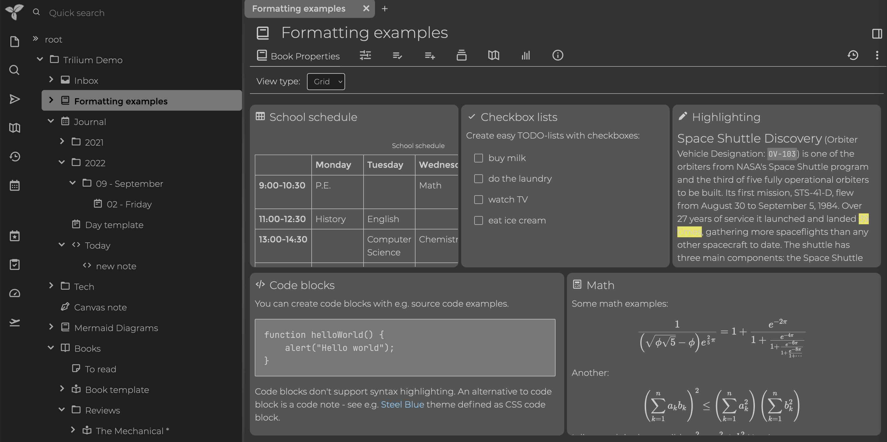
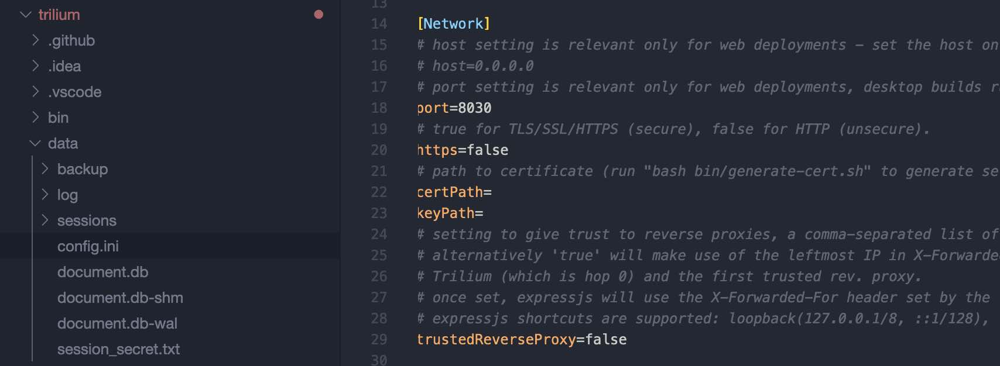
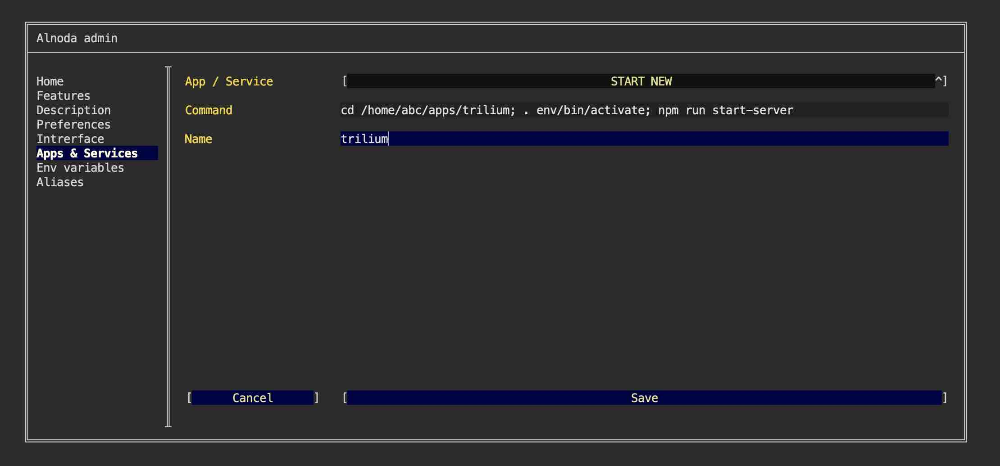
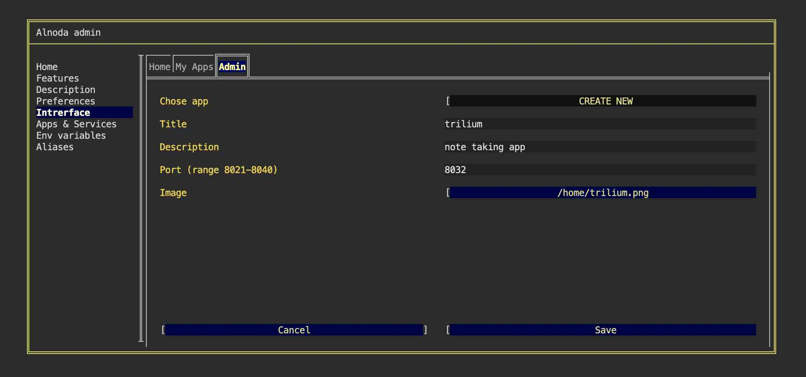

# Trilium Notes

## Intro

In this example we are going to add [__Trilium__](https://github.com/zadam/trilium) - a hierarchical note taking 
application with focus on building large personal knowledge bases. 



!!! attention
    [__Trilium__](https://github.com/zadam/trilium) can be installed in any workspace. We will use __Codeserver workspace v.4.0__ for this example.

Trilium is a Javascript application with the browser-based user interface. 

!!! note
    We will create isolated node environment for Trilium and its dependencies.  
    Then we will start it in a permanent way, and add Trilium card to the workspace UI.  

## Install

Let's clone the trilium git repository

<div class="termy">
```bash
$ git clone https://github.com/zadam/trilium.git ~/apps/trilium

Cloning into '/home/abc/apps/toastui'...
remote: Enumerating objects: 14427, done.
remote: Counting objects: 100% (1803/1803), done.
remote: Compressing objects: 100% (700/700), done.
remote: Total 14427 (delta 1016), reused 1516 (delta 858), pack-reused 12624
Receiving objects: 100% (14427/14427), 24.42 MiB | 1.13 MiB/s, done.
Resolving deltas: 100% (10079/10079), done.

$ cd ~/apps/toastui
with <font color="#FDEB61">abc</font> in <font color="#37E6E8">~/apps/toastui</font> on <font color="#BC94B7">⇡master</font> <font color="#98E242">➜</font>
```
</div>


Create node enviroment and activate it

<div class="termy">
```
$ nodeenv --node=16.17.0 env && . env/bin/activate

 * Install prebuilt node (16.17.0) ..... done.
(env) 17:58:14 with <font color="#FDEB61">abc</font> in <font color="#37E6E8">~/apps/toastui</font> on <font color="#BC94B7">⇡master</font> is 📦  <font color="#5EA702">via ⬢ v16.17.0</font>  <font color="#98E242">➜</font>
```
</div>

Installs a package and all dependsies on.

<div class="termy">
```
$ npm install

added 1009 packages, and audited 1010 packages in 4m
```
</div>

## Run 

Before we start Trilium we need to configure the port application will be listening to and disable authentication. 
The Trilium configuration is in the subfolder `data` in the file `data/config.ini`.    

Let's open this config file with code editor (nao, vim, Theia), and modify two lines, set 

```
noAuthentication=true

port=8030
```



Now we can start Trilium 

<div class="termy">
```
$ npm run start-server

Listening on port 8030
Becca (note cache) load took 16ms
websocket client connected
Table counts: notes: 170, note_revisions: 0, branches: 188, attributes: 247, etapi_tokens: 0
All consistency checks passed with no errors detected (took 18ms)
```
</div>

In the workspace UI open "My Apps" and click "My app on port 8030".   

Well done! Trilium is up an running. 

## Add to workspace

The way we have launched Trilium is not permanent. As soon as we close the terminal session Trilium will shut down.  

Lets add Trilium to the workspace as a permanet application.  

Let's change the Trilium config again. Port 8030 is reserved for the "My app on port 8030", let's use another port - 8032.  

After you changed the port to 8032 in the file `data/config.ini`, open "Admin" tab, click "Workspace settings" go to "Apps & Services" 
and select "START NEW" from the picklist.   

We need to enter the command that will activate the node environment, and will also start trilium.  

The entire command will look like this

```
cd /home/abc/apps/trilium; . env/bin/activate; npm run start-server
```

Use this command, enter any name you want and click "Save".   



Restart the workspace.   

## Update UI 

Let's add Trilium card to the workspace UI.  

On the workspace UI open "Admin" tab, click "Workspace settings", go to "Interface", chose tab you want to add Trilium card to 
(default Home), and select "START NEW" from the picklist.  

You can provide any name, description and image for the new card. It is important though to properly enter the port that Trilium 
is listening to. We have should set it to 8032.  



As soon as you hit "Save" button, the Trilium card will appear on the respective tab of the workspace UI page. We can use 
this card for quick access to Trilium.  

## Result 

We have installed [__Trilium__](https://github.com/zadam/trilium) in the isolated node environment, and have permanently 
added it to the workspace. We added the Trilium card to the workspace UI. 

Trilium will always start together with the workspace. All other workspaces created from this one will have Trilium too. 
