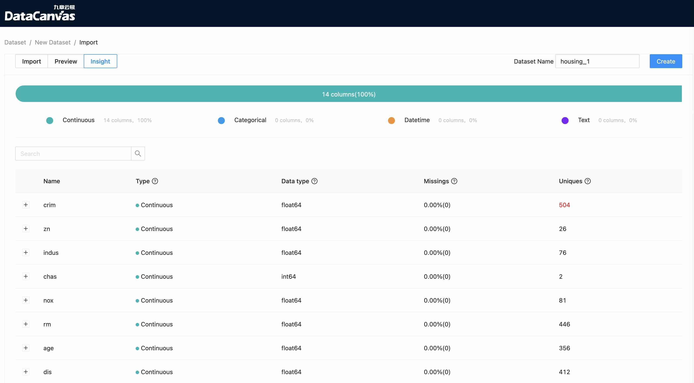
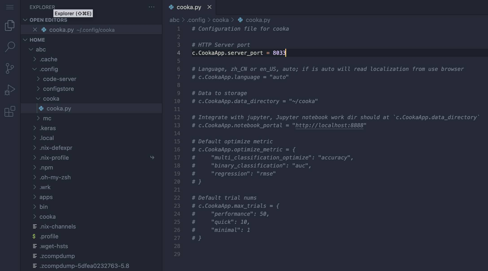
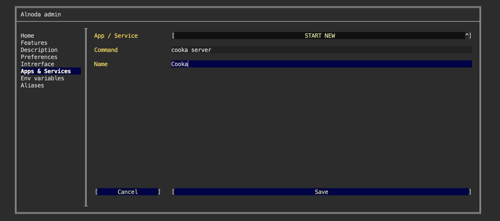
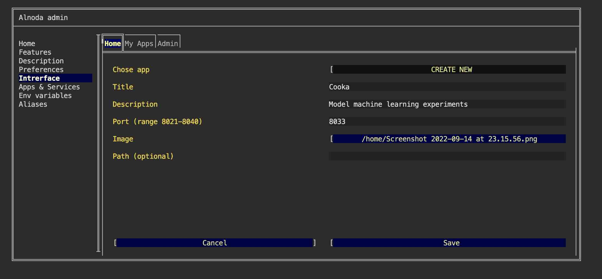
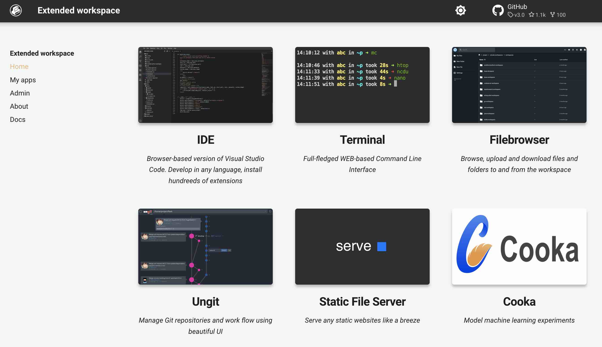

# Cooka - manage machine learning datasets and experiments

## Intro

In this example we are going to add [Cooka](https://github.com/DataCanvasIO/Cooka) to the workspace as a permanent workspace application.   

[Cooka](https://github.com/DataCanvasIO/Cooka) is a lightweight and visualization toolkit to manage datasets and design 
model learning experiments through web UI.  



[Cooka](https://github.com/DataCanvasIO/Cooka) can be installed in any workspace. We will use __Extended workspace__ in this example.  

[Cooka](https://github.com/DataCanvasIO/Cooka) is a python application with a graphical browser-based user interface.   

We will install [Cooka](https://github.com/DataCanvasIO/Cooka) python package, add [Cooka](https://github.com/DataCanvasIO/Cooka) 
as a permanent workspace application, and create [Cooka](https://github.com/DataCanvasIO/Cooka) shortcut in the workspace UI page.   

## Requirements 

Before installing Cooca, we need to install several dependencies.   

Install tensorflow - is an open source software library for high performance numerical computation.
<div class="termy">
```bash
$ pip install pyarrow==2.0.0

Installing collected packages: pyarrow
Successfully installed pyarrow-2.0.0

$ pip install numpy==1.19.1 scikit-learn==0.23.0 tensorflow==2.2.0
<font color="#D81E00">ERROR: pip's dependency resolver does not currently take into account all the packages that are installed. This behaviour is the source of the following dependency conflicts.
vizex 2.1.0 requires numpy>=1.19.2, but you have numpy 1.19.1 which is incompatible.</font>
Successfully installed termcolor-1.1.0 typing-extensions-4.3.0 werkzeug-2.2.2 wrapt-1.14.1 zipp-3.8.1 ...

$ pip install shap==0.28.5 matplotlib dask-ml==1.4.0 featuretools==0.27.1

changing mode of /home/abc/.local/bin/dask-worker to 755
Successfully installed PyWavelets-1.3.0 asttokens-2.0.8 backcall-0.2.0 cloudpickle-2.1.0 cycler-0.11.0 dask-2022.9.0 dask-glm-0.2.0 dask-ml-1.4.0 decorator-5.1.1 distributed-2022.9.0 executing-1.0.0 fonttools-4.37.1 fsspec-2022.8.2 heapdict-1.0.1 imageio-2.21.2 ipython-8.4.0 jedi-0.18.1 jinja2-3.1.2 kiwisolver-1.4.4 llvmlite-0.39.1 locket-1.0.0 matplotlib-3.5.3 matplotlib-inline-0.1.6 msgpack-1.0.4 multipledispatch-0.6.0 networkx-2.8.6 numba-0.56.2 numpy-1.23.2 parso-0.8.3 partd-1.3.0 pexpect-4.8.0 pickleshare-0.7.5 pillow-9.2.0 prompt-toolkit-3.0.31 ptyprocess-0.7.0 pure-eval-0.2.2 pygments-2.13.0 pyyaml-6.0 scikit-image-0.19.3 setuptools-59.8.0 shap-0.28.5 sortedcontainers-2.4.0 stack-data-0.5.0 tblib-1.7.0 tifffile-2022.8.12 toolz-0.12.0 tornado-6.1 tqdm-4.64.1 traitlets-5.3.0 wcwidth-0.2.5 zict-2.2.0

$ pip install protobuf==3.20.0

Successfully installed protobuf-3.20.0
```
</div>


## Install 

[Cooka](https://github.com/DataCanvasIO/Cooka) is a python package. It can be installed with either __pip__ or [__pipx__](https://github.com/pypa/pipx).  

There is an advantage of using [__pipx__](https://github.com/pypa/pipx) - with pipx we install and run Python applications in an 
isolated environments. This will prevent package conflicts with any other Python application that we might install in future.  

To install Cooka, execute the next command. __NOTE: this will take several minutes__
<div class="termy">
```bash
$ pip install cooka==0.1.5

  installed package cooka 0.1.5, installed using Python 3.8.10
  These apps are now globally available
    - cooka
done! ✨ 🌟 ✨
```
</div>


## Run 

Before we start Cooka, let's generate config 

<div class="termy">
```bash
$ mkdir -p ~/.config/cooka/

with <font color="#FDEB61">abc</font> in <font color="#37E6E8">~/p</font> on <font color="#BC94B7">⇡master</font> <font color="#98E242">➜</font>

$ cooka generate-config > ~/.config/cooka/cooka.py

with <font color="#FDEB61">abc</font> in <font color="#37E6E8">~/p</font> on <font color="#BC94B7">⇡master</font> <font color="#98E242">➜</font>
```
</div>

The config file `/home/abc/.config/cooka/cooka.py` was generated. Open it with the IDE and change the application port 
to 8033. This is one of the free ports in the workspace port range 8021-8040.  



Now we can start Cooka. Execute in the workspace terminal 

<div class="termy">
```bash
$ cooka server

INFO 2022-09-14 21:11:48,738 process_monitor MainProcess ProcessMonitorThread: [MonitorThread] loop running...
INFO 2022-09-14 21:11:48,739 server MainProcess MainThread: Cooka running at: http://0.0.0.0:8033
```
</div>

You can now open [localhost:8033](http://localhost:8033) in your browser - the Cooka is up and running.   

Import or upload any dataset, for example [Boston housing dataset](https://www.kaggle.com/code/prasadperera/the-boston-housing-dataset/data), 
design and run experiments.  


## Add to workspace

We can use Cooka already. But it was started from the terminal. As soon as we close the terminal, Cooka will terminalte too. 
It is inconvenient to start Cooka via terminal command every time we want to use it.  

It would be more convenient if we didn't have to start Cooka from the terminal each time. Cooka should start 
automatically with all other workspace applications every time we start the workspace.     

Let's add Cooka as a permanent workspace application: 

- [X] Open "Admin" tab in the workspace UI and navigate to "Workspace Settings" 
- [X] Go to the tab "Apps & Services"
- [X] Select "START NEW" from the picklist 
- [X] Enter the following command 

```
cooka server
```

- [X] Give it any name and click "Save" 



Restart the workspace to apply the change.  


## Create UI tab 

Let's add Cooka shortcut tab to the workspace "Home" page.   

Shortcut tab has title, description and image. Use filebrowser or IDE to upload any image you want into the workspace. 
You can choose whatever you like, one option - is to create a printscreen of the Cooka app itself.  

After you upload the image to the workspace

- [X] Go to the "Interface" tab of the workspace settings and select "CREATE NEW" from the picklist.   
- [X] Give it any title and description. 
- [X] In the field "Port" enter port 8033 - the port we set in the Cooka configuration file.
- [X] In the file picker find your image.   
- [X] Leave field "path" blank and click "Create"



Now we have Cooka tab on the Home page 



## Result

Cooka was installed and permanently added to the workspace. If we stop and then start workspace, cooka will start too.  

