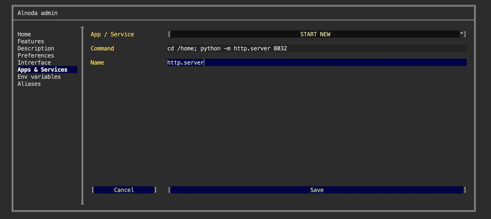
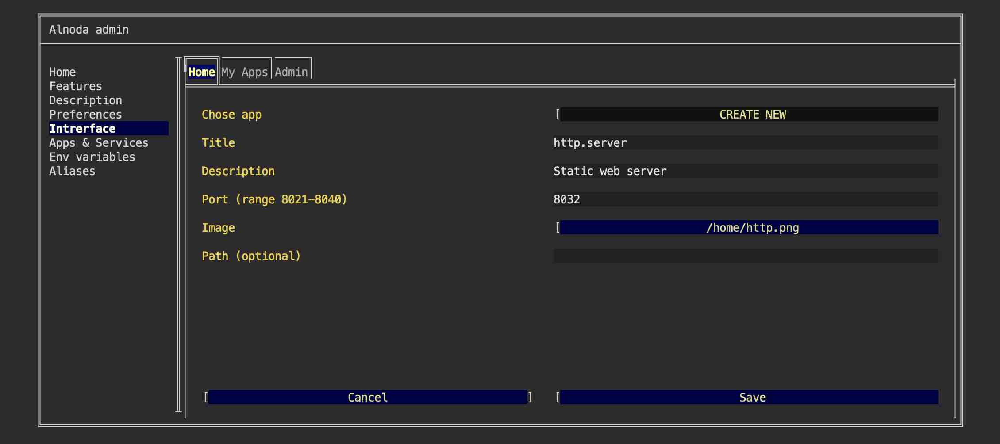
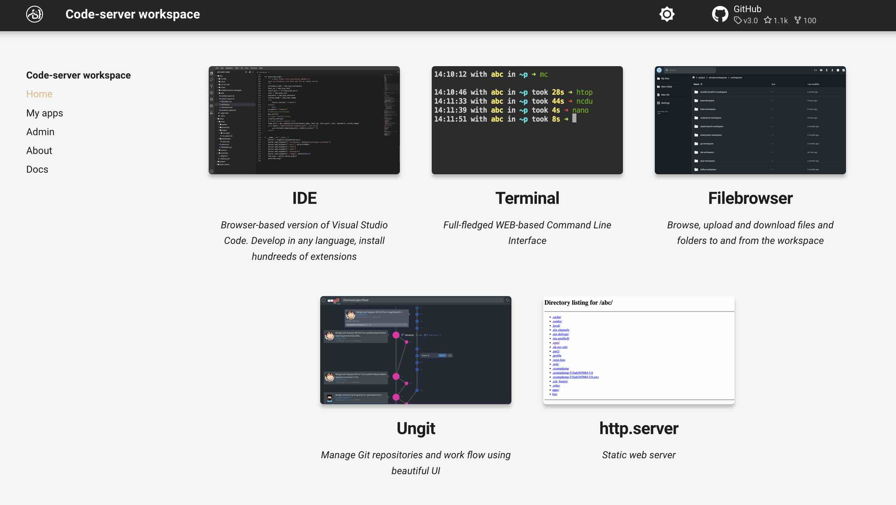

# Label Studio - data labeling tool

## Intro

In this example we are going to add a very basic static web server to the workspace.  

We will launch python [__http.server__](https://docs.python.org/3/library/http.server.html).  
This is the simplest way to start up a web server that serves the directory.  

Python is installed in every workspace, and http.server - is a built-in package. So we won't need to install anything. 
We only need to start it is a permanent workspace service, and add a UI tab for the http.server.  

!!! attention
    [__http.server__](https://docs.python.org/3/library/http.server.html) is already installed in every workspace. We will use __Codeserver workspace v.4.0__ in this example.  


## Use

If you want to use __http.server__ without adding it to the workspace permanently, you can start it with PM2, and use port 8030 or 8031. 
For these ports there are shortcut tabs "My app on port ..." on the "My apps" tab.  

<div class="termy">
```bash
$ pm2 start sh -- -c 'cd /home; python -m http.server 8030'

<font color="#5EA702">[PM2]</font> Starting /usr/bin/sh in fork_mode (1 instance)
<font color="#5EA702">[PM2]</font> Done.
```
</div>

Now you can close the terminal window, and open file server from the "My apps" tab - "My app on port 8030" 


## Add workspace service 

Permanent workspace service ensures that application is started together with the workspace, every time we start it.  

Let's start __http.server__ as a permanent workspace service: 

- [X] Open "Admin" tab oo the workspace UI and avigate to "Workspace Settings" 
- [X] Go to the tab "Apps & Services"
- [X] Select "START NEW" from the picklist 
- [X] Enter the following command 

```sh
cd /home; python -m http.server 8032
```

- [X] Give it any name you want 
- [X] Click "Save"



Restart workspace to apply changes.


## Create UI tab

Now let's create tab for the __http.server__ on the "Homes" page  

- [X] Go to the "Interface" tab of the workspace settings and select "CREATE NEW" from the picklist.   
- [X] Give it any title and description. 
- [X] In the field "Port" enter port 8032 
- [X] In the file picker find your image.   
- [X] Leave field "path" blank and click "Create"



Now we have __http.server__ tab on the Home page 

