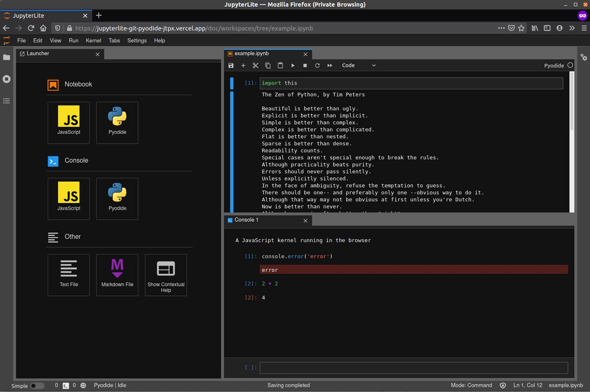
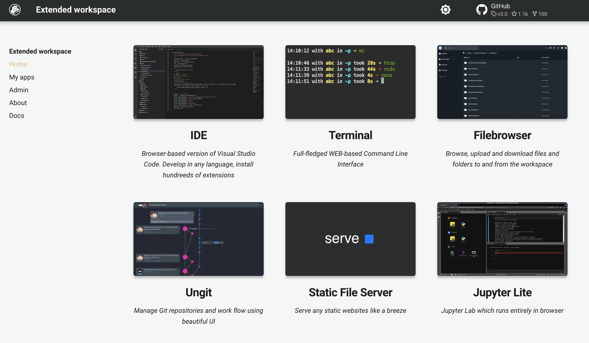

# JupyterLite - JupyterLab that runs entirely in the browser

## Intro

In this example we will set up [__JupyterLite__](https://jupyterlite.readthedocs.io/en/latest/#build-your-own-jupyterlite) in the 
workspace.  

JupyterLite is a JupyterLab distribution that runs entirely in the browser built from the ground-up using JupyterLab components and extensions.  



JupyterLite requires no dedicated application server. It can be served via static HTTP, locally or on most static web hosts.  

!!! attention
    JupyterLite requires static web server. One can use __Extended workspace__ or any other workspaces have extended workspace in the lineage. Extended workspace will be used in this example.  

!!! note
    In this example, we will install python package, use it to build JupyterLite. Webpage with JupyterLite we will save to in the folder 
    which is served with the Serve (static web server). Finally, we will create a card for JupyterLite on the Home page.

## Preparation

Python package [jupyterlite](https://pypi.org/project/jupyterlite/) can be used to generate static website with JupyterLite.  

Install python `jupyterlite` package with commad

<div class="termy">
```
$ pip install --pre jupyterlite

Installing collected packages: zipp, traitlets, entrypoints, cloudpickle, jupyter_core, importlib-metadata, doit, jupyterlite
Successfully installed cloudpickle-2.2.0 doit-0.36.0 entrypoints-0.4 importlib-metadata-4.12.0 jupyter_core-4.11.1 jupyterlite-0.1.0b12 traitlets-5.3.0 zipp-3.8.1
```
</div>

## Create

Now we can generate static website, and output the result into the folder `/home/static-server` - the folder which is served by the 
static web server

<div class="termy">
```
$ jupyter lite build --output-dir /home/static-server/jupyterlite

...
.  init:static:unpack
[LiteBuildApp] WARNING | [lite] [translation] `jupyterlab_server` was not importable, cannot create translation data No module named 'jupyterlab_server'
translation:copy
.  build:translation:copy
federated_extensions:patch
mimetypes:patch
.  post_build:federated_extensions:patch
.  post_build:mimetypes:patch
```
</div>

We can open "Static server (serve)" from the "Home" tab of the workspace UI. (be patient, it will take some time to open) 


## Update UI

Let's add a card for JupyterLite on the Home page for quick access. UI tab needs an image, choose the one and upload using Filebrowser.  

- [X] Open workspace UI, navigate to "Admin" tab and open "Workspace settings". Then go to "Interface" tab and select "CREATE NEW" from the picklist.  
- [X] Give it any title, and any description
- [X] Choose image you have uploaded  
- [X] Enter port `8028` - the port of the static web server (Serve)
- [X] Enter path `jupyterlite/lab` 

 

Now we have a shortcut tab on the "Home" page to quickly onep JupyterLab 

 


## Result

We have generated webpage with JupyterLite and serve it with Serve (static web server). We have created JupyterLite tab on the 
workspace UI.