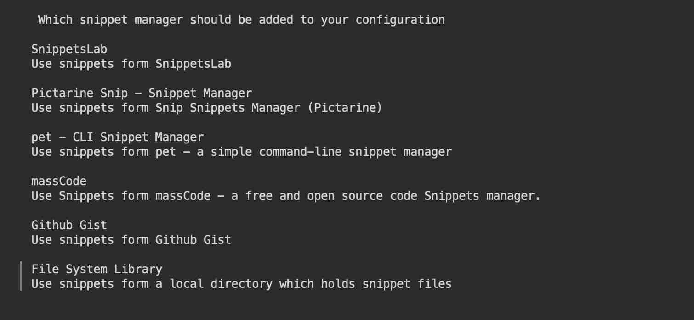
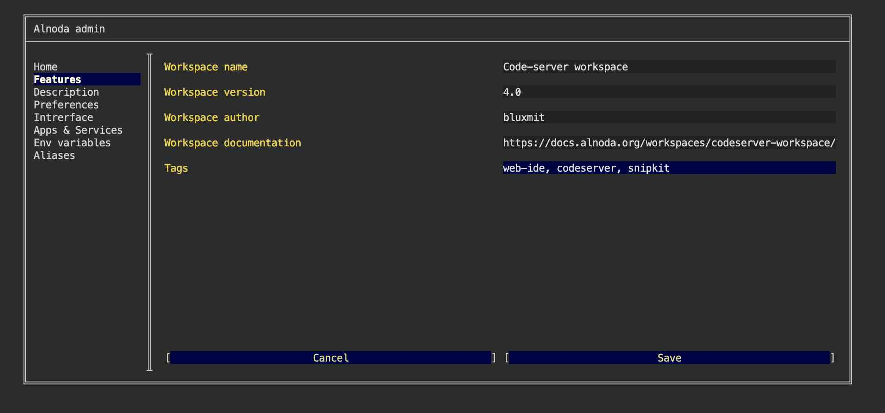

In this example we will install [__SnipKit__](https://github.com/lemoony/snipkit) - snippet manager that lets you execute 
the scripts saved in your favorite snippet manager without even leaving the terminal.   

[__SnipKit__](https://github.com/lemoony/snipkit) is a terminal-based application without a graphical user interface.   

!!! info 
    [__SnipKit__](https://github.com/lemoony/snipkit) can be installed in any workspace. We will use __Codeserver workspace v.5.0__ in this example.

## Install 

Add repository to the list of sources

<div class="termy">
```
<font color="#5EA702">echo</font> <font color="#CFAE00">'deb [trusted=yes] https://apt.fury.io/lemoony/ /'</font> | <font color="#5EA702">sudo tee</font> /etc/apt/sources.list.d/snipkit.list
```
</div>


Update the package lists 

<div class="termy">
```
<font color="#5EA702">sudo apt</font> update
```
</div>

Install SnipKit

<div class="termy">
```
$ sudo apt install snipkit -y

Reading package lists... Done
Building dependency tree       
Reading state information... Done
The following NEW packages will be installed:
  snipkit
Preparing to unpack .../snipkit_1.3.1_amd64.deb ...
Unpacking snipkit (1.3.1) ...
Setting up snipkit (1.3.1) ...
```
</div>


## Initialize

Create a new config

<div class="termy">
```
$ snipkit config init

Config file created at:
  <span style="text-decoration: underline; font-style: italic;">/home/abc/.config/snipkit/config.yaml</span>

To add snippet managers, type in snipkit manager add.

If you want to edit the config, type in <span style="text-decoration: underline; font-style: italic;">snipkit config edit</span>.
If you want to delete the config, type in <span style="text-decoration: underline; font-style: italic;">snipkit config clean</span>.
```
</div>

Follow the next steps to add your snippet manager to SnipKit.



## Add tag 

On the "About" tab of the workspace UI you can see that workspaces have tags. Let's add `snipkit` tag tp our workspace to indicate 
that this application is present.  

Open "Admin" tab, go to "Workspace settings", then to "Features", add new tag after comma and save.



